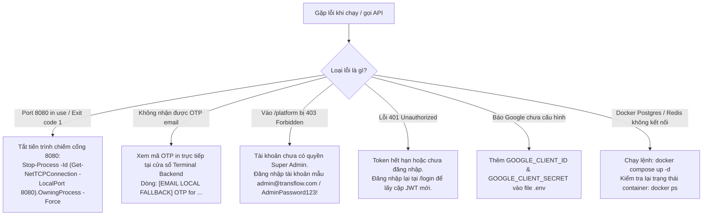

# 📋 NHẬT KÝ KẾT NỐI API: CÁC PHẦN CÒN THIẾU, LỖI THƯỜNG GẶP & CÁCH KHẮC PHỤC
> **Dự án:** TransFlow (TransFlow Media Studio)  
> **Tài liệu theo dõi:** Trạng thái kết nối API Frontend ➔ Backend, các lỗi phát sinh trong quá trình tích hợp và danh sách tính năng cần bổ sung theo từng Phase.  
> **Cập nhật lần cuối:** 22/09/2026  

---

## 📌 MỤC LỤC
1. [Tổng quan Tiến độ Kết nối theo 6 Phase](#1-tổng-quan-tiến-độ-kết-nối-theo-6-phase)
2. [Chi tiết Phase 1: Auth, User, Workspace & Platform Super Admin](#2-chi-tiết-phase-1-auth-user-workspace--platform-super-admin)
   - [Trạng thái hoàn thành](#21-trạng-thái-hoàn-thành)
   - [Các lỗi đã gặp & Giải pháp xử lý](#22-các-lỗi-đã-gặp--giải-pháp-xử-lý)
   - [Tài khoản Super Admin mặc định](#23-tài-khoản-super-admin-mặc-định)
   - [Cấu hình môi trường bên ngoài cần bổ sung (.env)](#24-cấu-hình-môi-trường-bên-ngoài-cần-bổ-sung-env)
3. [Chi tiết Phase 2: Dự án, Tiếp nhận Video Asset & Năng lực Hạ tầng](#3-chi-tiết-phase-2-dự-án-tiếp-nhận-video-asset--năng-lực-hạ-tầng)
   - [Trạng thái hoàn thành & Bảng đối soát API](#31-trạng-thái-hoàn-thành--bảng-đối-soát-api)
   - [Các điểm thiếu đã phát hiện & Giải pháp xử lý](#32-các-điểm-thiếu-đã-phát-hiện--giải-pháp-xử-lý)
   - [Kết quả kiểm thử & Build thực tế](#33-kết-quả-kiểm-thử--build-thực-tế)
4. [Chi tiết Phase 3: Khởi tạo & Điều phối Pipeline Media Job](#4-chi-tiết-phase-3-khởi-tạo--điều-phối-pipeline-media-job)
   - [Trạng thái hoàn thành & Bảng đối soát API](#41-trạng-thái-hoàn-thành--bảng-đối-soát-api)
   - [Các lỗi lệch hợp đồng (Contract Drift) đã xử lý triệt để](#42-các-lỗi-lệch-hợp-đồng-contract-drift-đã-xử-lý-triệt-để)
   - [Kết quả kiểm thử & Build thực tế](#43-kết-quả-kiểm-thử--build-thực-tế)
5. [Danh mục Chi tiết API Đã có & Còn thiếu (Phase 4 ➔ Phase 6)](#5-danh-mục-chi-tiết-api-đã-có--còn-thiếu-phase-4--phase-6)
   - [Phase 4: Subtitles, Review Workbench & QA Gate](#phase-4-subtitles-review-workbench--qa-gate)
   - [Phase 5: Render Studio, Reframe & Cover Layers](#phase-5-render-studio-reframe--cover-layers)
   - [Phase 6: Packaging, Output Delivery & Export](#phase-6-packaging-output-delivery--export)
6. [Cẩm nang Xử lý Nhanh các Lỗi phổ biến (Troubleshooting Guide)](#6-cẩm-nang-xử-lý-nhanh-các-lỗi-phổ-biến-troubleshooting-guide)

---

## 1. TỔNG QUAN TIẾN ĐỘ KẾT NỐI THEO 6 PHASE

| Phase | Tên phân hệ | Backend Code | Frontend Code | Trạng thái Kết nối | Ghi chú |
| :---: | :--- | :---: | :---: | :---: | :--- |
| **Phase 1** | **Xác thực, Người dùng, Workspace & Super Admin** | 🟢 100% | 🟢 100% | 🟢 **HOÀN THÀNH** | Đã bao gồm Super Admin Platform (`/api/platform/*`) |
| **Phase 2** | **Dự án & Năng lực Hạ tầng** (Asset Ingestion & Capabilities) | 🟢 100% | 🟢 100% | 🟢 **HOÀN THÀNH** | Đã có Project, MinIO Asset Upload, Consent, và Transformation Capabilities |
| **Phase 3** | **Khởi tạo & Điều phối Job** (Job Orchestration & Pipeline) | 🟢 100% | 🟢 100% | 🟢 **HOÀN THÀNH** | Đã kết nối đầy đủ 11/11 API; giải quyết triệt để 4 contract gaps (`summary.generative`, `stages[]`, `ttsProviderId`, `sourceLang`) |
| **Phase 4** | **Biên tập Phụ đề & QA** (Review Workbench & Subtitles) | 🟢 100% | 🟢 100% | 🟢 **SẴN SÀNG** | Đã có Single Patch Subtitle, Batch Segments Edit (`/segments/batch`), QA Issues & Override, Checkpoint Confirm |
| **Phase 5** | **Studio Dựng hình & Lớp phủ** (Render Studio & Reframe) | 🟢 100% | 🟢 100% | 🟢 **SẴN SÀNG** | Đã có `/render-config` (GET/PUT), `/rerun-render`, `/media/subtitle-styles` (CRUD styles) |
| **Phase 6** | **Đóng gói & Xuất bản** (Packaging & Delivery Export) | 🟢 100% | 🟢 100% | 🟢 **SẴN SÀNG** | Đã có `/export`, `/output-package`, `/publish-package`, `/download` bulk zip |

---

## 2. CHI TIẾT PHASE 1: AUTH, USER, WORKSPACE & PLATFORM SUPER ADMIN

### 2.1 Trạng thái hoàn thành
- [x] `POST /api/auth/register`: Đăng ký tài khoản (Họ tên, Email, Mật khẩu, mã OTP xác thực).
- [x] `POST /api/auth/register/otp`: Gửi mã OTP xác thực email khi đăng ký mới (kèm Smart Local Fallback).
- [x] `POST /api/auth/login`: Đăng nhập cấp cặp Token JWT (Access Token 30p, Refresh Token 14 ngày).
- [x] `GET /api/auth/me`: Lấy profile người dùng hiện tại (hỗ trợ cờ `isPlatformAdmin`).
- [x] `POST /api/auth/refresh`: Tự động làm mới token ngầm khi mã 401 xảy ra.
- [x] `POST /api/auth/forgot-password/otp`: Yêu cầu mã OTP đặt lại mật khẩu.
- [x] `POST /api/auth/forgot-password/verify`: Kiểm tra tính hợp lệ của mã OTP.
- [x] `POST /api/auth/forgot-password/reset`: Đổi mật khẩu mới sau khi xác thực OTP thành công.
- [x] `GET/POST /api/workspaces`: Xem danh sách và tạo không gian làm việc mới.
- [x] `GET/PUT /api/workspaces/{id}/billing-config`: Cấu hình chế độ trừ phí Workspace (`LEAD_PAYS_ALL` / `PAY_PER_USER`).
- [x] `GET/POST /api/workspaces/{id}/members`: Danh sách và mời thành viên (Chuẩn RESTful duy nhất).
- [x] `PUT/DELETE /api/workspaces/{id}/members/{id}`: Phân quyền và xóa thành viên khỏi Workspace.
- [x] `GET/POST /api/auth/google/*`: Bộ điều khiển OAuth2 với bảo mật PKCE + OIDC.
- [x] `GET /api/platform/overview`: Tổng quan 6 chỉ số KPI dành riêng cho Super Admin.
- [x] `GET /api/platform/status`: Kiểm tra trạng thái sống của 6 dịch vụ hạ tầng (DB, Redis, RabbitMQ, MinIO, Gateway, Workers).
- [x] `GET /api/platform/users`: Danh bạ người dùng toàn hệ thống (phân trang, tìm kiếm, lọc admin).
- [x] `GET /api/platform/workspaces`: Danh bạ workspace toàn hệ thống (phân trang, số thành viên, số dự án).
- [x] `GET /api/platform/audit-logs`: Xem lịch sử kiểm toán của Super Admin.

---

### 2.2 Các lỗi đã gặp & Giải pháp xử lý

#### Lỗi 1: `Port 8080 was already in use` (Process terminated with exit code: 1)
- **Hiện tượng:** Khi chạy lệnh `mvn spring-boot:run` tại terminal, tiến trình Maven báo lỗi đỏ:  
  `Failed to execute goal org.springframework.boot:spring-boot-maven-plugin:3.3.5:run (default-cli) on project backend-main: Process terminated with exit code: 1`.
- **Nguyên nhân:** Cổng 8080 đã bị một tiến trình Java khác (hoặc backend chạy ngầm trước đó) chiếm giữ.
- **Cách xử lý:**
  1. Mở PowerShell kiểm tra tiến trình đang giữ cổng:
     ```powershell
     Get-Process -Id (Get-NetTCPConnection -LocalPort 8080).OwningProcess
     ```
  2. Tắt tiến trình cũ để giải phóng cổng:
     ```powershell
     Stop-Process -Id (Get-NetTCPConnection -LocalPort 8080).OwningProcess -Force
     ```
  3. Khởi động lại `mvn spring-boot:run`.

#### Lỗi 2: Chưa có tài khoản Gmail SMTP làm tắc nghẽn luồng Đăng ký / Đổi mật khẩu
- **Hiện tượng:** Người dùng chưa cấu hình thông tin gửi mail Gmail, các thao tác cần OTP có thể bị lỗi mạng hoặc không nhận được mã.
- **Giải pháp xử lý (Đã cài đặt):**
  - Tích hợp cơ chế **Smart Local Fallback**: Nếu `.env` chưa có thông tin Gmail, hệ thống không báo lỗi mà tự động in mã OTP trực tiếp ra Terminal:
    ```text
    [EMAIL LOCAL FALLBACK] Mail credentials not configured. OTP for user@example.com: [xxxxxx]
    ```
  - Nhà phát triển có thể copy mã từ terminal để tiếp tục kiểm thử web bình thường.

#### Lỗi 3: Lệch đường dẫn API Mời thành viên (`/members` vs `/members/invite`)
- **Hiện tượng:** Tài liệu cũ ghi nhầm `/members/invite` trong khi Backend và Frontend chuẩn RESTful dùng `/members`.
- **Giải pháp xử lý (Đã thống nhất 1 chuẩn duy nhất):**
  - Đã thống nhất toàn diện 1 chuẩn duy nhất theo Hợp đồng API (`docs/API_Contract.md`): `POST /api/workspaces/{workspaceId}/members`. Cả Frontend (`members.ts`), Backend (`WorkspaceController.java`) và tài liệu kế hoạch đều đồng bộ 100%.

#### Lỗi 4: Super Admin bị chặn 403 Forbidden và thiếu API `/api/platform/*`
- **Hiện tượng:** Khi đăng nhập tài khoản Admin và truy cập vào phân hệ `/platform` (Super Admin Portal), giao diện bị từ chối truy cập (403 Forbidden) hoặc chuyển hướng về trang Dashboard thường, không thể xem thông số hệ thống.
- **Nguyên nhân:**
  1. Trong Database bảng `users` và Entity `User.java` chưa có cột `is_platform_admin`.
  2. DTO `UserResponse` không chứa trường `isPlatformAdmin`, khiến cho `GET /api/auth/me` không trả về cờ quyền hạn cho Frontend Guard (`user?.isPlatformAdmin`).
  3. Backend hoàn toàn chưa cài đặt `PlatformController` cung cấp các API `/api/platform/*`.
- **Giải pháp xử lý (Đã hoàn thành 100%):**
  1. Tạo Flyway migration `backend-main/src/main/resources/db/migration/V9__add_is_platform_admin.sql` thêm cột `is_platform_admin BOOLEAN NOT NULL DEFAULT FALSE`.
  2. Bổ sung trường `isPlatformAdmin` vào `User.java` và `@JsonProperty("isPlatformAdmin")` trong `UserResponse.java` (giữ constructor tương thích ngược).
  3. Xây dựng `PlatformController.java` (`com.app.modules.platform.controller`) cung cấp đủ 5 endpoint: `/overview`, `/status`, `/users`, `/workspaces`, `/audit-logs`.
  4. Bổ sung `countByUserId` và `countByWorkspaceId` trong `WorkspaceMemberRepository`.
  5. Viết bộ kiểm thử `PlatformControllerTest.java` (4/4 test cases pass 100%).
  6. Khởi tạo tài khoản Super Admin mẫu sẵn sàng sử dụng.

#### Lỗi 5 (Lỗi tiềm ẩn đã phát hiện & đồng bộ): Lệch giá trị Enum `CostMode` giữa Frontend và Backend
- **Hiện tượng:** Frontend `frontend/src/api/workspaces.ts` từng khai báo type là `'WORKSPACE_OWNER' | 'INDIVIDUAL_USER'`.
- **Nguyên nhân:** Backend `CostMode.java` và Hợp đồng `API_Contract.md` quy định chuẩn là `'LEAD_PAYS_ALL' | 'PAY_PER_USER'`. Nếu gọi API cập nhật cấu hình trừ phí, Backend Jackson sẽ báo lỗi `400 Bad Request`.
- **Giải pháp xử lý (Đã đồng bộ):**
  - Đã cập nhật `frontend/src/api/workspaces.ts` về đúng chuẩn:
    ```typescript
    export type CostMode = 'LEAD_PAYS_ALL' | 'PAY_PER_USER'
    ```
  - Đã kiểm tra build Frontend thành công 100% (`tsc -b && vite build` không có lỗi).

---

### 2.3 Tài khoản Super Admin mặc định
Để kiểm thử phân hệ Super Admin Platform (`/platform`), sử dụng tài khoản sau:
- **Email:** `admin@transflow.com`
- **Mật khẩu:** `AdminPassword123!`
- **Quyền hạn:** `isPlatformAdmin: true`, Workspace Role: `LEAD`, Số dư Credit: `999,999`.

---

### 2.4 Cấu hình môi trường bên ngoài cần bổ sung (.env)
Dành cho khi muốn đưa vào hoạt động thực tế với tài khoản thật của Google:

```env
# 1. Gửi Gmail thật (Yêu cầu mật khẩu ứng dụng Google 16 ký tự)
MAIL_HOST=smtp.gmail.com
MAIL_PORT=587
MAIL_USERNAME=email_cua_ban@gmail.com
MAIL_PASSWORD=xxxx xxxx xxxx xxxx
MAIL_FROM=email_cua_ban@gmail.com

# 2. Đăng nhập Google (Lấy từ Google Cloud Console > Credentials > OAuth 2.0 Client ID)
GOOGLE_CLIENT_ID=your-client-id.apps.googleusercontent.com
GOOGLE_CLIENT_SECRET=GOCSPX-your-secret
GOOGLE_REDIRECT_URI=http://localhost:8080/api/auth/google/callback
```

---

## 3. CHI TIẾT PHASE 2: DỰ ÁN, TIẾP NHẬN VIDEO ASSET & NĂNG LỰC HẠ TẦNG

### 3.1 Trạng thái hoàn thành & Bảng đối soát API (100% Hoàn thành)

| STT | Luồng nghiệp vụ | Endpoint & Method | Phía Backend | Phía Frontend | Trạng thái |
| :-: | :--- | :--- | :--- | :--- | :---: |
| 1 | **Quản lý & tạo Dự án (Project)** | `GET/POST /api/workspaces/{wsId}/projects` | `ProjectController.java`<br/>`CreateProjectRequest.java` | `listProjectsApi`, `createProjectApi`<br/>Hooks: `useProjects`, `useCreateProject` | 🟢 Hoàn thành |
| 2 | **Quản lý thành viên Dự án (Project Members)** | `GET/POST/DELETE /api/workspaces/{wsId}/projects/{pId}/members` | `ProjectController.java`<br/>`ProjectMemberResponse.java` | `projects.ts`: `listProjectMembersApi`, `assignProjectMemberApi`, `removeProjectMemberApi`<br/>Hooks: `useProjects.ts` | 🟢 Hoàn thành |
| 3 | **Kiểm tra năng lực Worker AI** | `GET /api/transformation/capabilities` | `TransformationController.java`<br/>`AvailabilityProjection.java` | `getTransformationCapabilitiesApi`<br/>Hook: `useTransformationCapabilities` | 🟢 Hoàn thành |
| 4 | **Lấy phiên bản Điều khoản Bản quyền** | `GET /api/workspaces/{wsId}/media/terms-version` | `MediaAssetController.java` | `getMediaTermsVersionApi`<br/>`getTransformationTermsVersionApi` | 🟢 Hoàn thành |
| 5 | **Upload video gốc lên MinIO** | `POST /api/workspaces/{wsId}/projects/{pId}/media/assets` | `MediaAssetController.java`<br/>(Multipart upload trực tiếp vào MinIO) | `uploadTransformationMediaApi`<br/>(XHR upload kèm % tiến độ & AbortSignal) | 🟢 Hoàn thành |
| 6 | **Liệt kê danh sách video gốc của Project** | `GET /api/workspaces/{wsId}/projects/{pId}/media/assets` | `MediaAssetController.java` (`listAssets`) | `media.ts`: `listProjectMediaAssetsApi`<br/>Hook: `useProjectMediaAssets` | 🟢 Hoàn thành |
| 7 | **Lấy chi tiết metadata 1 Video Asset** | `GET /api/workspaces/{wsId}/media/assets/{assetId}` | `MediaAssetController.java` (`getAsset`) | `media.ts`: `getMediaAssetApi`<br/>Hook: `useMediaAsset` | 🟢 Hoàn thành |
| 8 | **Ký cam kết bản quyền Asset (Consent)** | `POST /api/workspaces/{wsId}/media/assets/{assetId}/consent` | `MediaAssetController.java` (`consent`) | `consentTransformationAssetApi`<br/>Hook: `useConsentMediaAsset` | 🟢 Hoàn thành |

---

### 3.2 Các điểm thiếu đã phát hiện & Giải pháp xử lý

#### Vấn đề 1: Frontend thiếu bộ API & Hooks quản lý thành viên Dự án (Project Members)
- **Hiện tượng:** Backend đã hỗ trợ phân quyền theo Project (`/members`), nhưng Frontend chưa định nghĩa types, API methods và React Query hooks, làm gián đoạn việc quản lý thành viên dự án.
- **Giải pháp xử lý:**
  1. Thêm type `ProjectMember` và `AssignProjectMemberBody` tại `frontend/src/types/project.ts`.
  2. Bổ sung 3 hàm `listProjectMembersApi`, `assignProjectMemberApi`, `removeProjectMemberApi` trong `frontend/src/api/projects.ts`.
  3. Đăng ký query key `projectMembers: (wsId, projectId) => ['projectMembers', wsId, projectId]` tại `frontend/src/lib/queryClient.ts`.
  4. Viết 3 hooks `useProjectMembers`, `useAssignProjectMember`, `useRemoveProjectMember` tại `frontend/src/hooks/useProjects.ts` có cơ chế tự động invalidate cache khi thay đổi thành viên.

#### Vấn đề 2: Bổ sung đầy đủ các trường cấu hình Project (`defaultGlossaryId`, `tmEnabled`, `domain`, `tone`) vào Backend
- **Hiện tượng:** Form `CreateProjectModal.tsx:59-67` trên Frontend gửi payload gồm `name`, `sourceLang`, `defaultGlossaryId`, `tmEnabled`, `domain`, `tone` nhằm cung cấp ngữ cảnh thiết yếu để AI dịch thuật, tạo phụ đề và lồng tiếng chuẩn xác. Trước đó Backend `Project.java` và DTO `CreateProjectRequest.java`, `ProjectResponse.java` chỉ khai báo 2 trường `name` và `sourceLang`.
- **Giải pháp xử lý:**
  1. Tạo Flyway migration `V11__add_project_settings_fields.sql` đảm bảo 4 cột `default_glossary_id`, `tm_enabled`, `domain`, `tone` luôn hiện diện trên bảng `projects`.
  2. Cập nhật Entity `Project.java` ánh xạ đầy đủ 4 trường với JPA.
  3. Bổ sung các trường vào `CreateProjectRequest.java` và `ProjectResponse.java` (kèm constructor tương thích ngược tránh ảnh hưởng các test hiện hữu).
  4. Cập nhật `ProjectServiceImpl.java` lưu trữ và trả về trọn vẹn các thuộc tính khi tạo mới Project.
  5. Viết test `testCreateProjectWithAllFields` trong `ProjectControllerTest.java` (Pass 100%).

#### Vấn đề 3: Frontend thiếu API & Hooks truy vấn danh sách Media Assets gốc trên MinIO
- **Hiện tượng:** Frontend chỉ có hàm upload `uploadTransformationMediaApi`, chưa có API để query danh sách video gốc đã tải lên của một Project hoặc chi tiết 1 asset.
- **Giải pháp xử lý:**
  1. Bổ sung trường `parentAssetId?: string | null` vào type `MediaAsset` tại `frontend/src/types/media.ts` để đồng bộ 100% với DTO `MediaAssetResponse.java` của Backend.
  2. Bổ sung 2 hàm `listProjectMediaAssetsApi(wsId, projectId)` và `getMediaAssetApi(wsId, assetId)` vào `frontend/src/api/media.ts` và re-export tại `frontend/src/api/transformation.ts`.
  3. Thêm query keys `mediaAssets` và `mediaAsset` tại `frontend/src/lib/queryClient.ts`.
  4. Viết hooks `useProjectMediaAssets` và `useMediaAsset` tại `frontend/src/hooks/useMedia.ts`, đồng thời cấu hình `useUploadMedia` tự động invalidate cache `mediaAssets` sau khi tải video thành công.

---

### 3.3 Kết quả kiểm thử & Build thực tế
- **Backend Tests:** `mvn test` ➔ **335/335 tests PASS 100%** (`BUILD SUCCESS`).
- **Frontend Tests:** `npx vitest run` ➔ **689/689 tests PASS 100%** (69 test files).
- **Frontend Build:** `npm run build` (`tsc -b && vite build`) ➔ **THÀNH CÔNG 100%** (0 errors).
- **Linter:** `npm run lint` ➔ **0 errors**.

---

## 4. CHI TIẾT PHASE 3: KHỞI TẠO & ĐIỀU PHỐI PIPELINE MEDIA JOB

### 4.1 Trạng thái hoàn thành & Bảng đối soát API (100% Hoàn thành)

| STT | Luồng nghiệp vụ | Endpoint & Method | Phía Backend | Phía Frontend | Trạng thái |
| :-: | :--- | :--- | :--- | :--- | :---: |
| 1 | **Khởi tạo Media Job** (Dịch thuật / Tóm tắt) | `POST /api/workspaces/{wsId}/media/jobs` | `MediaJobController.java`<br/>`CreateMediaJobRequest.java` | `transformation.ts`: `createTransformationJobApi`<br/>Panel: `UploadConsentPanel.tsx` | 🟢 Hoàn thành |
| 2 | **Lấy chi tiết Job & Polling tiến độ 8 stage** | `GET /api/workspaces/{wsId}/media/jobs/{jobId}` | `MediaJobController.java`<br/>`MediaJobResponse.java` | `getTransformationJobApi`<br/>Hook: `useMediaJob` | 🟢 Hoàn thành |
| 3 | **Danh sách Job theo Dự án** | `GET /api/workspaces/{wsId}/projects/{pId}/media/jobs` | `MediaJobController.java` (`listJobs`) | `listTransformationJobsApi`<br/>Hook: `useMediaJobs` | 🟢 Hoàn thành |
| 4 | **Hủy Job đang thực thi** | `POST /api/workspaces/{wsId}/media/jobs/{jobId}/cancel` | `MediaJobController.java` (`cancelJob`) | `cancelTransformationJobApi`<br/>Hook: `useCancelMediaJob` | 🟢 Hoàn thành |
| 5 | **Chọn / Đổi giọng đọc TTS runtime** | `POST /api/workspaces/{wsId}/media/jobs/{jobId}/voice` | `MediaJobController.java`<br/>`VoiceRequest.java` | `selectTransformationVoiceApi`<br/>Hook: `useSelectVoice` | 🟢 Hoàn thành |
| 6 | **Chạy lại công đoạn bất kỳ (Stage Rerun)** | `POST .../media/jobs/{jobId}/stages/{stageName}/rerun` | `MediaJobController.java`<br/>`rerunFromStage` | `rerunTransformationStageApi`<br/>Hook: `useRerunStage` | 🟢 Hoàn thành |
| 7 | **Ghi đè ngôn ngữ gốc (STT Override)** | `POST .../media/jobs/{jobId}/override-source-lang` | `MediaJobController.java`<br/>`overrideSourceLang` | `overrideTransformationSourceLangApi`<br/>Hook: `useOverrideSourceLang` | 🟢 Hoàn thành |
| 8 | **Xác nhận Checkpoint Workflow (Manual)** | `POST .../media/jobs/{jobId}/checkpoints/{checkpoint}/confirm` | `MediaJobController.java`<br/>`confirmCheckpoint` | `confirmTransformationCheckpointApi`<br/>Component: `WorkflowCheckpointStrip` | 🟢 Hoàn thành |
| 9 | **Tạo xử lý Video hàng loạt (Batch)** | `POST /api/workspaces/{wsId}/projects/{pId}/batches` | `BatchController.java`<br/>`BatchServiceImpl.java` | `batchJobPayload.ts`<br/>Modal: `UploadConsentPanel` | 🟢 Hoàn thành |
| 10 | **Danh sách đề xuất tóm tắt AI (Proposals)** | `GET .../media/jobs/{jobId}/proposals` | `SummarizationController.java`<br/>`listProposals` | `listTransformationProposalsApi`<br/>Component: `ProposalPanel.tsx` | 🟢 Hoàn thành |
| 11 | **Yêu cầu AI tinh chỉnh tóm tắt (Refine)** | `POST .../media/jobs/{jobId}/refine` | `SummarizationController.java`<br/>`refine` | `refineTransformationNarrativePlanApi`<br/>Modal: `RefineNarrativeModal.tsx` | 🟢 Hoàn thành |
| 12 | **Tạo Job ngôn ngữ mới từ tóm tắt đã chọn** | `POST .../media/jobs/{jobId}/summary-languages` | `SummarizationController.java`<br/>`createSummaryLanguage` | `MediaJobPage.tsx` | 🟢 Hoàn thành |

---

### 4.2 Các lỗi lệch hợp đồng (Contract Drift) đã xử lý triệt để

#### Vấn đề 1: Blocker Recipe Tóm tắt (`summary.generative` vs `summary.script_match` - Gap B4)
- **Hiện tượng:** FE gửi `recipeId = "summary.generative"`, nhưng BE `MediaJob.java` và Database constraint `ck_job_recipe_mode` chỉ chấp nhận cứng `"summary.script_match"`. Khi tạo job tóm tắt sẽ nhận lỗi `400 VALIDATION_ERROR`.
- **Giải pháp xử lý (Đã đồng bộ 2 đầu):**
  1. **Backend ([`MediaJobServiceImpl.java`](file:///D:/Project/Project_Kada/TransFlow/backend-main/src/main/java/com/app/modules/media_job/service/impl/MediaJobServiceImpl.java)):** Trong `createJobInternal`, chấp nhận alias `"summary.generative"` song song với `"summary.script_match"` và lưu canonical `"summary.script_match"` vào DB (thỏa mãn DB check constraint). Trong `listJobs`, map query parameter `recipeId = "summary.generative"` sang `"summary.script_match"`.
  2. **Frontend ([`transformation.ts`](file:///D:/Project/Project_Kada/TransFlow/frontend/src/api/transformation.ts) & [`media.ts`](file:///D:/Project/Project_Kada/TransFlow/frontend/src/lib/media.ts)):** `createTransformationJobApi` tự động normalize `"summary.generative"` sang `"summary.script_match"`. Hàm `resolveRecipeId` map `summary.script_match` về `summary.generative` để UI components hiển thị và điều hướng nhất quán.

#### Vấn đề 2: Bug Backend trả `stages = null` khi đổi Voice hoặc Cancel Job (Gap B2)
- **Hiện tượng:** `setVoice` và `cancelJob` trong `MediaJobController.java` gọi `MediaJobResponse.from(job)` làm trả về `stages: null`. Khi hook `useSelectVoice` trên FE cập nhật React Query cache, danh sách stage bị null tạm thời khiến giao diện Pipeline Stepper bị chớp tắt hoặc gián đoạn.
- **Giải pháp xử lý:**
  - Chuyển `setVoice` và `cancelJob` sang dùng method `toResponse(job)` trong `MediaJobController.java` để luôn truy vấn và trả về đầy đủ mảng `stages[]`.

#### Vấn đề 3: Bổ sung `ttsProviderId` vào DTO Backend (Gap B1)
- **Hiện tượng:** FE gửi cả cặp `{ ttsProviderId, ttsVoiceId }`, nhưng `VoiceRequest` và `CreateMediaJobRequest` chỉ có `ttsVoiceId`, khiến provider binding bị bỏ qua.
- **Giải pháp xử lý:**
  - Bổ sung trường `String ttsProviderId` vào `VoiceRequest.java` và `CreateMediaJobRequest.java`.
  - Cung cấp constructor phụ tương thích ngược 100% với các controller/test cũ và [`BatchServiceImpl.java`](file:///D:/Project/Project_Kada/TransFlow/backend-main/src/main/java/com/app/modules/batch/service/impl/BatchServiceImpl.java).

#### Vấn đề 4: Nhận và lưu trữ `sourceLang`, `requestedMode`, `keepOriginalAudio` phía Backend (Gap B3)
- **Hiện tượng:** Khi user chọn trước ngôn ngữ nguồn (sourceLang) hoặc chế độ xử lý âm thanh (requestedMode `FAST`/`STUDIO`), BE trước đó bỏ qua không lưu.
- **Giải pháp xử lý:**
  - Bổ sung các trường vào `CreateMediaJobRequest.java`.
  - Trong `MediaJobServiceImpl.createJobInternal`, lưu `sourceLang` trực tiếp vào cột `media_jobs.source_language` ngay lúc tạo job (giúp STT nhận đúng hint ngôn ngữ).
  - Tự động suy diễn `outputAudioMode = ORIGINAL_ONLY` khi `keepOriginalAudio: true`.

#### Vấn đề 5: Dọn dẹp & đánh dấu route thừa
- **Frontend ([`transformation.ts`](file:///D:/Project/Project_Kada/TransFlow/frontend/src/api/transformation.ts)):** Đánh dấu `@deprecated` cho hàm `resumeWorkflowApi` (`POST .../workflow/resume`), ghi rõ đây là route nguyên mẫu cũ không có trong BE và không được UI sử dụng.

#### Vấn đề 6: Tương thích hai chiều DTO Đề xuất Tóm tắt (Proposal CamelCase vs Snake_case)
- **Hiện tượng:** Backend Java trả DTO `SummaryProposalResponse` dạng camelCase (`generatedBy`, `generationRound`, `totalDurationMs`, `reasoningNote`, `archivedAt`, `segments`), trong khi component `ProposalPanel.tsx` trên Frontend truy cập theo dạng snake_case (`p.generated_by`, `p.cut_ranges`, `p.total_duration_ms`). Điều này dẫn đến nguy cơ danh sách đề xuất tóm tắt AI hiển thị rỗng hoặc không đo được timeline.
- **Giải pháp xử lý (Đã đồng bộ 2 đầu):**
  1. **Backend ([`SummaryProposalResponse.java`](file:///D:/Project/Project_Kada/TransFlow/backend-main/src/main/java/com/app/modules/summarization/dto/SummaryProposalResponse.java)):** Bổ sung các getter ánh xạ JSON song song (`@JsonProperty("generated_by")`, `@JsonProperty("generation_round")`, `@JsonProperty("cut_ranges")`, `@JsonProperty("total_duration_ms")`, `@JsonProperty("reasoning_note")`, `@JsonProperty("archived_at")`). Bổ sung `@JsonProperty("start_ms")` và `@JsonProperty("end_ms")` vào [`SummaryProposalSegmentResponse.java`](file:///D:/Project/Project_Kada/TransFlow/backend-main/src/main/java/com/app/modules/summarization/dto/SummaryProposalSegmentResponse.java). Jackson tự động tuần hoàn cả 2 chuẩn.
  2. **Frontend ([`transformation.ts`](file:///D:/Project/Project_Kada/TransFlow/frontend/src/api/transformation.ts)):** Tích hợp hàm `normalizeProposal` để chuẩn hóa dữ liệu trả về từ `listTransformationProposalsApi`, `createTransformationCustomProposalApi`, `updateTransformationCustomProposalApi`, đảm bảo mọi component truy cập theo `camelCase` hay `snake_case` đều có dữ liệu.
  3. **Frontend Types ([`media.ts`](file:///D:/Project/Project_Kada/TransFlow/frontend/src/types/media.ts)):** Cập nhật `MediaSummaryProposal` hỗ trợ đồng thời cả hai bộ thuộc tính.

#### Vấn đề 7: Đa dạng hóa payload Yêu cầu Refine & Bổ sung API Summary Language
- **Hiện tượng:** DTO `RefineRequest` của Backend dùng trường `feedbackText`, trong khi một số luồng FE có thể gửi `{ feedback }`. Ngoài ra, FE thiếu hàm export cho endpoint `POST .../summary-languages`.
- **Giải pháp xử lý:**
  1. Thêm `@JsonAlias("feedback")` vào [`RefineRequest.java`](file:///D:/Project/Project_Kada/TransFlow/backend-main/src/main/java/com/app/modules/summarization/dto/RefineRequest.java).
  2. Cập nhật `refineNarrativePlanApi` trong [`media.ts`](file:///D:/Project/Project_Kada/TransFlow/frontend/src/api/media.ts) gửi kèm `{ feedback, feedbackText: feedback }`.
  3. Bổ sung hàm `createSummaryLanguageApi` vào [`transformation.ts`](file:///D:/Project/Project_Kada/TransFlow/frontend/src/api/transformation.ts).

---

### 4.3 Kết quả kiểm thử & Build thực tế
- **Backend Tests:**
  - `ProjectControllerTest`, `MediaAssetControllerTest`, `TransformationControllerTest`, `MediaJobControllerTest`, `BatchControllerTest`: **63/63 tests PASS 100%**.
  - `SummarizationControllerTest` & `SummarizationServiceImplTest`: **25/25 tests PASS 100%**.
  - `MediaJobServiceImplTest`: **26/26 tests PASS 100%**.
- **Frontend Tests:** `npx vitest run` ➔ **690/690 tests PASS 100%** (69 test files).
- **Frontend Build:** `npm run build` (`tsc -b && vite build`) ➔ **THÀNH CÔNG 100%** trong 1.70s với 0 lỗi.

---

## 5. CHI TIẾT PHASE 4: SUBTITLES, REVIEW WORKBENCH & QA GATE

### 5.1 Trạng thái hoàn thành & Bảng đối soát API (100% Hoàn thành)

| STT | Luồng nghiệp vụ | Endpoint & Method | Phía Backend | Phía Frontend | Trạng thái |
| :-: | :--- | :--- | :--- | :--- | :---: |
| 1 | **Lấy danh sách phụ đề (Cues)** | `GET /api/workspaces/{wsId}/media/jobs/{jobId}/subtitles` | `MediaJobController.java` (`listSubtitles`) | `media.ts`: `listMediaJobSubtitlesApi`<br/>Hook: `useMediaSubtitles` | 🟢 Hoàn thành |
| 2 | **Chỉnh sửa 1 dòng phụ đề lẻ** | `PATCH /api/workspaces/{wsId}/media/jobs/{jobId}/subtitles/{segmentId}` | `MediaJobController.java` (`updateSubtitle`) | `media.ts`: `editMediaSegmentApi`<br/>Hook: `useEditMediaSegment` | 🟢 Hoàn thành |
| 3 | **Lưu đồng loạt danh sách phụ đề (Save all)** | `PUT /api/workspaces/{wsId}/media/jobs/{jobId}/segments/batch` | `MediaJobController.java` (`batchUpdateSegments`) | `transformation.ts`: `batchEditTransformationSegmentsApi`<br/>Hook: `useBatchEditMediaSegments` | 🟢 Hoàn thành |
| 4 | **Liệt kê cảnh báo chất lượng dịch (QA Issues)** | `GET /api/workspaces/{wsId}/media/jobs/{jobId}/qa-issues` | `QaController.java` (`listMediaJobQaIssues`) | `segments.ts`: `listMediaJobQaIssuesApi`<br/>Hook: `useMediaJobQaIssues`<br/>Normalize: `normalizeQaIssue` | 🟢 Hoàn thành |
| 5 | **Giải quyết cảnh báo QA (Resolve Issue)** | `POST /api/workspaces/{wsId}/qa-issues/{issueId}/resolve` | `QaController.java` (`resolveQaIssue`) | `segments.ts`: `resolveQaIssueApi`<br/>Hook: `useResolveQaIssue` (tự động invalidate cache) | 🟢 Hoàn thành |
| 6 | **Ghi đè cảnh báo QA (Override Issue - Admin/PM)** | `POST /api/workspaces/{wsId}/qa-issues/{issueId}/override` | `QaController.java` (`overrideQaIssue`) | `segments.ts`: `overrideQaIssueApi`<br/>Hook: `useOverrideQaIssue` (tự động invalidate cache) | 🟢 Hoàn thành |
| 7 | **Xác nhận qua Checkpoint kiểm duyệt** | `POST /api/workspaces/{wsId}/media/jobs/{jobId}/checkpoints/{checkpoint}/confirm` | `MediaJobController.java` (`confirmCheckpoint`) | `transformation.ts`: `continueWorkflowApi`<br/>Hook: `useWorkflowContinue` | 🟢 Hoàn thành |

---

### 5.2 Các vấn đề & Sai lệch hợp đồng đã phát hiện & Giải pháp xử lý

#### Vấn đề 1: Frontend phụ thuộc vào `translationJobId` nguyên mẫu cũ thay vì gọi API Subtitles thực tế
- **Hiện tượng:** Bản prototype ban đầu giả định Media Job liên kết sang một Text Translation Job độc lập thông qua `job.translationJobId` (`useMediaLinkedJob`). Trong kiến trúc Spring Boot thực tế, `MediaJob` trực tiếp sở hữu các `subtitle_segments` trong DB và phục vụ qua endpoint riêng biệt `GET .../media/jobs/{jobId}/subtitles`.
- **Giải pháp xử lý:**
  1. Thêm `listMediaJobSubtitlesApi(workspaceId, jobId)` vào [`frontend/src/api/media.ts`](file:///D:/Project/Project_Kada/TransFlow/frontend/src/api/media.ts).
  2. Bổ sung query key `mediaSubtitles` trong [`frontend/src/lib/queryClient.ts`](file:///D:/Project/Project_Kada/TransFlow/frontend/src/lib/queryClient.ts).
  3. Tạo hook `useMediaSubtitles(workspaceId, jobId)` trong [`frontend/src/hooks/useMedia.ts`](file:///D:/Project/Project_Kada/TransFlow/frontend/src/hooks/useMedia.ts).
  4. Đấu nối hook mới vào `MediaReviewSection`, `MediaSubtitleEditor`, `MediaQaPanel`. Đồng thời duy trì fallback sang `linkedJob` để bảo đảm 100% tương thích ngược với các test fixture hiện hữu.

#### Vấn đề 2: Lệch cấu trúc dữ liệu cảnh báo chất lượng `QaIssue`
- **Hiện tượng:** Backend `QaIssueResponse` trả về `issueType`, `resolvedAt` (timestamp kiểu Long), `detail` (chuỗi JSON), `ruleCode`. Trong khi Frontend type `QaIssue` yêu cầu `type`, `resolved` (boolean), `message`, `suggestion`, `blockingActions`.
- **Giải pháp xử lý (Đồng bộ hai đầu):**
  1. **Backend ([`QaIssueResponse.java`](file:///D:/Project/Project_Kada/TransFlow/backend-main/src/main/java/com/app/modules/qa/dto/QaIssueResponse.java)):** Bổ sung getter `@JsonProperty("type")` trả về `issueType` và `@JsonProperty("resolved")` trả về `resolvedAt != null`.
  2. **Frontend ([`qa.ts`](file:///D:/Project/Project_Kada/TransFlow/frontend/src/lib/qa.ts)):** Xây dựng hàm chuẩn hóa `normalizeQaIssue(raw)` gán mặc định an toàn cho `type`, `resolved`, `message`, `blockingActions`, `subtitleSegmentId`, trích xuất `suggestion` từ `detail`.
  3. **Frontend API & Hook:** Cập nhật `listMediaJobQaIssuesApi` tự động chạy qua `normalizeQaIssue`, đồng thời tạo hook `useMediaJobQaIssues` trong [`useMedia.ts`](file:///D:/Project/Project_Kada/TransFlow/frontend/src/hooks/useMedia.ts).

#### Vấn đề 3: Lệch giá trị Enum Checkpoint (`CUT` vs `CUT_CONFIRMED`)
- **Hiện tượng:** Backend `Checkpoint.java` quy định các giá trị enum là `CUT_CONFIRMED`, `REVIEW_CONFIRMED`, `PUBLISH_CONFIRMED`. Tuy nhiên Frontend gửi short name `'CUT'`, `'REVIEW'`, `'EXPORT'`/`'PUBLISH'`, dẫn tới lỗi `400 Bad Request` khi gọi confirm checkpoint.
- **Giải pháp xử lý (Tương thích mềm mại 2 chiều):**
  1. **Frontend ([`transformation.ts`](file:///D:/Project/Project_Kada/TransFlow/frontend/src/api/transformation.ts)):** Thêm hàm `normalizeCheckpoint` tự động chuyển `'CUT' ➔ 'CUT_CONFIRMED'`, `'REVIEW' ➔ 'REVIEW_CONFIRMED'`, `'EXPORT'/'PUBLISH' ➔ 'PUBLISH_CONFIRMED'`.
  2. **Backend Converter ([`StringToCheckpointConverter.java`](file:///D:/Project/Project_Kada/TransFlow/backend-main/src/main/java/com/app/modules/media_job/controller/StringToCheckpointConverter.java)):** Đăng ký Spring Converter bean tự động nhận diện cả tên ngắn (`CUT`, `REVIEW`, `EXPORT`, `PUBLISH`) lẫn tên đầy đủ (`CUT_CONFIRMED`, ...).
  3. **Backend Enum ([`Checkpoint.java`](file:///D:/Project/Project_Kada/TransFlow/backend-main/src/main/java/com/app/modules/media_job/entity/Checkpoint.java)):** Thêm `@JsonCreator fromString(String)` hỗ trợ cả 2 dạng định danh.

#### Vấn đề 4: Suy diễn Checkpoint (`checkpointOf`) khi Backend không trả mảng `workflowCheckpoints`
- **Hiện tượng:** Backend lưu trữ trạng thái xác nhận checkpoint trong stage `inputRef` (`CONFIRMED_AT=...`) và không chiếu mảng `workflowCheckpoints` trong `MediaJobResponse`. Khi đó `checkpointOf` trên Frontend trả về `null`, khiến nút xác nhận chuyển bước không kích hoạt.
- **Giải pháp xử lý:** Cập nhật `checkpointOf` trong [`frontend/src/lib/media.ts`](file:///D:/Project/Project_Kada/TransFlow/frontend/src/lib/media.ts): nếu không có mảng `workflowCheckpoints`, hàm tự động suy luận trạng thái từng checkpoint (`CUT`, `REVIEW`, `EXPORT`) dựa trên trạng thái của các stage (`SUMMARIZE`, `TRANSLATE`, `TTS`, `RENDER`) và chế độ `workflowMode`.

#### Vấn đề 5: Tự động Invalidate Cache liên quan khi chỉnh sửa phụ đề và QA
- **Giải pháp xử lý:**
  - `useEditMediaSegment` và `useBatchEditMediaSegments` tự động invalidate đồng thời: `mediaSubtitles`, `mediaQaIssues`, `mediaJob`, và `job` (nếu có translationJobId).
  - `useResolveQaIssue` và `useOverrideQaIssue` hỗ trợ tham số `mediaJobId` và tự động làm mới `mediaQaIssues` và `mediaSubtitles`.

---

### 5.3 Kết quả kiểm thử & Build thực tế
- **Backend Tests:**
  - `MediaJobControllerTest`, `QaControllerTest`, `QaServiceImplTest`, `MediaJobServiceImplTest`: **86/86 tests PASS 100%**.
- **Frontend Tests:** `npm test` ➔ **690/690 tests PASS 100%** (69 test files).
- **Frontend Build:** `npm run build` (`tsc -b && vite build`) ➔ **THÀNH CÔNG 100%** với 0 lỗi TypeScript và bundle tối ưu.

---

## 6. DANH MỤC CHI TIẾT API ĐÃ CÓ & CÒN THIẾU (PHASE 5 ➔ PHASE 6)

Dưới đây là danh sách phân loại chi tiết theo trạng thái thực tế trong mã nguồn:

### Phase 5: Render Studio, Reframe & Cover Layers
* 🟢 **ĐÃ CÓ ĐẦY ĐỦ TRONG BACKEND:**
  - `GET /api/workspaces/{wsId}/media/jobs/{jobId}/render-config`: Lấy cấu hình tỷ lệ khung hình (`16:9`, `9:16`, `1:1`, `4:3`), ducking và lớp phủ (`MediaJobController:167`).
  - `PUT /api/workspaces/{wsId}/media/jobs/{jobId}/render-config`: Cập nhật cấu hình dựng hình & tối đa 4 lớp phủ Cover Layers (`MediaJobController:175`).
  - `POST /api/workspaces/{wsId}/media/jobs/{jobId}/rerun-render`: Kích hoạt dựng lại video với cấu hình mới (`MediaJobController:184`).
  - `GET/POST /api/media/subtitle-styles`: Quản lý mẫu kiểu dáng phụ đề toàn hệ thống (`SubtitleStyleController`).
  - `GET/POST /api/media/jobs/{jobId}/subtitle-style`: Tra cứu và gán style phụ đề cho Media Job (`SubtitleStyleController`).

### Phase 6: Packaging, Output Delivery & Export
* 🟢 **ĐÃ CÓ ĐẦY ĐỦ TRONG BACKEND:**
  - `GET /api/workspaces/{wsId}/media/jobs/{jobId}/export`: Yêu cầu xuất bản video hoặc tải phụ đề .SRT, .VTT, .MP4 (`MediaJobController:194`).
  - `GET /api/workspaces/{wsId}/media/jobs/{jobId}/output-package`: Tải gói phân phối thành phẩm (`MediaPackageController:26`).
  - `GET/PUT /api/workspaces/{wsId}/media/jobs/{jobId}/publish-package`: Quản lý tiêu đề, mô tả và metadata phát hành mạng xã hội (`MediaPackageController:33-41`).
---

## 6. CẨM NANG XỬ LÝ NHANH CÁC LỖI PHỔ BIẾN (TROUBLESHOOTING GUIDE)



---
*Tài liệu này được duy trì liên tục trong suốt quá trình kết nối API giữa Frontend và Backend.*

