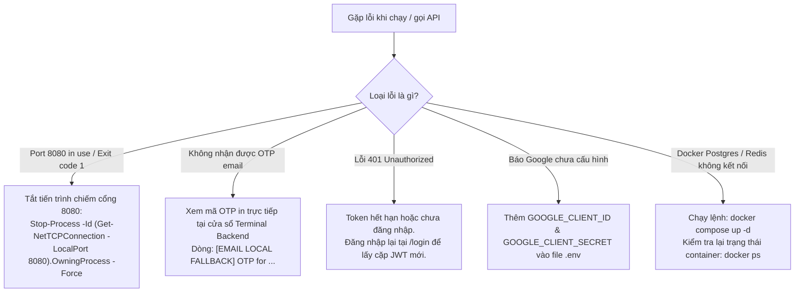

# 📋 NHẬT KÝ KẾT NỐI API: CÁC PHẦN CÒN THIẾU, LỖI THƯỜNG GẶP & CÁCH KHẮC PHỤC
> **Dự án:** TransFlow (TransFlow Media Studio)  
> **Tài liệu theo dõi:** Trạng thái kết nối API Frontend ➔ Backend, các lỗi phát sinh trong quá trình tích hợp và danh sách tính năng cần bổ sung theo từng Phase.  
> **Cập nhật lần cuối:** 21/09/2026  

---

## 📌 MỤC LỤC
1. [Tổng quan Tiến độ Kết nối theo 6 Phase](#1-tổng-quan-tiến-độ-kết-nối-theo-6-phase)
2. [Chi tiết Phase 1: Auth, User & Workspace](#2-chi-tiết-phase-1-auth-user--workspace)
   - [Trạng thái hoàn thành](#21-trạng-thái-hoàn-thành)
   - [Các lỗi đã gặp & Giải pháp xử lý](#22-các-lỗi-đã-gặp--giải-pháp-xử-lý)
   - [Cấu hình môi trường bên ngoài cần bổ sung (.env)](#23-cấu-hình-môi-trường-bên-ngoài-cần-bổ-sung-env)
3. [Danh mục API còn thiếu cần Backend bổ sung (Phase 2 ➔ Phase 6)](#3-danh-mục-api-còn-thiếu-cần-backend-bổ-sung-phase-2--phase-6)
   - [Phase 2: Project, Asset Ingestion & Worker Capabilities](#phase-2-project-asset-ingestion--worker-capabilities)
   - [Phase 3: Media Job Orchestration & Pipeline Execution](#phase-3-media-job-orchestration--pipeline-execution)
   - [Phase 4: Subtitles, Review Workbench & QA Gate](#phase-4-subtitles-review-workbench--qa-gate)
   - [Phase 5: Render Studio, Reframe & Cover Layers](#phase-5-render-studio-reframe--cover-layers)
   - [Phase 6: Packaging, Output Delivery & Export](#phase-6-packaging-output-delivery--export)
4. [Cẩm nang Xử lý Nhanh các Lỗi phổ biến (Troubleshooting Guide)](#4-cẩm-nang-xử-lý-nhanh-các-lỗi-phổ-biến-troubleshooting-guide)

---

## 1. TỔNG QUAN TIẾN ĐỘ KẾT NỐI THEO 6 PHASE

| Phase | Tên phân hệ | Backend Code | Frontend Code | Trạng thái Kết nối | Ghi chú |
| :---: | :--- | :---: | :---: | :---: | :--- |
| **Phase 1** | **Xác thực, Người dùng & Không gian làm việc** (Auth & Workspace) |  100% |  100% | 🟢 **HOÀN THÀNH** | Sẵn sàng hoạt động (cần điền Google / Gmail `.env` khi muốn dùng mail/OAuth thật) |
| **Phase 2** | **Dự án & Năng lực Hạ tầng** (Asset Ingestion & Capabilities) | 🟡 40% |  100% | 🟡 **ĐANG KẾT NỐI** | Thiếu API `/api/transformation/capabilities` |
| **Phase 3** | **Khởi tạo & Điều phối Job** (Job Orchestration & Pipeline) | 🟡 60% |  100% | ⚪ Chờ Phase 2 | Cần đồng bộ trạng thái Job STAGED/SUBMITTED |
| **Phase 4** | **Biên tập Phụ đề & QA** (Review Workbench & Subtitles) | 🟡 50% |  100% | ⚪ Chờ Phase 3 | Thiếu API `/segments/batch` |
| **Phase 5** | **Studio Dựng hình & Lớp phủ** (Render Studio & Reframe) | 🔴 20% |  100% | ⚪ Chờ Phase 4 | Thiếu API `/render-config`, `/subtitle-styles` |
| **Phase 6** | **Đóng gói & Xuất bản** (Packaging & Delivery Export) | 🔴 20% |  100% | ⚪ Chờ Phase 5 | Thiếu API `/export`, `/publish-package` |

---

## 2. CHI TIẾT PHASE 1: AUTH, USER & WORKSPACE

### 2.1 Trạng thái hoàn thành
- [x] `POST /api/auth/register`: Đăng ký tài khoản (Họ tên, Email, Mật khẩu, mã OTP xác thực).
- [x] `POST /api/auth/register/otp`: Gửi mã OTP xác thực email khi đăng ký mới.
- [x] `POST /api/auth/login`: Đăng nhập cấp cặp Token JWT (Access Token 30p, Refresh Token 14 ngày).
- [x] `GET /api/auth/me`: Lấy profile người dùng hiện tại và giữ phiên làm việc.
- [x] `POST /api/auth/refresh`: Tự động làm mới token ngầm khi mã 401 xảy ra.
- [x] `POST /api/auth/forgot-password/otp`: Yêu cầu mã OTP đặt lại mật khẩu.
- [x] `POST /api/auth/forgot-password/verify`: Kiểm tra tính hợp lệ của mã OTP.
- [x] `POST /api/auth/forgot-password/reset`: Đổi mật khẩu mới sau khi xác thực OTP thành công.
- [x] `GET/POST /api/workspaces`: Xem danh sách và tạo không gian làm việc mới.
- [x] `GET/PUT /api/workspaces/{id}/billing-config`: Cấu hình chế độ trừ phí Workspace.
- [x] `GET/POST /api/workspaces/{id}/members`: Danh sách và mời thành viên (hỗ trợ cả alias `/members/invite`).
- [x] `PUT/DELETE /api/workspaces/{id}/members/{id}`: Phân quyền và xóa thành viên khỏi Workspace.
- [x] `GET/POST /api/auth/google/*`: Bộ điều khiển OAuth2 với bảo mật PKCE + OIDC.

---

### 2.2 Các lỗi đã gặp & Giải pháp xử lý

#### Lỗi 1: `Port 8080 was already in use` (Process terminated with exit code: 1)
- **Hiện tượng:** Khi chạy lệnh `mvn spring-boot:run` tại terminal, tiến trình Maven báo lỗi đỏ:  
  `Failed to execute goal org.springframework.boot:spring-boot-maven-plugin:3.3.5:run (default-cli) on project backend-main: Process terminated with exit code: 1`.
- **Nguyên nhân:** Cổng 8080 đã bị một tiến trình Java khác (hoặc backend chạy ngầm trước đó) chiếm giữ.
- **Cách xử lý:**
  1. Mở PowerShell kiểm tra tiến trình đang giữ cổng:
     ```powershell
     Get-Process -Id (Get-NetTCPConnection -LocalPort 8080).OwningProcess
     ```
  2. Tắt tiến trình cũ để giải phóng cổng:
     ```powershell
     Stop-Process -Id (Get-NetTCPConnection -LocalPort 8080).OwningProcess -Force
     ```
  3. Khởi động lại `mvn spring-boot:run`.

#### Lỗi 2: Chưa có tài khoản Gmail SMTP làm tắc nghẽn luồng Đăng ký / Đổi mật khẩu
- **Hiện tượng:** Người dùng chưa cấu hình thông tin gửi mail Gmail, các thao tác cần OTP có thể bị lỗi mạng hoặc không nhận được mã.
- **Giải pháp xử lý (Đã cài đặt):**
  - Tích hợp cơ chế **Smart Local Fallback**: Nếu `.env` chưa có thông tin Gmail, hệ thống không báo lỗi mà tự động in mã OTP trực tiếp ra Terminal:
    ```text
    [EMAIL LOCAL FALLBACK] Mail credentials not configured. OTP for user@example.com: [xxxxxx]
    ```
  - Nhà phát triển có thể copy mã từ terminal để tiếp tục kiểm thử web bình thường.

#### Lỗi 3: Lệch đường dẫn API Mời thành viên (`/members` vs `/members/invite`)
- **Hiện tượng:** Một số tài liệu gọi `/api/workspaces/{id}/members/invite` trong khi controller backend ban đầu chỉ nhận `/api/workspaces/{id}/members`.
- **Giải pháp xử lý (Đã cài đặt):**
  - Đã bổ sung alias `@PostMapping(path = {"/{workspaceId}/members", "/{workspaceId}/members/invite"})` trong `WorkspaceController.java`.

---

### 2.3 Cấu hình môi trường bên ngoài cần bổ sung (.env)
Dành cho khi muốn đưa vào hoạt động thực tế với tài khoản thật của Google:

```env
# 1. Gửi Gmail thật (Yêu cầu mật khẩu ứng dụng Google 16 ký tự)
MAIL_HOST=smtp.gmail.com
MAIL_PORT=587
MAIL_USERNAME=email_cua_ban@gmail.com
MAIL_PASSWORD=xxxx xxxx xxxx xxxx
MAIL_FROM=email_cua_ban@gmail.com

# 2. Đăng nhập Google (Lấy từ Google Cloud Console > Credentials > OAuth 2.0 Client ID)
GOOGLE_CLIENT_ID=your-client-id.apps.googleusercontent.com
GOOGLE_CLIENT_SECRET=GOCSPX-your-secret
GOOGLE_REDIRECT_URI=http://localhost:8080/api/auth/google/callback
```

---

## 3. DANH MỤC API CÒN THIẾU CẦN BACKEND BỔ SUNG (PHASE 2 ➔ PHASE 6)

Dưới đây là các API mà Frontend đã sẵn sàng và đang đợi Backend cài đặt theo kế hoạch:

### Phase 2: Project, Asset Ingestion & Worker Capabilities
* 🔴 **`GET /api/transformation/capabilities`**:
  - **Mức độ:** Cực kỳ quan trọng (Blocker giao diện Media Studio).
  - **Nhiệm vụ:** Kiểm tra tình trạng sẵn sàng của Worker AI (chế độ `FAST` và `STUDIO`).
  - **Trạng thái:** Backend chưa có Controller.
* 🟢 **`GET /api/workspaces/{wsId}/media/terms-version`**:
  - **Nhiệm vụ:** Lấy phiên bản điều khoản bản quyền video (`v1.0`).
* 🟢 **`POST /api/workspaces/{wsId}/projects/{pId}/media/assets`**:
  - **Nhiệm vụ:** Upload multipart file video gốc lên MinIO.
* 🟢 **`POST /api/workspaces/{wsId}/media/assets/{assetId}/consent`**:
  - **Nhiệm vụ:** Lưu xác nhận cam kết bản quyền người dùng.

### Phase 3: Media Job Orchestration & Pipeline Execution
* 🔴 **`POST /api/workspaces/{wsId}/media/jobs`**:
  - **Nhiệm vụ:** Tạo một hoặc nhiều Media Job từ video đã tải lên kèm cấu hình dịch thuật, giọng đọc.
* 🟡 **`POST /api/workspaces/{wsId}/media/jobs/{jobId}/cancel`**:
  - **Nhiệm vụ:** Hủy tiến trình xử lý video đang chạy dở.
* 🟡 **`POST /api/workspaces/{wsId}/media/jobs/{jobId}/rerun-stage`**:
  - **Nhiệm vụ:** Chạy lại một giai đoạn cụ thể (ASR, TRANSLATE, DUBBING, RENDER).

### Phase 4: Subtitles, Review Workbench & QA Gate
* 🔴 **`PUT /api/workspaces/{wsId}/media/jobs/{jobId}/segments/batch`**:
  - **Mức độ:** Cực kỳ quan trọng (Dành cho tính năng "Lưu tất cả" của phụ đề).
  - **Nhiệm vụ:** Lưu hàng loạt thay đổi phụ đề (text, timeline start/end, speaker) trong 1 request.
* 🟢 **`POST /api/workspaces/{wsId}/media/jobs/{jobId}/qa/override`**:
  - **Nhiệm vụ:** Cho phép người dùng vượt qua cảnh báo QA để tiếp tục dựng video.

### Phase 5: Render Studio, Reframe & Cover Layers
* 🔴 **`GET/PUT /api/workspaces/{wsId}/media/jobs/{jobId}/render-config`**:
  - **Nhiệm vụ:** Lưu và lấy cấu hình render khung hình (`16:9`, `9:16`, `1:1`), thuật toán Reframe và tối đa 4 lớp phủ (Cover Layers).
* 🔴 **`GET/POST/PUT/DELETE /api/media/subtitle-styles`**:
  - **Nhiệm vụ:** Quản lý mẫu phong cách phụ đề (Font chữ, màu sắc, vị trí, hiệu ứng karaoke).

### Phase 6: Packaging, Output Delivery & Export
* 🔴 **`POST /api/workspaces/{wsId}/media/jobs/{jobId}/export`**:
  - **Nhiệm vụ:** Kích hoạt xuất bản video thành phẩm, tải về file MP4 hoặc file phụ đề rời (.SRT, .VTT).
* 🔴 **`GET /api/workspaces/{wsId}/media/jobs/{jobId}/output-package`**:
  - **Nhiệm vụ:** Lấy đường dẫn tải gói sản phẩm hoàn chỉnh (Video + Phụ đề đa ngữ + Báo cáo QA).

---

## 4. CẨM NANG XỬ LÝ NHANH CÁC LỖI PHỔ BIẾN (TROUBLESHOOTING GUIDE)



---
*Tài liệu này được duy trì liên tục trong suốt quá trình kết nối API giữa Frontend và Backend.*
