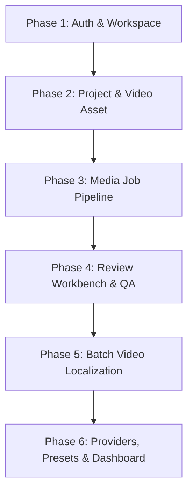

# 🛠️ TÀI LIỆU KỸ THUẬT: BACKEND THIẾU IMPLEMENT & KẾ HOẠCH KẾT NỐI API TOÀN DIỆN

> **Dự án:** TransFlow (TransFlow Mini)  
> **Ngày lập:** 19/09/2026  
> **Tài liệu căn cứ:** `docs/API_Contract.md`, `docs/api-response-convention.md`, `docs/API_AUDIT_REPORT.md`  
> **Trạng thái Frontend:** Đã hoàn thành sửa các lỗi URL lệch và tự động unwrap `ApiResponse<T>`.

---

## 📑 MỤC LỤC
1. [Phần 1: Chi tiết các Endpoint Backend còn thiếu (High Priority) & Hướng giải quyết](#phần-1-chi-tiết-các-endpoint-backend-còn-thiếu-high-priority--hướng-giải-quyết)
   - [1.1 Xuất bản & Tải kết quả Media Job (`/export`)](#11-xuất-bản--tải-kết-quả-media-job-export)
   - [1.2 Tải gói nén Video Batch (`/download`)](#12-tải-gói-nén-video-batch-download)
   - [1.3 Sửa phụ đề hàng loạt (`/segments/batch`)](#13-sửa-phụ-đề-hàng-loạt-segmentsbatch)
   - [1.4 Quên mật khẩu & Đặt lại mật khẩu qua OTP](#14-quên-mật-khẩu--đặt-lại-mật-khẩu-qua-otp)
   - [1.5 Nghe thử giọng đọc TTS (`/voices/preview`)](#15-nghe-thử-giọng-đọc-tts-voicespreview)
   - [1.6 Cấu hình Dựng hình & Delivery Package (`render-config`)](#16-cấu-hình-dựng-hình--delivery-package-render-config)
   - [1.7 Thống nhất kiến trúc Provider (BYOK) & Glossary](#17-thống-nhất-kiến-trúc-provider-byok--glossary)
2. [Phần 2: Kế hoạch Kết nối API Toàn diện (Integration Master Plan)](#phần-2-kế-hoạch-kết-nối-api-toàn-diện-integration-master-plan)
   - [2.1 Chuyển đổi môi trường: Tắt Mock sang Backend thật](#21-chuyển-đổi-môi-trường-tắt-mock-sang-backend-thật)
   - [2.2 Cấu hình CORS & Spring Security](#22-cấu-hình-cors--spring-security)
   - [2.3 Lộ trình kết nối 6 Phase chi tiết](#23-lộ-trình-kết-nối-6-phase-chi-tiết)
   - [2.4 Bảng kiểm thử tích hợp (Integration Checklist & Edge Cases)](#24-bảng-kiểm-thử-tích-hợp-integration-checklist--edge-cases)

---

## PHẦN 1: CHI TIẾT CÁC ENDPOINT BACKEND CÒN THIẾU (HIGH PRIORITY) & HƯỚNG GIẢI QUYẾT

---

### 1.1 Xuất bản & Tải kết quả Media Job (`/export`)
* **Mức độ:** 🔴 **CRITICAL** (Không có endpoint này, user không thể lấy được video hoặc phụ đề đã hoàn thành).
* **Đặc tả trong Docs (`API_Contract.md` §5):**
  - **Path:** `GET /api/workspaces/{workspaceId}/media/jobs/{jobId}/export?format=VIDEO|SUBTITLE`
  - **Quyền:** `LEAD / MEMBER / CLIENT`
  - **Ràng buộc:** Trả về `403 FORBIDDEN` nếu còn QA issue ở mức `CRITICAL` chưa được override (theo SRS §5.3).
* **Hiện trạng Backend:** Chưa có trong `MediaJobController.java`.
* **Hướng giải quyết (Backend Implementation):**

#### 1.1.1 DTO Response:
```java
package com.app.modules.media_job.dto;

import lombok.*;

@Data
@Builder
@NoArgsConstructor
@AllArgsConstructor
public class MediaExportResponse {
    private String format;           // "VIDEO", "SRT", "VTT"
    private String fileName;         // e.g. "my_video_vi.mp4"
    private String downloadUrl;      // Presigned MinIO/S3 URL (hết hạn sau 1h)
    private String content;          // Chứa raw text nếu là SRT/VTT (phục vụ xem/tải trực tiếp)
}
```

#### 1.1.2 Controller Method (`MediaJobController.java`):
```java
@GetMapping("/media/jobs/{jobId}/export")
public ApiResponse<MediaExportResponse> exportJob(
        @PathVariable UUID workspaceId,
        @PathVariable UUID jobId,
        @RequestParam(defaultValue = "VIDEO") String format,
        @AuthenticationPrincipal AuthenticatedUser user) {
    MediaExportResponse res = mediaJobService.exportJob(workspaceId, user.id(), jobId, format);
    return ApiResponse.<MediaExportResponse>builder().data(res).build();
}
```

#### 1.1.3 Service Logic:
1. Kiểm tra quyền truy cập project chứa job.
2. Kiểm tra trạng thái job (`COMPLETED`).
3. Kiểm tra QA issues: `qaIssueRepository.countBlockingCritical(jobId) > 0` $\rightarrow$ ném `AppException(ErrorCode.QA_BLOCKED)`.
4. Nếu `format == "SUBTITLE"`: đọc các record `subtitle_segments` theo `seq`, format ra chuỗi SRT hoặc WebVTT, gán vào trường `content`.
5. Nếu `format == "VIDEO"`: lấy `storage_ref` của video hoàn thành, sinh Presigned URL từ MinIO/S3.

---

### 1.2 Tải gói nén Video Batch (`/download`)
* **Mức độ:** 🟡 **HIGH** (Phục vụ khách hàng xử lý video hàng loạt).
* **Đặc tả trong Docs (`API_Contract.md` §6):**
  - **Path:** `GET /api/workspaces/{workspaceId}/batches/{batchId}/download`
  - **Quyền:** `LEAD / MEMBER / CLIENT`
  - **Mô tả:** Trả về URL tải gói nén (zip) kết quả của tất cả các job con đã `COMPLETED`.
* **Hiện trạng Backend:** Chưa có trong `BatchController.java`.
* **Hướng giải quyết:**
  1. Thêm endpoint `GET /api/workspaces/{workspaceId}/batches/{batchId}/download`.
  2. Service kiểm tra các job con thuộc batch có `status == COMPLETED`.
  3. Sử dụng `ZipOutputStream` stream dữ liệu từ MinIO trực tiếp về client hoặc nén lưu tạm trên MinIO `batches/{batchId}/deliverables.zip` rồi trả presigned URL.

---

### 1.3 Sửa phụ đề hàng loạt (`/segments/batch`)
* **Mức độ:** 🟡 **HIGH** (Tối ưu UX cho màn hình Review Workbench).
* **Vấn đề:**
  - Backend hiện tại chỉ có: `PATCH /api/workspaces/{workspaceId}/media/jobs/{jobId}/subtitles/{segmentId}` (sửa từng câu đơn lẻ).
  - Frontend Review Workbench cho phép biên tập phụ đề nhiều dòng, khi bấm "Save All" sẽ gọi:  
    `PUT /api/workspaces/{workspaceId}/media/jobs/{jobId}/segments/batch`.
  - Nếu không có endpoint batch, Frontend phải gửi 50-100 request HTTP đồng thời, dễ dẫn tới race condition hoặc quá tải.
* **Hướng giải quyết (Backend Implementation):**

#### 1.3.1 DTO Request:
```java
package com.app.modules.media_job.dto;

import lombok.Data;
import java.util.List;
import java.util.UUID;

@Data
public class BatchEditSegmentsRequest {
    private List<SegmentUpdateItem> updates;

    @Data
    public static class SegmentUpdateItem {
        private UUID segmentId;
        private String targetText;
        private Long startMs;
        private Long endMs;
    }
}
```

#### 1.3.2 Controller Method (`MediaJobController.java`):
```java
@PutMapping("/media/jobs/{jobId}/segments/batch")
public ApiResponse<List<SubtitleSegmentResponse>> batchUpdateSubtitles(
        @PathVariable UUID workspaceId,
        @PathVariable UUID jobId,
        @Valid @RequestBody BatchEditSegmentsRequest request,
        @AuthenticationPrincipal AuthenticatedUser user) {
    List<SubtitleSegmentResponse> res = mediaJobService.batchUpdateSubtitles(
        workspaceId, user.id(), jobId, request.getUpdates()
    );
    return ApiResponse.<List<SubtitleSegmentResponse>>builder().data(res).build();
}
```

#### 1.3.3 Service Logic:
- Chạy trong 1 `@Transactional`.
- Cập nhật toàn bộ các segment thuộc `jobId`.
- Nếu job đã trải qua các stage TTS hoặc RENDER, tự động set các stage phía sau thành `STALE` đúng 1 lần (theo SRS §5.3).

---

### 1.4 Quên mật khẩu & Đặt lại mật khẩu qua OTP
* **Mức độ:** 🟡 **HIGH** (Tính năng Auth cơ bản cho người dùng).
* **Vấn đề:** Frontend `auth.ts` có 3 hàm đã thiết kế giao diện:
  1. `POST /api/auth/forgot-password/otp`: Gửi OTP qua email.
  2. `POST /api/auth/forgot-password/verify`: Kiểm tra mã OTP.
  3. `POST /api/auth/forgot-password/reset`: Đổi mật khẩu mới kèm OTP đã xác thực.
* **Hướng giải quyết:**
  1. Lưu mã OTP tạm thời vào Redis với TTL = 5 phút (Key: `otp:pwd_reset:<email>`).
  2. Nếu hệ thống chưa gắn dịch vụ SMTP/SendGrid, trong môi trường dev (`application-dev.yml`): log mã OTP ra terminal console để test nhanh.
  3. Khi reset thành công, mã hóa `BCryptPasswordEncoder` và cập nhật cột `password_hash` trong bảng `users`.

---

### 1.5 Nghe thử giọng đọc TTS (`/voices/preview`)
* **Mức độ:** 🟢 **MEDIUM** (Hỗ trợ người dùng nghe thử âm sắc trước khi chốt tạo job).
* **Vấn đề:** Frontend `VoiceSelector.tsx` có nút Play Demo cho từng giọng đọc, gọi `POST /api/users/me/providers/{id}/voices/preview` (hoặc `/api/tts-voices/preview`).
* **Hướng giải quyết:**
  - Thêm endpoint `POST /api/tts-voices/preview` nhận `{ voiceId: "uuid", text: "Xin chào" }`.
  - Gọi xuống `backend-ai` (FastAPI) endpoint `/media/tts/synthesize` với sample text ngắn (dưới 50 ký tự), trả về URL file audio demo mp3 ngắn (2-3 giây).

---

### 1.6 Cấu hình Dựng hình & Delivery Package (`render-config`)
* **Mức độ:** 🟢 **MEDIUM**.
* **Vấn đề:** Màn hình chuẩn bị Render (Phase 6) ở Frontend cho phép cấu hình:
  - Tỉ lệ khung hình (`ORIGINAL`, `16:9`, `9:16`, `1:1`).
  - Gắn nhãn che / Cover Layers đè lên phụ đề cũ (tối đa 4 layer).
  - Tùy chọn burn hard-sub hay soft-sub.
* **Hướng giải quyết:**
  - Trong bảng `media_jobs` đã có sẵn cột JSONB `render_config`.
  - Thêm 2 endpoints trong `MediaJobController.java`:
    - `GET /api/workspaces/{workspaceId}/media/jobs/{jobId}/render-config`
    - `PUT /api/workspaces/{workspaceId}/media/jobs/{jobId}/render-config`
  - Khi lưu, cập nhật trực tiếp vào cột `render_config` của job.

---

### 1.7 Thống nhất kiến trúc Provider (BYOK) & Glossary
* **Provider (BYOK - Bring Your Own Key):**
  - **Docs & Backend:** Quản lý theo từng User (`/api/users/me/providers`). Lý do bảo mật: API Key OpenAI/Claude của user nào thì chỉ user đó quản lý và chịu chi phí.
  - **Frontend:** Trước đó gọi `/workspaces/{id}/providers`.
  - **Giải pháp:** Giữ nguyên thiết kế chuẩn bảo mật của Backend (`/api/users/me/providers`), cập nhật lại màn hình Settings/Providers trên Frontend để gọi đúng URL cá nhân của user.
* **Glossary (Bảng thuật ngữ):**
  - **Docs & Backend:** Quản lý theo từng Project (`/projects/{projectId}/glossary`). Lý do: Mỗi dự án dịch thuật có bộ từ vựng chuyên ngành riêng.
  - **Frontend:** Trước đó gọi theo Workspace (`/workspaces/{id}/glossaries`).
  - **Giải pháp:** Cập nhật Frontend `glossary.ts` nhận tham số `projectId` và gọi đường dẫn `/projects/{projectId}/glossary`.

---

## PHẦN 2: KẾ HOẠCH KẾT NỐI API TOÀN DIỆN (INTEGRATION MASTER PLAN)

---

### 2.1 Chuyển đổi môi trường: Tắt Mock sang Backend thật

Mặc định Frontend đang kích hoạt plugin Mock Server. Để kết nối với Backend Spring Boot thật (cổng `8080`), thực hiện 2 thao tác trong [`frontend/vite.config.ts`](file:///D:/Project/Project_Kada/TransFlow/frontend/vite.config.ts):

#### Bước 1: Comment dòng `mockApiPlugin()`
```typescript
export default defineConfig({
  plugins: [
    react(),
    tailwindcss(),
    // TẮT MOCK ĐỂ DÙNG BACKEND THẬT:
    // mockApiPlugin(), 
  ],
```

#### Bước 2: Bật khối `proxy` chuyển tiếp request `/api` sang Spring Boot
```typescript
  server: {
    port: 5173,
    proxy: {
      '/api': {
        target: 'http://localhost:8080',
        changeOrigin: true,
        secure: false,
      },
    },
  },
```

---

### 2.2 Cấu hình CORS & Spring Security

Đảm bảo file `SecurityConfig.java` trong Backend cho phép frontend localhost gọi qua:

```java
@Bean
public CorsConfigurationSource corsConfigurationSource() {
    CorsConfiguration configuration = new CorsConfiguration();
    configuration.setAllowedOrigins(List.of("http://localhost:5173", "http://127.0.0.1:5173"));
    configuration.setAllowedMethods(List.of("GET", "POST", "PUT", "PATCH", "DELETE", "OPTIONS"));
    configuration.setAllowedHeaders(List.of("Authorization", "Content-Type", "Accept", "X-Requested-With"));
    configuration.setAllowCredentials(true);
    UrlBasedCorsConfigurationSource source = new UrlBasedCorsConfigurationSource();
    source.registerCorsConfiguration("/**", configuration);
    return source;
}
```

---

### 2.3 Lộ trình kết nối 6 Phase chi tiết



#### 🔹 Phase 1: Authentication & Workspace (Nền tảng người dùng)
* **Mục tiêu:** Đăng nhập, nhận JWT Token, tự động khởi tạo Workspace & Project đầu tiên.
* **Các API tích hợp:**
  1. `POST /api/auth/register` & `POST /api/auth/login` $\rightarrow$ Lưu `accessToken` và `refreshToken` vào LocalStorage/Zustand Store.
  2. `GET /api/auth/me` $\rightarrow$ Lấy thông tin user đăng nhập.
  3. `GET /api/workspaces` $\rightarrow$ Lấy danh sách workspace.
  4. `GET /api/workspaces/{id}/members` $\rightarrow$ Hiển thị thành viên và role (`LEAD`, `MEMBER`, `CLIENT`).
* **Tiêu chí nghiệm thu (Acceptance Criteria):** Đăng nhập thành công, F5 trang không bị logout, hiển thị đúng tên Workspace trên thanh điều hướng.

---

#### 🔹 Phase 2: Project & Media Asset (Quản lý Video đầu vào)
* **Mục tiêu:** Tạo Project, tải video lên MinIO, xác nhận bản quyền nội dung.
* **Các API tích hợp:**
  1. `GET/POST /api/workspaces/{id}/projects` $\rightarrow$ Tạo và chọn dự án.
  2. `GET /api/workspaces/{id}/media/terms-version` $\rightarrow$ Lấy phiên bản điều khoản bản quyền hiện hành.
  3. `POST /api/workspaces/{id}/projects/{pid}/media/assets` (Multipart XHR) $\rightarrow$ Tải file video lên (validate $\le$ 500MB, $\le$ 30 phút), hiển thị thanh tiến trình 0% - 100%.
  4. `POST /api/workspaces/{id}/media/assets/{aid}/consent` $\rightarrow$ Ký xác nhận đồng ý điều khoản bản quyền.
* **Tiêu chí nghiệm thu:** Upload video xong trả về `assetId`, modal Consent hiển thị đúng phiên bản điều khoản, ký consent thành công mới mở khóa nút tạo Job.

---

#### 🔹 Phase 3: Media Studio Orchestrator (Xử lý Video AI)
* **Mục tiêu:** Khởi tạo tiến trình dịch/tóm tắt video và theo dõi trạng thái thời gian thực.
* **Các API tích hợp:**
  1. `POST /api/workspaces/{id}/media/jobs` $\rightarrow$ Tạo Job (chọn Recipe: `localization.full` hoặc `summary.script_match`).
  2. `GET /api/workspaces/{id}/media/jobs/{jobId}` (Polling 3s - 5s một lần):
     - Theo dõi 8 stage: `EXTRACT_AUDIO` $\rightarrow$ `SOURCE_SEPARATION` $\rightarrow$ `STT` $\rightarrow$ `SUMMARIZE` $\rightarrow$ `TRANSLATE` $\rightarrow$ `TTS` $\rightarrow$ `AUDIO_MIX` $\rightarrow$ `RENDER`.
     - Cập nhật tiến độ `progressPercent` của từng stage lên thanh Pipeline Stepper.
  3. `POST /api/workspaces/{id}/media/jobs/{jobId}/cancel` $\rightarrow$ Hủy job đang chạy.
  4. `POST /api/workspaces/{id}/media/jobs/{jobId}/stages/{stage}/rerun` $\rightarrow$ Chạy lại từ một stage cụ thể khi muốn đổi cấu hình.
* **Tiêu chí nghiệm thu:** Job chuyển trạng thái mượt mà từ `PENDING` $\rightarrow$ `PROCESSING` $\rightarrow$ `COMPLETED`. Accordion tự động mở màn hình tương ứng khi stage hoàn tất.

---

#### 🔹 Phase 4: Review Workbench & Quality Gate (Duyệt kịch bản & Phụ đề)
* **Mục tiêu:** Kiểm tra chất lượng phụ đề, sửa phụ đề, duyệt đề xuất tóm tắt và xử lý cảnh báo QA.
* **Các API tích hợp:**
  1. `GET /api/workspaces/{id}/media/jobs/{jobId}/subtitles` $\rightarrow$ Tải toàn bộ các đoạn phụ đề kèm mốc thời gian (`startMs`, `endMs`, `targetText`).
  2. `PUT /api/workspaces/{id}/media/jobs/{jobId}/segments/batch` $\rightarrow$ Lưu hàng loạt các đoạn phụ đề đã chỉnh sửa.
  3. `GET /api/workspaces/{id}/media/jobs/{jobId}/qa-issues` $\rightarrow$ Hiển thị các lỗi chất lượng (trùng mốc thời gian, ký tự quá dài, từ cấm).
  4. `POST /api/workspaces/{id}/qa-issues/{issueId}/override` $\rightarrow$ Trưởng nhóm/Người tạo job ghi chú lý do bỏ qua cảnh báo để tiếp tục render.
  5. `GET /api/workspaces/{id}/media/jobs/{jobId}/proposals` & `POST .../select` $\rightarrow$ Với job tóm tắt: xem các kịch bản rút gọn và chọn phương án ưng ý.
* **Tiêu chí nghiệm thu:** Sửa text phụ đề cập nhật tức thì lên khung phát video preview. Mọi QA Issue mức `CRITICAL` phải được xử lý hoặc override thì mới cho Render.

---

#### 🔹 Phase 5: Video Batch Localization (Xử lý hàng loạt)
* **Mục tiêu:** Tạo 1 batch gồm nhiều video (tối đa 20 video), áp dụng chung 1 cấu hình dịch.
* **Các API tích hợp:**
  1. `POST /api/workspaces/{id}/projects/{pid}/batches` $\rightarrow$ Tạo batch dịch.
  2. `GET /api/workspaces/{id}/batches/{batchId}` $\rightarrow$ Xem bảng tổng hợp tiến độ của tất cả các video con.
  3. `POST /api/workspaces/{id}/batches/{bid}/jobs/{jid}/retry` $\rightarrow$ Chạy lại riêng video con bị lỗi mà không ảnh hưởng video khác.
  4. `GET /api/workspaces/{id}/batches/{batchId}/download` $\rightarrow$ Tải file zip tổng hợp kết quả.
* **Tiêu chí nghiệm thu:** Batch rate limiter chặn nếu tạo quá 5 batch/10 phút; hiển thị rõ ràng từng job con thành công/thất bại.

---

#### 🔹 Phase 6: Dịch vụ hỗ trợ (Preset, BYOK, Credit & Dashboard)
* **Mục tiêu:** Quản lý mẫu cấu hình sẵn, nguồn AI riêng và thống kê chi phí.
* **Các API tích hợp:**
  1. `GET/POST/PUT/DELETE /api/workspaces/{id}/presets` $\rightarrow$ Quản lý preset cấp Workspace và Project.
  2. `GET /api/media/presets/templates` $\rightarrow$ Đọc danh mục preset mẫu của hệ thống.
  3. `GET/POST/PUT/DELETE /api/users/me/providers` $\rightarrow$ Nhập API Key cá nhân (OpenAI, Claude, ElevenLabs) mã hóa AES-GCM an toàn.
  4. `GET /api/users/me/credit` & `GET /api/users/me/credit/transactions` $\rightarrow$ Kiểm tra số dư credit và lịch sử trừ phí.
  5. `GET /api/workspaces/{id}/usage` $\rightarrow$ Biểu đồ tiêu thụ token AI theo ngày/dự án trên Dashboard.
  6. `GET /api/workspaces/{id}/notifications` $\rightarrow$ Thông báo pop-up khi video hoàn thành hoặc thất bại.
* **Tiêu chí nghiệm thu:** Thêm key BYOK thành công có thể test connection; dashboard vẽ biểu đồ chính xác theo log usage thực tế.

---

### 2.4 Bảng kiểm thử tích hợp (Integration Checklist & Edge Cases)

| Kịch bản kiểm thử | Hành vi kỳ vọng | Mã lỗi / Trạng thái |
| :--- | :--- | :--- |
| **Token hết hạn khi đang thao tác** | Frontend tự gọi `/api/auth/refresh` bằng refresh token ngầm, retry lại request gốc không làm gián đoạn user. | `200 OK` (Auto-refresh) |
| **Upload video vượt quá 500MB hoặc 30 phút** | Backend từ chối ngay sau khi kiểm tra header hoặc sau khi ffprobe, FE hiện toast lỗi rõ ràng. | `400 BAD_REQUEST`<br>`MEDIA_FILE_TOO_LARGE` (2801) |
| **Tạo job từ asset chưa ký Consent** | Backend chặn không cho tạo job. | `403 FORBIDDEN`<br>`TERMS_NOT_ACCEPTED` (2800) |
| **Tài khoản không đủ Credit** | Chặn ở bước tạo job nếu số dư không đủ định mức tạm giữ (Block upfront). | `402 PAYMENT_REQUIRED`<br>`INSUFFICIENT_CREDIT` (2300) |
| **Chọn giọng TTS khác ngôn ngữ đích** | Ví dụ: dịch sang tiếng Nhật (`ja`) nhưng chọn giọng tiếng Việt (`vi`) $\rightarrow$ Backend từ chối ngay. | `400 BAD_REQUEST`<br>`VOICE_LANGUAGE_MISMATCH` (2900) |
| **Chạy lại stage khi stage trước chưa xong** | Cố tình rerun `RENDER` khi `TRANSLATE` chưa `COMPLETED`. | `409 CONFLICT`<br>`STAGE_NOT_READY` (2902) |
| **User role `CLIENT` cố tình xác nhận Checkpoint** | Chỉ Lead hoặc Member sở hữu job mới được confirm checkpoint/override QA. Client luôn bị từ chối. | `403 FORBIDDEN`<br>`JOB_OWNERSHIP_REQUIRED` (2901) |
| **Xuất video khi còn lỗi QA `CRITICAL`** | Không cho phép tải file thành phẩm nếu còn lỗi trùng phụ đề nghiêm trọng chưa được duyệt. | `403 FORBIDDEN`<br>`QA_BLOCKED` (3300) |
| **Tạo Batch vượt quá 20 video** | Báo lỗi giới hạn số lượng video trong một mẻ. | `400 BAD_REQUEST`<br>`BATCH_SIZE_EXCEEDED` (3100) |
| **Refine kịch bản tóm tắt quá 5 lần/phiên** | Giới hạn 5 lần yêu cầu AI viết lại kịch bản để tránh lạm dụng token. | `429 TOO_MANY_REQUESTS`<br>`REFINE_LIMIT_REACHED` (3000) |

---

## 📌 TỔNG KẾT BÀN GIAO CHO TEAM

1. **Frontend:** Đã hoàn toàn tương thích với Spring Boot:
   - Tự động unwrap envelope `{ code: 1000, data: T }` trong `client.ts`.
   - Chuẩn hóa toàn bộ URL sang `/media/jobs`, `/presets`, `/media/assets`.
   - Mock Server đã hỗ trợ cả 2 chuẩn route để dev độc lập không bị ảnh hưởng.
2. **Backend:** Cần bổ sung 3 endpoint quan trọng nhất:
   - `GET .../media/jobs/{jobId}/export` (Export video/subtitle).
   - `PUT .../media/jobs/{jobId}/segments/batch` (Lưu phụ đề hàng loạt).
   - `GET .../batches/{batchId}/download` (Tải zip kết quả batch).
3. **Kết nối:** Bám sát theo **Lộ trình 6 Phase** ở Mục 2.3 để cắm nối từng module một cách trơn tru và an toàn!
