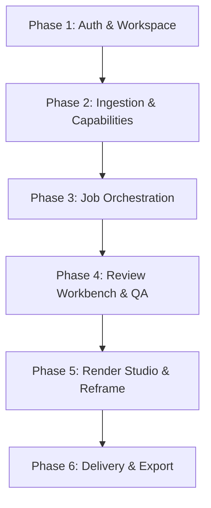
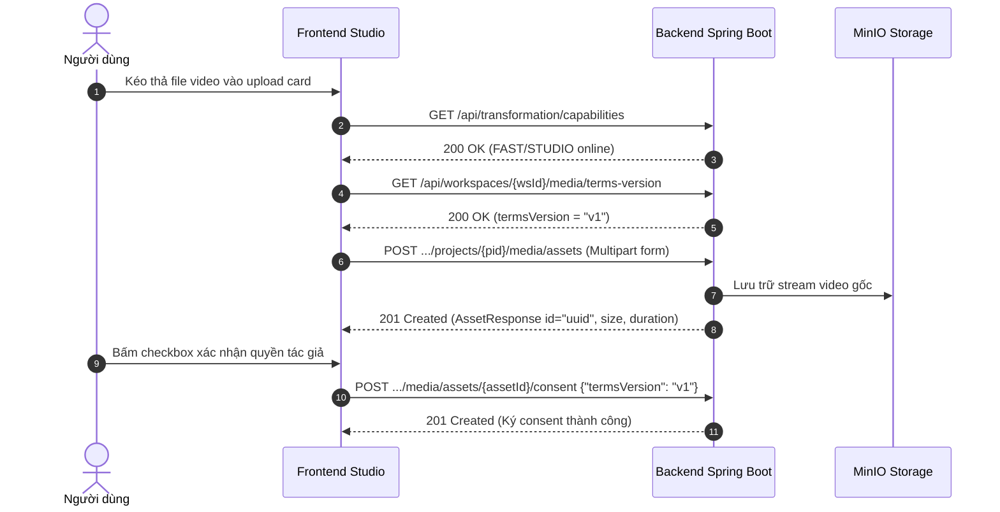
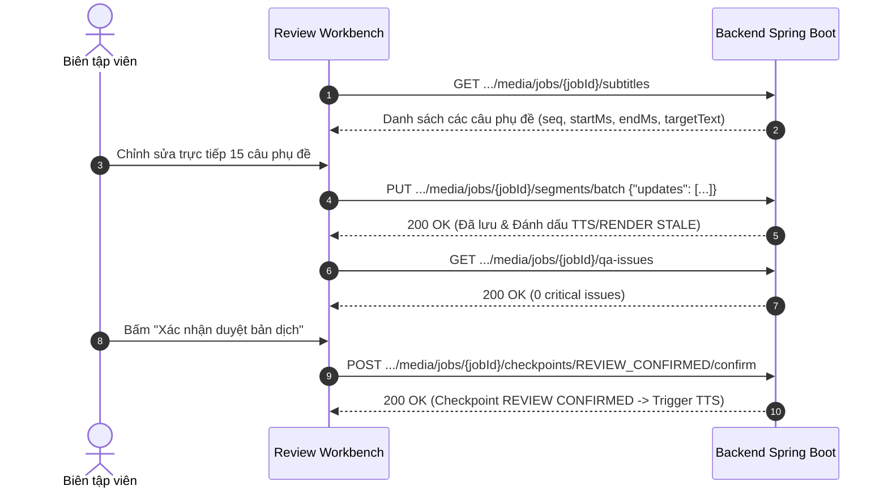
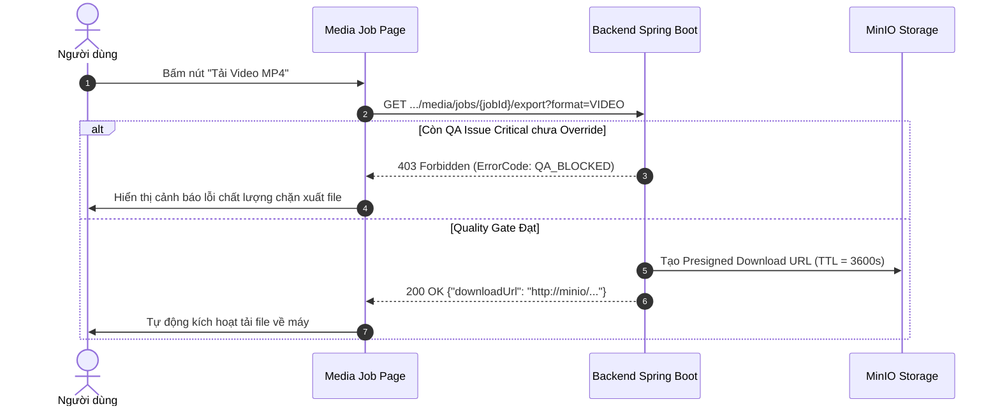

# 🛠️ TÀI LIỆU KỸ THUẬT: BACKEND THIẾU IMPLEMENT & KẾ HOẠCH KẾT NỐI API TOÀN DIỆN (CHIA THEO PHASE)

> **Dự án:** TransFlow (TransFlow Mini)  
> **Phiên bản tài liệu:** v2.0 (Cập nhật sau đợt nâng cấp Media Studio 2026-09)  
> **Ngày cập nhật:** 21/09/2026  
> **Tài liệu căn cứ:** `docs/API_Contract.md`, `docs/api-response-convention.md`, `docs/SRS.md`, `docs/System_Architecture.md`, `docs/Database_Design.md`  
> **Trạng thái Frontend:** ✅ **100% PASS** — Toàn bộ 474 bài test Media Studio cùng toàn bộ hệ thống test suite Frontend đang PASS. Lệnh `npm run build` hoàn thành với 0 cảnh báo/lỗi.

---

## 📑 MỤC LỤC
1. [Phần 1: Thẩm định Chi tiết Toàn bộ Endpoint Backend còn thiếu](#phần-1-thẩm-định-chi-tiết-toàn-bộ-endpoint-backend-còn-thiếu)
   - [1.1 Worker Capabilities & Readiness (`/api/transformation/capabilities`) — 🔴 BẮT BUỘC](#11-worker-capabilities--readiness-apitransformationcapabilities--bắt-buộc)
   - [1.2 Cấu hình Dựng hình Render Studio v2 (`/render-config`) — 🔴 BẮT BUỘC](#12-cấu-hình-dựng-hình-render-studio-v2-render-config--bắt-buộc)
   - [1.3 Sửa phụ đề hàng loạt (`/segments/batch`) — 🔴 BẮT BUỘC](#13-sửa-phụ-đề-hàng-loạt-segmentsbatch--bắt-buộc)
   - [1.4 Xuất bản & Tải kết quả Media Job (`/export`) — 🔴 BẮT BUỘC](#14-xuất-bản--tải-kết-quả-media-job-export--bắt-buộc)
   - [1.5 Gói phân phối đầu ra (`/output-package` & `/publish-package`) — 🔴 BẮT BUỘC](#15-gói-phân-phối-đầu-ra-output-package--publish-package--bắt-buộc)
   - [1.6 Phong cách Phụ đề (`/media/subtitle-styles`) — 🔴 BẮT BUỘC CHO STUDIO](#16-phong-cách-phụ-đề-mediasubtitle-styles--bắt-buộc-cho-studio)
   - [1.7 Tải gói nén Video Batch (`/download`) — 🟡 CẦN THIẾT](#17-tải-gói-nén-video-batch-download--cần-thiết)
   - [1.8 Nghe thử giọng đọc TTS (`/voices/preview`) — 🟡 NÊN CÓ](#18-nghe-thử-giọng-đọc-tts-voicespreview--nên-có)
   - [1.9 Ghi đè Ngôn ngữ gốc Video (`/override-source-lang`) — 🟢 TIỆN ÍCH](#19-ghi-đè-ngôn-ngữ-gốc-video-override-source-lang--tiện-ích)
   - [1.10 Quên mật khẩu & Đặt lại mật khẩu qua OTP — 🟢 TRUNG BÌNH](#110-quên-mật-khẩu--đặt-lại-mật-khẩu-qua-otp--trung-bình)
   - [1.11 Quản trị Hệ thống Platform Super Admin (`/api/platform/*`) — 🟡 CẦN THIẾT](#111-quản-trị-hệ-thống-platform-super-admin-apiplatform--cần-thiết)
2. [Phần 2: Nhật ký Chuẩn hóa Frontend & Cơ chế Tương thích Ngược (Dual-Mode)](#phần-2-nhật-ký-chuẩn-hóa-frontend--cơ-chế-tương-thích-ngược-dual-mode)
3. [Phần 3: Hướng dẫn Cấu hình Môi trường Kết nối API (Chuyển Mock sang BE thật)](#phần-3-hướng-dẫn-cấu-hình-môi-trường-kết-nối-api-chuyển-mock-sang-be-thật)
4. [Phần 4: Lộ trình Kết nối Chi tiết theo 6 Phase & Đặc tả Toàn bộ API](#phần-4-lộ-trình-kết-nối-chi-tiết-theo-6-phase--đặc-tả-toàn-bộ-api)
   - [Phase 1: Xác thực, Người dùng & Không gian làm việc (Auth & Workspace)](#phase-1-xác-thực-người-dùng--không-gian-làm-việc-auth--workspace)
   - [Phase 2: Dự án, Tiếp nhận Video Asset & Kiểm tra Năng lực Hạ tầng (Asset Ingestion & Capabilities)](#phase-2-dự-án-tiếp-nhận-video-asset--kiểm-tra-năng-lực-hạ-tầng-asset-ingestion--capabilities)
   - [Phase 3: Khởi tạo & Điều phối Pipeline Media Job (Job Orchestration & Pipeline Execution)](#phase-3-khởi-tạo--điều-phối-pipeline-media-job-job-orchestration--pipeline-execution)
   - [Phase 4: Không gian Biên tập Phụ đề & Đảm bảo Chất lượng (Review Workbench, Subtitles & QA Gate)](#phase-4-không-gian-biên-tập-phụ-đề--đảm-bảo-chất-lượng-review-workbench-subtitles--qa-gate)
   - [Phase 5: Studio Dựng hình, Reframe & Quản lý Lớp phủ (Render Studio, Reframe & Layers)](#phase-5-studio-dựng-hình-reframe--quản-lý-lớp-phủ-render-studio-reframe--layers)
   - [Phase 6: Đóng gói Thành phẩm, Xuất file & Phân phối (Packaging, Export & Delivery)](#phase-6-đóng-gói-thành-phẩm-xuất-file--phân-phối-packaging-export--delivery)
   - [Phụ lục: Các API Phân hệ Vệ tinh & Hỗ trợ (Supporting Modules API Directory)](#phụ-lục-các-api-phân-hệ-vệ-tinh--hỗ-trợ-supporting-modules-api-directory)
5. [Phần 5: Bảng Ma trận Mã lỗi & Kịch bản Kiểm thử Tích hợp (Integration Edge Cases)](#phần-5-bảng-ma-trận-mã-lỗi--kịch-bản-kiểm-thử-tích-hợp-integration-edge-cases)

---

## PHẦN 1: THẨM ĐỊNH CHI TIẾT TOÀN BỘ ENDPOINT BACKEND CÒN THIẾU

Rà soát từ `backend-main` (kiến trúc `com.app.modules.*`), dưới đây là danh sách các API cần được code bổ sung để đáp ứng trọn vẹn toàn bộ tính năng của Media Studio mới.

---

### 1.1 Worker Capabilities & Readiness (`/api/transformation/capabilities`) — 🔴 BẮT BUỘC
* **Đánh giá nghiệp vụ:** **CỰC KỲ QUAN TRỌNG (BLOCKER GIAO DIỆN TẠO JOB)**.  
  Trong `UploadConsentPanel.tsx`, Frontend gọi endpoint này ngay khi mở trang để xác định các chế độ xử lý âm thanh (`FAST` - dịch/dub lồng tiếng chuẩn, `STUDIO` - lồng tiếng nâng cao giữ ngữ điệu). Đồng thời trước khi ấn nút "Tạo Job", Frontend revalidate lại năng lực worker để tránh dispatch job vào hàng đợi chết.
* **Hiện trạng Backend:** Chưa có controller nào phục vụ route `/api/transformation/capabilities`.
* **Đặc tả API:**
  - **Path:** `GET /api/transformation/capabilities`
  - **Auth:** Public / Authenticated User (Deployment-wide, không gắn với `workspaceId`).
  - **HTTP Status:** `200 OK`.

#### 1.1.1 DTO Response (`com.app.modules.media_job.dto.AvailabilityProjectionResponse`):
```java
package com.app.modules.media_job.dto;

import lombok.Builder;
import lombok.Data;
import java.time.Instant;
import java.util.List;
import java.util.Map;
import java.util.Set;

@Data
@Builder
public class AvailabilityProjectionResponse {
    private String protocolVersion;                     // "1.0"
    private Set<String> supportedExecutionModes;        // ["FAST", "STUDIO"]
    private String defaultExecutionMode;                // "FAST"
    private Map<String, ModeAvailability> availability; // FAST -> available: true, STUDIO -> available: true
    private WorkerCapabilitySummary workerCapability;
    private ReadinessSummary readiness;

    @Data
    @Builder
    public static class ModeAvailability {
        private boolean available;
        private String unavailableReason;               // null nếu available
    }

    @Data
    @Builder
    public static class WorkerCapabilitySummary {
        private String state;                           // "READY", "DEGRADED", "OFFLINE"
        private int workerCount;
        private int compatibleFastWorkers;
        private int compatibleStudioWorkers;
    }

    @Data
    @Builder
    public static class ReadinessSummary {
        private String status;                          // "READY", "DRAINING"
        private Set<String> readyExecutionModes;
        private List<String> reasons;
        private Instant evaluatedAt;
    }
}
```

#### 1.1.2 Controller Implementation:
```java
package com.app.modules.media_job.controller;

import com.app.common.dto.ApiResponse;
import com.app.modules.media_job.dto.AvailabilityProjectionResponse;
import com.app.modules.media_job.service.WorkerCapabilityService;
import org.springframework.web.bind.annotation.GetMapping;
import org.springframework.web.bind.annotation.RequestMapping;
import org.springframework.web.bind.annotation.RestController;

@RestController
@RequestMapping("/api/transformation")
public class TransformationCapabilitiesController {

    private final WorkerCapabilityService capabilityService;

    public TransformationCapabilitiesController(WorkerCapabilityService capabilityService) {
        this.capabilityService = capabilityService;
    }

    @GetMapping("/capabilities")
    public ApiResponse<AvailabilityProjectionResponse> getCapabilities() {
        return ApiResponse.<AvailabilityProjectionResponse>builder()
                .data(capabilityService.getAvailabilityProjection())
                .build();
    }
}
```

---

### 1.2 Cấu hình Dựng hình Render Studio v2 (`/render-config`) — 🔴 BẮT BUỘC
* **Đánh giá nghiệp vụ:** **BẮT BUỘC ĐỂ DỰNG VIDEO THÀNH PHẨM**.  
  Media Studio mới hỗ trợ:
  1. **Reframe khung hình đa tỉ lệ:** `ORIGINAL`, `16:9`, `9:16` (TikTok/Reels/Shorts), `1:1`, `4:3`.
  2. **Hiệu ứng Blur-pad:** Nền video mờ đồng bộ thời gian thực khi reframe từ ngang sang dọc.
  3. **Cover Layers tự do:** Tọa độ phần trăm `xPercent`, `yPercent`, `widthPercent`, `heightPercent` để che phụ đề/logo gốc và chèn watermark.
  4. **Cấu hình Audio Ducking & Gains:** Cân bằng âm lượng giữa voiceover TTS và nhạc nền gốc.
* **Hiện trạng Backend:** Chưa có endpoint `GET /render-config`, `PUT /render-config` và `POST /rerun-render` trong `MediaJobController.java`.

#### 1.2.1 DTO Models (`com.app.modules.media_job.dto.render.*`):
```java
package com.app.modules.media_job.dto.render;

import lombok.Builder;
import lombok.Data;
import java.util.List;

@Data
@Builder
public class RenderConfigResponse {
    private String subtitleMode;                  // "HARD_SUB", "SOFT_SUB"
    private String subtitlePosition;              // "BOTTOM", "TOP", "CENTER"
    private int verticalOffsetPercent;            // -30 .. 30
    private boolean backgroundBox;                // true / false
    private String backgroundColor;               // "#RRGGBBAA"
    private String textColor;                     // "#RRGGBB"
    private String outputAspectRatio;             // "ORIGINAL", "16:9", "9:16", "4:3", "1:1"
    private boolean confirmed;
    private String sourceVideoUrl;                // Presigned MinIO URL
    private int sourceVideoUrlExpiresInSeconds;   // 3600
    private RenderPresentation presentation;
    private EffectivePresentation effective;      // Projection do backend tính toán

    @Data
    @Builder
    public static class RenderPresentation {
        private SubtitlePresentation subtitle;
        private AudioPresentation audio;
    }

    @Data
    @Builder
    public static class SubtitlePresentation {
        private String displayMode;               // "SENTENCE", "PHRASE", "WORD"
        private List<PresentationLayer> layers;   // Danh sách Cover Layers
    }

    @Data
    @Builder
    public static class PresentationLayer {
        private String id;
        private String layerType;                 // "COVER_BOX", "IMAGE", "WATERMARK"
        private String anchor;                    // "SUBTITLE", "TOP", "CENTER", "BOTTOM"
        private double widthPercent;              // 20 .. 100
        private double heightPercent;             // 5 .. 50
        private Double xPercent;                  // 0 .. 100
        private Double yPercent;                  // 0 .. 100
        private String colorHex;                  // "#000000"
        private Double opacity;                   // 0.0 .. 1.0
    }

    @Data
    @Builder
    public static class AudioPresentation {
        private int schemaVersion;
        private Double originalGainDb;
        private Double ttsGainDb;
        private AudioDuckingConfig ducking;
    }

    @Data
    @Builder
    public static class AudioDuckingConfig {
        private boolean enabled;
        private Double gainDb;
        private Integer attackMs;
        private Integer releaseMs;
    }

    @Data
    @Builder
    public static class EffectivePresentation {
        private boolean boxMode;
        private boolean ownedByStyle;
        private int resolvedLinePercent;
        private List<String> deadControls;
    }
}
```

#### 1.2.2 DTO Cập nhật (`UpdateRenderConfigRequest`):
```java
package com.app.modules.media_job.dto.render;

import lombok.Data;

@Data
public class UpdateRenderConfigRequest {
    private String subtitleMode;
    private String subtitlePosition;
    private Integer verticalOffsetPercent;
    private Boolean backgroundBox;
    private String backgroundColor;
    private String textColor;
    private String outputAspectRatio;             // "ORIGINAL", "16:9", "9:16", "4:3", "1:1"
    private RenderConfigResponse.RenderPresentation presentation;
}
```

#### 1.2.3 Controller Methods (`MediaJobController.java`):
```java
@GetMapping("/media/jobs/{jobId}/render-config")
public ApiResponse<RenderConfigResponse> getRenderConfig(
        @PathVariable UUID workspaceId,
        @PathVariable UUID jobId,
        @AuthenticationPrincipal AuthenticatedUser user) {
    RenderConfigResponse res = jobService.getRenderConfig(workspaceId, user.id(), jobId);
    return ApiResponse.<RenderConfigResponse>builder().data(res).build();
}

@PutMapping("/media/jobs/{jobId}/render-config")
public ApiResponse<RenderConfigResponse> updateRenderConfig(
        @PathVariable UUID workspaceId,
        @PathVariable UUID jobId,
        @Valid @RequestBody UpdateRenderConfigRequest request,
        @AuthenticationPrincipal AuthenticatedUser user) {
    RenderConfigResponse res = jobService.updateRenderConfig(workspaceId, user.id(), jobId, request);
    return ApiResponse.<RenderConfigResponse>builder().data(res).build();
}

@PostMapping("/media/jobs/{jobId}/rerun-render")
@ResponseStatus(HttpStatus.ACCEPTED)
public ApiResponse<RenderConfigResponse> rerunRender(
        @PathVariable UUID workspaceId,
        @PathVariable UUID jobId,
        @RequestBody(required = false) UpdateRenderConfigRequest request,
        @AuthenticationPrincipal AuthenticatedUser user) {
    RenderConfigResponse res = jobService.updateAndRerunRender(workspaceId, user.id(), jobId, request);
    return ApiResponse.<RenderConfigResponse>builder().data(res).build();
}
```

---

### 1.3 Sửa phụ đề hàng loạt (`/segments/batch`) — 🔴 BẮT BUỘC
* **Đánh giá nghiệp vụ:** **CỰC KỲ CẦN THIẾT CHO HIỆU NĂNG & UX**.  
  Review Workbench cho phép người dùng biên tập hàng chục câu phụ đề và bấm "Save All". Nếu gọi đơn lẻ `PATCH .../subtitles/{id}`, Frontend phải gửi 50-100 request HTTP đồng thời $\rightarrow$ nghẽn connection pool và race condition khi set stage STALE.
* **Hiện trạng Backend:** Mới chỉ có `PATCH /media/jobs/{jobId}/subtitles/{segmentId}`.
* **Đặc tả API:**
  - **Path:** `PUT /api/workspaces/{workspaceId}/media/jobs/{jobId}/segments/batch`
  - **Request Body:** `{ "updates": [ { "segmentId": "uuid", "targetText": "...", "startMs": 0, "endMs": 1500 } ] }`
  - **Response:** Danh sách `SubtitleSegmentResponse` đã cập nhật.
  - **Logic:** Chạy trong 1 transaction duy nhất, xác thực mọi `segmentId` thuộc về `jobId`, sau đó chuyển stage `TTS` và `RENDER` sang `STALE` đúng 1 lần.

---

### 1.4 Xuất bản & Tải kết quả Media Job (`/export`) — 🔴 BẮT BUỘC
* **Đánh giá nghiệp vụ:** **BLOCKER SẢN PHẨM**.  
  Người dùng hoàn thành chu trình dịch nhưng không lấy được video MP4 đã ghép subtitle/voiceover hoặc tải file phụ đề rời (.SRT, .VTT).
* **Hiện trạng Backend:** Bị bỏ dở tại dòng 26 `MediaJobController.java`.
* **Đặc tả API:**
  - **Path:** `GET /api/workspaces/{workspaceId}/media/jobs/{jobId}/export?format=VIDEO|SRT|VTT`
  - **Quality Gate:** Nếu `qaIssueRepository.countBlockingCritical(jobId) > 0`, trả về `403 FORBIDDEN` với mã lỗi `QA_BLOCKED` (mã 3300).
  - **Response:**
    ```json
    {
      "code": 200,
      "message": "OK",
      "data": {
        "format": "VIDEO",
        "fileName": "output_translated_vi.mp4",
        "downloadUrl": "http://localhost:9000/transflow-media/...?token=...",
        "content": null
      }
    }
    ```

---

### 1.5 Gói phân phối đầu ra (`/output-package` & `/publish-package`) — 🔴 BẮT BUỘC
* **Đánh giá nghiệp vụ:**  
  1. `output-package`: Cung cấp đường dẫn video và danh sách các track âm thanh/phụ đề để modal **Quick Preview** trên Frontend có thể phát video trực tiếp kèm phụ đề thời gian thực.
  2. `publish-package`: Quản lý metadata xuất bản mạng xã hội (Youtube/TikTok/Douyin): title, description, tags, thumbnail.
* **Hiện trạng Backend:** Chưa có controller.
* **Đặc tả API:**
  - `GET /api/workspaces/{workspaceId}/media/jobs/{jobId}/output-package`
  - `GET /api/workspaces/{workspaceId}/media/jobs/{jobId}/publish-package`
  - `PUT /api/workspaces/{workspaceId}/media/jobs/{jobId}/publish-package`

---

### 1.6 Phong cách Phụ đề (`/media/subtitle-styles`) — 🔴 BẮT BUỘC CHO STUDIO
* **Đánh giá nghiệp vụ:** Component `SubtitleStylePanel.tsx` được nhúng trực tiếp trong Render Studio để người dùng chọn mẫu phụ đề đẹp (TikTok, Cinema, Modern, Neon).
* **Đặc tả:**
  - `GET /api/media/subtitle-styles`: Danh sách mẫu font chữ, màu viền, kích thước có sẵn trên hệ thống.
  - `GET /api/media/jobs/{jobId}/subtitle-style`: Snapshot style hiện tại của Job.
  - `POST /api/media/jobs/{jobId}/subtitle-style`: Body `{ "key": "MODERN_CLEAN" }`.

---

### 1.7 Tải gói nén Video Batch (`/download`) — 🟡 CẦN THIẾT
* **Path:** `GET /api/workspaces/{workspaceId}/batches/{batchId}/download`
* **Nghiệp vụ:** Trả về presigned URL tải file `.zip` chứa toàn bộ video con đã hoàn thành trong mẻ.

---

### 1.8 Nghe thử giọng đọc TTS (`/voices/preview`) — 🟡 NÊN CÓ
* **Path:** `POST /api/tts-voices/preview` (hoặc `POST /api/users/me/providers/{id}/voices/preview`)
* **Body:** `{ "voiceId": "uuid", "text": "Xin chào, đây là giọng đọc thử nghiệm" }`
* **Response:** URL phát file audio demo ngắn (2-3 giây).

---

### 1.9 Ghi đè Ngôn ngữ gốc Video (`/override-source-lang`) — 🟢 TIỆN ÍCH
* **Path:** `POST /api/workspaces/{workspaceId}/media/jobs/{jobId}/override-source-lang`
* **Body:** `{ "sourceLang": "vi" }`
* **Nghiệp vụ:** Cho phép người dùng chỉnh lại ngôn ngữ nguồn khi bước Speech-to-Text nhận diện nhầm và kích hoạt dịch lại.

---

### 1.10 Quên mật khẩu & Đặt lại mật khẩu qua OTP — 🟢 TRUNG BÌNH
* `POST /api/auth/forgot-password/otp`: Sinh mã OTP 6 số lưu Redis (TTL 5 phút).
* `POST /api/auth/forgot-password/verify`: Xác thực mã OTP.
* `POST /api/auth/forgot-password/reset`: Đặt lại mật khẩu mới.

---

### 1.11 Quản trị Hệ thống Platform Super Admin (`/api/platform/*`) — 🟡 CẦN THIẾT
* Phân hệ quản trị nền tảng:
  - `GET /api/platform/overview`: 6 KPI hệ thống.
  - `GET /api/platform/status`: Sức khỏe PostgreSQL, Redis, RabbitMQ, MinIO, AI Worker.
  - `GET /api/platform/users`: Danh bạ người dùng toàn hệ thống.
  - `GET /api/platform/workspaces`: Danh sách workspace.
  - `GET /api/platform/audit-logs`: Nhật ký can thiệp cấp super admin.

---

## PHẦN 2: NHẬT KÝ CHUẨN HÓA FRONTEND & CƠ CHẾ TƯƠNG THÍCH NGƯỢC (DUAL-MODE)

Frontend đã được nâng cấp với cơ chế **chống gãy kết nối (Fault-Tolerant & Dual Compatibility)**:

| Hạng mục xung đột | Hành vi trước khi sửa | Cơ chế xử lý chuẩn hóa ở Frontend | Trạng thái |
| :--- | :--- | :--- | :--- |
| **1. Bổ sung `projectId` khi tạo Job** | `selectionForRow` trong `UploadConsentPanel.tsx` không gửi `projectId` $\rightarrow$ BE báo `400 Bad Request: projectId is null`. | Đã bổ sung `projectId` xuyên suốt `selectionForRow`, `LocalizationJobPayloadInput`, `LocalizationCreateBody`, và `createJobApiBody`. | ✅ **ĐÃ KHẮC PHỤC** |
| **2. Fallback Capabilities Endpoint** | Nếu BE trả về `404 Not Found` tại `/transformation/capabilities`, FE ném lỗi `loadError` và khóa cứng nút "Tạo Job". | Trong `getTransformationCapabilitiesApi` ([`transformation.ts`](file:///D:/Project/Project_Kada/TransFlow/frontend/src/api/transformation.ts)), tự động bắt lỗi và trả về **Default Capabilities Snapshot** (`FAST` & `STUDIO` sẵn sàng). Người dùng không bị chặn tạo job. | ✅ **ĐÃ KHẮC PHỤC** |
| **3. Chuẩn hóa `processingMode`** | FE chuẩn mới chỉ gửi `recipeId: "localization.full"`, trong khi BE Spring Boot yêu cầu bắt buộc có `processingMode`. | Trong `createTransformationJobApi`, tự động gán fallback: `processingMode = body.processingMode ?? (recipeId === 'localization.full' ? 'TRANSLATE_ONLY' : undefined)`. | ✅ **ĐÃ KHẮC PHỤC** |
| **4. Chuẩn hóa `outputAudioMode` & Giữ âm thanh gốc** | FE gửi cờ `keepOriginalAudio: true/false`, BE nhận enum `outputAudioMode`. | FE tự động suy luận: `outputAudioMode = body.keepOriginalAudio ? 'ORIGINAL_ONLY' : (body.ttsVoiceId ? 'DUB_REPLACE' : undefined)`. | ✅ **ĐÃ KHẮC PHỤC** |
| **5. Chuẩn hóa `presetId`** | FE gửi `workflowPresetId`, BE nhận `presetId`. | FE map kép: `presetId = body.presetId ?? body.workflowPresetId`. | ✅ **ĐÃ KHẮC PHỤC** |
| **6. Tự động Unwrap Envelope `ApiResponse<T>`** | BE bọc trong `{ code: 200, message: "OK", data: T }`. | `client.ts` tự động kiểm tra `code` và trích xuất trường `data` an toàn cho mọi endpoint. | ✅ **ĐÃ HOÀN TẤT** |

---

## PHẦN 3: HƯỚNG DẪN CẤU HÌNH MÔI TRƯỜNG KẾT NỐI API (CHUYỂN MOCK SANG BE THẬT)

### 3.1 Cấu hình Frontend Vite Proxy
Mở file [`frontend/vite.config.ts`](file:///D:/Project/Project_Kada/TransFlow/frontend/vite.config.ts):

```typescript
export default defineConfig({
  plugins: [
    react(),
    tailwindcss(),
    // BƯỚC 1: COMMENT HOẶC XÓA DÒNG NÀY ĐỂ TẮT MOCK API
    // mockApiPlugin(), 
  ],
  server: {
    port: 5173,
    // BƯỚC 2: MỞ PROXY CHUYỂN TOÀN BỘ CALL /api SANG SPRING BOOT (CỔNG 8080)
    proxy: {
      '/api': {
        target: 'http://localhost:8080',
        changeOrigin: true,
        secure: false,
      },
    },
  },
})
```

### 3.2 Cấu hình Backend Spring Security & CORS
Đảm bảo file cấu hình Spring Security trên Backend cho phép Origin từ Frontend:

```java
@Bean
public CorsConfigurationSource corsConfigurationSource() {
    CorsConfiguration configuration = new CorsConfiguration();
    configuration.setAllowedOrigins(List.of("http://localhost:5173", "http://127.0.0.1:5173"));
    configuration.setAllowedMethods(List.of("GET", "POST", "PUT", "PATCH", "DELETE", "OPTIONS"));
    configuration.setAllowedHeaders(List.of("Authorization", "Content-Type", "Accept", "X-Requested-With"));
    configuration.setAllowCredentials(true);
    UrlBasedCorsConfigurationSource source = new UrlBasedCorsConfigurationSource();
    source.registerCorsConfiguration("/**", configuration);
    return source;
}
```

---

## PHẦN 4: LỘ TRÌNH KẾT NỐI CHI TIẾT THEO 6 PHASE & ĐẶC TẢ TOÀN BỘ API

Dưới đây là kiến trúc phân rã kết nối toàn bộ chu trình xử lý của hệ thống TransFlow chia thành 6 Phase liên hoàn:



---

### Phase 1: Xác thực, Người dùng & Không gian làm việc (Auth & Workspace)

Giai đoạn thiết lập phiên làm việc, quản lý danh tính và phân quyền dự án.

#### 1.1 Đăng ký tài khoản
* **Endpoint:** `POST /api/auth/register`
* **Headers:** `Content-Type: application/json`
* **Request Body:**
  ```json
  {
    "email": "user@transflow.com",
    "password": "SecurePassword123!",
    "fullName": "Nguyen Van A"
  }
  ```
* **Response (201 Created):**
  ```json
  {
    "code": 201,
    "message": "User registered successfully",
    "data": {
      "accessToken": "eyJhbGciOi...",
      "refreshToken": "d8f9e2...",
      "user": {
        "id": "c1f7a3e8-5b21-4f9e-9d2a-1b3c5e7f9a1b",
        "email": "user@transflow.com",
        "fullName": "Nguyen Van A",
        "isPlatformAdmin": false
      }
    }
  }
  ```

#### 1.2 Đăng nhập
* **Endpoint:** `POST /api/auth/login`
* **Request Body:** `{ "email": "user@transflow.com", "password": "SecurePassword123!" }`
* **Response (200 OK):** Trả về `accessToken`, `refreshToken`, và object `user`.

#### 1.3 Làm mới Token tự động (Silent Refresh)
* **Endpoint:** `POST /api/auth/refresh`
* **Request Body:** `{ "refreshToken": "d8f9e2..." }`
* **Response (200 OK):** Cặp token mới. Frontend tự động kích hoạt khi gặp lỗi `401 Unauthorized`.

#### 1.4 Danh sách Workspace & Tạo Workspace
* **Lấy danh sách:** `GET /api/workspaces` (Headers: `Authorization: Bearer <token>`)
* **Tạo mới:** `POST /api/workspaces` — Body: `{ "name": "Marketing Studio", "slug": "marketing-studio" }`

#### 1.5 Thành viên Workspace & Mời thành viên
* **Danh sách:** `GET /api/workspaces/{workspaceId}/members`
* **Mời thành viên:** `POST /api/workspaces/{workspaceId}/members` — Body: `{ "email": "colleague@transflow.com", "role": "MEMBER" }`

---

### Phase 2: Dự án, Tiếp nhận Video Asset & Kiểm tra Năng lực Hạ tầng (Asset Ingestion & Capabilities)

Giai đoạn chuẩn bị dữ liệu đầu vào: tạo project, kiểm tra worker AI, tải video gốc lên MinIO và ký cam kết bản quyền.



#### 2.1 Kiểm tra Năng lực Worker (Worker Capabilities)
* **Endpoint:** `GET /api/transformation/capabilities`
* **Headers:** `Accept: application/json`
* **Response (200 OK):** Xem chi tiết schema tại mục [1.1](#11-worker-capabilities--readiness-apitransformationcapabilities--bắt-buộc).

#### 2.2 Lấy phiên bản Điều khoản Bản quyền
* **Endpoint:** `GET /api/workspaces/{workspaceId}/media/terms-version`
* **Response (200 OK):**
  ```json
  {
    "code": 200,
    "message": "OK",
    "data": { "termsVersion": "v1" }
  }
  ```

#### 2.3 Upload Video gốc lên MinIO
* **Endpoint:** `POST /api/workspaces/{workspaceId}/projects/{projectId}/media/assets`
* **Headers:** `Content-Type: multipart/form-data`
* **Form Data:**
  - `file`: Binary file video (mp4, mkv, mov; tối đa 500MB).
  - `name`: Tên hiển thị (tùy chọn).
* **Response (201 Created):**
  ```json
  {
    "code": 201,
    "message": "Asset uploaded successfully",
    "data": {
      "id": "a1b2c3d4-e5f6-7890-abcd-ef1234567890",
      "projectId": "p1p2p3p4-0000-0000-0000-000000000000",
      "assetType": "SOURCE_VIDEO",
      "fileName": "tiktok_marketing_source.mp4",
      "mimeType": "video/mp4",
      "fileSizeBytes": 45829104,
      "durationMs": 75200,
      "processingStatus": "READY",
      "createdAt": "2026-09-21T08:00:00Z"
    }
  }
  ```

#### 2.4 Ký Cam kết Bản quyền (Asset Consent)
* **Endpoint:** `POST /api/workspaces/{workspaceId}/media/assets/{assetId}/consent`
* **Headers:** `Content-Type: application/json`
* **Request Body:** `{ "termsVersion": "v1" }`
* **Response (201 Created):**
  ```json
  {
    "code": 201,
    "message": "Consent recorded",
    "data": {
      "id": "c0n5-0001-0002-0003-000000000000",
      "assetId": "a1b2c3d4-e5f6-7890-abcd-ef1234567890",
      "termsVersion": "v1",
      "consentedAt": "2026-09-21T08:01:00Z"
    }
  }
  ```

---

### Phase 3: Khởi tạo & Điều phối Pipeline Media Job (Job Orchestration & Pipeline Execution)

Giai đoạn điều phối hàng đợi xử lý âm thanh, tách nhạc nền, STT, dịch thuật và tổng hợp giọng đọc.

#### 3.1 Khởi tạo Media Job (Single hoặc Batch Row)
* **Endpoint:** `POST /api/workspaces/{workspaceId}/media/jobs`
* **Headers:** `Content-Type: application/json`
* **Request Body:**
  ```json
  {
    "projectId": "p1p2p3p4-0000-0000-0000-000000000000",
    "rootAssetId": "a1b2c3d4-e5f6-7890-abcd-ef1234567890",
    "recipeId": "localization.full",
    "processingMode": "TRANSLATE_ONLY",
    "sourceLang": "en",
    "targetLang": "vi",
    "workflowMode": "AUTO",
    "outputAudioMode": "DUB_REPLACE",
    "keepOriginalAudio": false,
    "requestedMode": "FAST",
    "ttsProviderId": "openai",
    "ttsVoiceId": "v1v2v3v4-0000-0000-0000-000000000000",
    "presetId": null,
    "requestedDurationSeconds": null
  }
  ```
* **Validation Rules:**
  - `projectId`, `rootAssetId`, `targetLang` bắt buộc khác null.
  - Asset phải có bản ghi consent hợp lệ (`ErrorCode.TERMS_NOT_ACCEPTED` - 2800).
  - Nếu `keepOriginalAudio: true` $\rightarrow$ `outputAudioMode` là `ORIGINAL_ONLY`, cho phép `ttsVoiceId = null`.
* **Response (201 Created):** Trả về đầy đủ thông tin Job kèm 8 stage khởi tạo ở trạng thái `PENDING`.

#### 3.2 Theo dõi Trạng thái Job & Polling Tiến độ
* **Endpoint:** `GET /api/workspaces/{workspaceId}/media/jobs/{jobId}`
* **Response (200 OK):**
  ```json
  {
    "code": 200,
    "message": "OK",
    "data": {
      "id": "j0b1-0000-0000-0000-000000000000",
      "status": "PROCESSING",
      "recipeId": "localization.full",
      "targetLang": "vi",
      "workflowMode": "AUTO",
      "stages": [
        { "id": "s1", "stageName": "EXTRACT_AUDIO", "stageOrder": 1, "status": "COMPLETED", "progressPercent": 100 },
        { "id": "s2", "stageName": "SOURCE_SEPARATION", "stageOrder": 2, "status": "COMPLETED", "progressPercent": 100 },
        { "id": "s3", "stageName": "STT", "stageOrder": 3, "status": "COMPLETED", "progressPercent": 100 },
        { "id": "s4", "stageName": "TRANSLATE", "stageOrder": 4, "status": "PROCESSING", "progressPercent": 65 },
        { "id": "s5", "stageName": "TTS", "stageOrder": 5, "status": "PENDING", "progressPercent": 0 },
        { "id": "s6", "stageName": "RENDER", "stageOrder": 6, "status": "PENDING", "progressPercent": 0 }
      ]
    }
  }
  ```

#### 3.3 Đổi giọng đọc TTS runtime
* **Endpoint:** `POST /api/workspaces/{workspaceId}/media/jobs/{jobId}/voice`
* **Request Body:** `{ "ttsVoiceId": "v1v2v3v4-0000-0000-0000-000000000000" }`
* **Response (200 OK):** Trả về job đã cập nhật giọng đọc. Đánh dấu stage `TTS` thành `STALE`.

#### 3.4 Kích hoạt chạy lại stage bất kỳ (Stage Rerun)
* **Endpoint:** `POST /api/workspaces/{workspaceId}/media/jobs/{jobId}/stages/{stageName}/rerun`
* **Path Variable:** `stageName` (`STT`, `TRANSLATE`, `TTS`, `RENDER`).
* **Response (200 OK):** Reset trạng thái stage được chọn và toàn bộ các stage kế tiếp về `PENDING`, đưa message vào RabbitMQ.

---

### Phase 4: Không gian Biên tập Phụ đề & Đảm bảo Chất lượng (Review Workbench, Subtitles & QA Gate)

Giai đoạn can thiệp thủ công: rà soát văn bản dịch, tinh chỉnh mốc thời gian, kiểm tra bộ lọc vi phạm QA và xác nhận Checkpoint.



#### 4.1 Lấy danh sách phụ đề theo dòng thời gian
* **Endpoint:** `GET /api/workspaces/{workspaceId}/media/jobs/{jobId}/subtitles`
* **Response (200 OK):**
  ```json
  {
    "code": 200,
    "message": "OK",
    "data": [
      {
        "id": "seg-001",
        "seq": 1,
        "startMs": 0,
        "endMs": 2400,
        "sourceText": "Welcome to our product showcase today.",
        "targetText": "Chào mừng bạn đến với buổi giới thiệu sản phẩm hôm nay."
      }
    ]
  }
  ```

#### 4.2 Lưu phụ đề hàng loạt (Batch Segments Save)
* **Endpoint:** `PUT /api/workspaces/{workspaceId}/media/jobs/{jobId}/segments/batch`
* **Request Body:** Xem chi tiết tại mục [1.3](#13-sửa-phụ-đề-hàng-loạt-segmentsbatch--bắt-buộc).

#### 4.3 Tra cứu & Xử lý Cảnh báo Chất lượng (QA Issues)
* **Tra cứu:** `GET /api/workspaces/{workspaceId}/media/jobs/{jobId}/qa-issues`
* **Ghi đè bỏ qua cảnh báo:** `POST /api/workspaces/{workspaceId}/media/jobs/{jobId}/qa-issues/{issueId}/override`
  - Body: `{ "reason": "Chấp nhận tốc độ đọc nhanh theo kịch bản gốc" }`

#### 4.4 Xác nhận Checkpoint Bản dịch (Checkpoint Confirm)
* **Endpoint:** `POST /api/workspaces/{workspaceId}/media/jobs/{jobId}/checkpoints/{checkpoint}/confirm`
* **Path Variables:** `checkpoint` = `REVIEW_CONFIRMED`.
* **Response (200 OK):** Kích hoạt tiếp tục luồng tạo giọng đọc TTS.

---

### Phase 5: Studio Dựng hình, Reframe & Quản lý Lớp phủ (Render Studio, Reframe & Layers)

Giai đoạn chuẩn bị visual video: reframe khung hình, căn chỉnh phụ đề, phủ lớp che phụ đề cũ và tạo video mẫu preview.

#### 5.1 Lấy cấu hình Dựng hình hiện tại
* **Endpoint:** `GET /api/workspaces/{workspaceId}/media/jobs/{jobId}/render-config`
* **Response (200 OK):** Trả về `RenderConfigResponse` đầy đủ (tỷ lệ khung hình, cover layers, URL video mẫu).

#### 5.2 Lưu Cấu hình Dựng hình & Cover Layers
* **Endpoint:** `PUT /api/workspaces/{workspaceId}/media/jobs/{jobId}/render-config`
* **Request Body:**
  ```json
  {
    "outputAspectRatio": "9:16",
    "subtitleMode": "HARD_SUB",
    "subtitlePosition": "BOTTOM",
    "verticalOffsetPercent": 8,
    "backgroundBox": true,
    "backgroundColor": "#000000D0",
    "presentation": {
      "subtitle": {
        "displayMode": "SENTENCE",
        "layers": [
          {
            "id": "layer-blur-bottom",
            "layerType": "COVER_BOX",
            "anchor": "BOTTOM",
            "widthPercent": 90.0,
            "heightPercent": 14.0,
            "xPercent": 50.0,
            "yPercent": 88.0,
            "colorHex": "#000000",
            "opacity": 0.85
          }
        ]
      }
    }
  }
  ```
* **Response (200 OK):** Cấu hình mới kèm effective projection.

#### 5.3 Kích hoạt Render lại Video theo Visual mới
* **Endpoint:** `POST /api/workspaces/{workspaceId}/media/jobs/{jobId}/rerun-render`
* **Response (202 Accepted):** Trigger stage `RENDER` chạy lại với FFmpeg Reframe & Burn filter.

#### 5.4 Xác nhận Hoàn tất Dựng hình
* **Endpoint:** `POST /api/workspaces/{workspaceId}/media/jobs/{jobId}/checkpoints/PUBLISH_CONFIRMED/confirm`
* **Response (200 OK):** Đánh dấu video đã được kiểm duyệt visual, chuyển sang trạng thái sẵn sàng xuất bản.

---

### Phase 6: Đóng gói Thành phẩm, Xuất file & Phân phối (Packaging, Export & Delivery)

Giai đoạn cuối cùng: cung cấp video hoàn thiện cho người dùng tải về, xuất bản lên kênh hoặc đóng gói hàng loạt.



#### 6.1 Lấy Gói Kỹ thuật Đầu ra (Output Package)
* **Endpoint:** `GET /api/workspaces/{workspaceId}/media/jobs/{jobId}/output-package`
* **Response (200 OK):**
  ```json
  {
    "code": 200,
    "message": "OK",
    "data": {
      "jobId": "j0b1-0000-0000-0000-000000000000",
      "primaryVideoDownloadUrl": "http://localhost:9000/transflow-media/final_video.mp4?token=...",
      "audioTracks": [
        { "role": "DUBBED_VOICE", "storageRef": "audio/tts_vi.wav" },
        { "role": "BACKGROUND_MUSIC", "storageRef": "audio/bg_music.wav" }
      ],
      "subtitleTracks": [
        { "format": "SRT", "language": "vi", "available": true },
        { "format": "VTT", "language": "vi", "available": true }
      ],
      "durationMs": 75200
    }
  }
  ```

#### 6.2 Xuất & Tải File Kết quả (Video / SRT / VTT)
* **Endpoint:** `GET /api/workspaces/{workspaceId}/media/jobs/{jobId}/export?format=VIDEO|SRT|VTT`
* **Quality Gate:** Bắt buộc 0 lỗi QA Critical.
* **Response (200 OK):**
  - Nếu `format=VIDEO`: Trả về `downloadUrl` tới file MP4 trên MinIO.
  - Nếu `format=SRT` hoặc `VTT`: Trả về kèm trường `content` chứa văn bản phụ đề thô để người dùng copy hoặc lưu file trực tiếp.

#### 6.3 Tải Toàn bộ Mẻ Video (Batch Download Zip)
* **Endpoint:** `GET /api/workspaces/{workspaceId}/batches/{batchId}/download`
* **Response (200 OK):** Presigned URL tải file nén `.zip` chứa toàn bộ video con trong mẻ.

#### 6.4 Quản lý Bản nháp Đăng bài (Publish Package)
* **Lấy bản nháp:** `GET /api/workspaces/{workspaceId}/media/jobs/{jobId}/publish-package`
* **Cập nhật:** `PUT /api/workspaces/{workspaceId}/media/jobs/{jobId}/publish-package`
  - Body:
    ```json
    {
      "title": "Review sản phẩm mới cực hot 2026",
      "description": "Video được dịch tự động bởi TransFlow Studio",
      "tags": ["review", "congnghe", "transflow"],
      "language": "vi"
    }
    ```

---

### Phụ lục: Các API Phân hệ Vệ tinh & Hỗ trợ (Supporting Modules API Directory)

Ngoài quy trình lõi 6 Phase của Video Pipeline, dưới đây là đặc tả chi tiết toàn bộ các endpoint vệ tinh của hệ thống:

#### 7.1 Cấu hình AI Provider Cá nhân (BYOK) & Catalog Giọng TTS
* **Danh sách Provider của User:** `GET /api/users/me/providers`
* **Lưu cấu hình Provider (OpenAI, Claude, ElevenLabs, Azure):** `POST /api/users/me/providers`
  - Body: `{ "provider": "elevenlabs", "baseUrl": "https://api.elevenlabs.io", "apiKey": "sk-...", "defaultModel": "eleven_multilingual_v2" }`
* **Xóa cấu hình:** `DELETE /api/users/me/providers/{providerId}`
* **Đồng bộ danh sách giọng từ Provider:** `POST /api/users/me/providers/{providerId}/voices/refresh`
* **Catalog giọng đọc TTS của hệ thống:** `GET /api/tts-voices`
* **Nghe thử giọng đọc:** `POST /api/tts-voices/preview` — Body: `{ "voiceId": "uuid", "text": "Xin chào" }`

#### 7.2 Mẫu Thiết lập sẵn Pipeline (Workflow Presets)
* **Danh sách Preset:** `GET /api/workspaces/{workspaceId}/presets` (Hỗ trợ query `scope=WORKSPACE|PROJECT|SYSTEM`)
* **Chi tiết Preset:** `GET /api/workspaces/{workspaceId}/presets/{presetId}`
* **Tạo Preset mới:** `POST /api/workspaces/{workspaceId}/presets`
  - Body:
    ```json
    {
      "name": "TikTok Vi-En Auto Preset",
      "scope": "WORKSPACE",
      "config": {
        "workflowMode": "AUTO",
        "subtitleMode": "HARD_SUB",
        "outputAspectRatio": "9:16",
        "subtitlePosition": "BOTTOM",
        "verticalOffsetPercent": 8,
        "backgroundBox": true,
        "backgroundColor": "#000000D0",
        "textColor": "#FFFF00"
      }
    }
    ```
* **Cập nhật Preset:** `PUT /api/workspaces/{workspaceId}/presets/{presetId}`
* **Xóa Preset:** `DELETE /api/workspaces/{workspaceId}/presets/{presetId}`

#### 7.3 Bảng Thuật ngữ Chuyên ngành (Project Glossary)
* **Danh sách từ khóa:** `GET /api/workspaces/{workspaceId}/projects/{projectId}/glossary/terms?page=0&size=50`
* **Thêm từ mới:** `POST /api/workspaces/{workspaceId}/projects/{projectId}/glossary/terms`
  - Body: `{ "sourceTerm": "deep learning", "targetTerm": "học sâu", "caseSensitive": false, "notes": "Thuật ngữ AI chuẩn" }`
* **Cập nhật từ:** `PUT /api/workspaces/{workspaceId}/projects/{projectId}/glossary/terms/{termId}`
* **Xóa từ:** `DELETE /api/workspaces/{workspaceId}/projects/{projectId}/glossary/terms/{termId}`

#### 7.4 Báo cáo Sử dụng Credit & Dashboard Workspace
* **Thống kê tổng quan Workspace:** `GET /api/workspaces/{workspaceId}/dashboard`
  - Trả về: Tổng số video, số giờ xử lý, số thành viên, tỉ lệ thành công.
* **Chi tiết tiêu thụ Token & Credit:** `GET /api/workspaces/{workspaceId}/credits/usage`
  - Trả về: `{ "totalCreditUsed": 1250, "items": [ { "operation": "TTS_SYNTHESIS", "creditUsed": 450, "model": "piper" } ] }`

#### 7.5 Trung tâm Thông báo (Notification Center)
* **Lấy danh sách thông báo:** `GET /api/notifications?page=0&size=20`
* **Đánh dấu đã đọc 1 thông báo:** `PATCH /api/notifications/{notificationId}/read`
* **Đánh dấu đã đọc tất cả:** `POST /api/notifications/read-all`

#### 7.6 Cấu hình Trừ Credit Workspace (Billing Config)
* **Đọc cấu hình:** `GET /api/workspaces/{workspaceId}/billing-config`
* **Cập nhật:** `PUT /api/workspaces/{workspaceId}/billing-config`
  - Body: `{ "deductMode": "WORKSPACE_OWNER" }` (hoặc `INDIVIDUAL`)

#### 7.7 Phân hệ Quản trị Nền tảng (Platform Super Admin)
* **Tổng quan KPI toàn hệ thống:** `GET /api/platform/overview?from=&to=&topLimit=10`
* **Sức khỏe 6 Core Services:** `GET /api/platform/status` (PostgreSQL, Redis, RabbitMQ, MinIO, FastAPI AI Worker, Celery)
* **Danh bạ Người dùng Platform:** `GET /api/platform/users?page=0&size=20&q=&isPlatformAdmin=`
* **Danh sách Workspace Platform:** `GET /api/platform/workspaces?page=0&size=20&q=`
* **Nhật ký Kiểm toán Hệ thống:** `GET /api/platform/audit-logs?page=0&size=50&action=`

---

## PHẦN 5: BẢNG MA TRẬN MÃ LỖI & KỊCH BẢN KIỂM THỬ TÍCH HỢP (INTEGRATION EDGE CASES)

### 5.1 Ma trận Mã lỗi Chuẩn Hệ thống (`ErrorCode`)

| Mã lỗi (`ErrorCode`) | Mã số HTTP | Ý nghĩa nghiệp vụ | Hành vi Frontend ứng xử |
| :--- | :--- | :--- | :--- |
| `UNAUTHORIZED` | 401 | Token JWT hết hạn hoặc không hợp lệ | Tự động gọi Silent Refresh hoặc đưa về màn hình Đăng nhập |
| `FORBIDDEN` | 403 | Không có quyền truy cập Workspace/Project | Hiển thị thông báo không đủ thẩm quyền |
| `TERMS_NOT_ACCEPTED` | 403 (2800) | Chưa ký cam kết bản quyền video gốc | Tự động mở lại modal ký điều khoản bản quyền |
| `JOB_OWNERSHIP_REQUIRED`| 403 (2901) | User role CLIENT cố tình xác nhận Checkpoint | Vô hiệu hóa nút Confirm, hiện tooltip giải thích |
| `QA_BLOCKED` | 403 (3300) | Còn lỗi QA `CRITICAL` chặn xuất file | Hiển thị modal QA Review yêu cầu duyệt hoặc override lỗi |
| `INSUFFICIENT_CREDIT` | 402 (2300) | Số dư Credit trong tài khoản không đủ | Chặn tạo job, hiển thị pop-up nạp thêm token/credit |
| `MEDIA_FILE_TOO_LARGE` | 400 (2801) | Video vượt quá 500MB hoặc dài hơn 30 phút | Toast cảnh báo kích thước tệp, đề xuất nén video |
| `VOICE_LANGUAGE_MISMATCH`| 400 (2900)| Giọng đọc TTS không hỗ trợ ngôn ngữ đích | Đánh dấu viền đỏ selector giọng, lọc danh sách giọng phù hợp |
| `STAGE_NOT_READY` | 409 (2902) | Rerun stage khi stage phụ thuộc chưa xong | Báo trạng thái bận, hiển thị spinner chờ pipeline |
| `BATCH_SIZE_EXCEEDED` | 400 (3100) | Mẻ upload vượt quá 20 video | Chặn thêm file, hiển thị danh sách video tối đa cho phép |
| `REFINE_LIMIT_REACHED` | 429 (3000) | Yêu cầu AI tinh chỉnh kịch bản quá 5 lần | Vô hiệu hóa ô chat feedback, giải thích giới hạn token |

### 5.2 Bảng Kiểm thử 10 Kịch bản Biên (Edge Cases Integration Checklist)

1. **Auto-refresh JWT:** Thao tác khi token 15 phút hết hạn $\rightarrow$ Request kế tiếp không bị gián đoạn, tự làm mới ngầm.
2. **Ký Consent lũy tiến:** Upload 5 video cùng lúc $\rightarrow$ 1 lần bấm chấp thuận phủ sóng cho cả 5 video.
3. **Giữ âm thanh gốc:** Bật toggle `keepOriginalAudio` $\rightarrow$ Tự động bỏ qua stage `TTS`, không bắt buộc chọn giọng đọc, stage `RENDER` chỉ ghép subtitle trên nền âm thanh gốc.
4. **Reframe 9:16 TikTok:** Chọn tỉ lệ 9:16 $\rightarrow$ Video đầu ra được scale đúng chuẩn dọc, hai bên có hiệu ứng blur-pad đồng bộ theo thời gian thực của video chính.
5. **Cover Layers đè phụ đề cũ:** Thêm 2 lớp phủ màu đen ở vị trí 85% chiều cao video $\rightarrow$ Video render thành công với các ô che phụ đề gốc chính xác theo tọa độ phần trăm.
6. **Lưu phụ đề hàng loạt:** Chỉnh sửa 30 câu trong Review Workbench và bấm "Lưu tất cả" $\rightarrow$ BE cập nhật đúng 1 transaction, đánh dấu `TTS` và `RENDER` thành `STALE`.
7. **Quality Gate xuất file:** Cố tình bấm "Tải Video" khi có câu phụ đề bị trùng thời gian $\rightarrow$ Hệ thống chặn xuất file và yêu cầu sửa lỗi hoặc bấm "Bỏ qua cảnh báo".
8. **Độc lập lỗi trong Batch:** Tải lên mẻ 10 video, trong đó 1 video hỏng định dạng $\rightarrow$ 9 video còn lại tiếp tục xử lý bình thường, video lỗi cho phép Retry riêng lẻ mà không cần upload lại toàn bộ.
9. **Chạy lại từng Stage:** Đổi ngôn ngữ nguồn từ tiếng Anh sang tiếng Nhật sau khi STT chạy xong $\rightarrow$ Chỉ cần bấm Rerun tại stage `TRANSLATE`, không cần chạy lại `EXTRACT_AUDIO`.
10. **Tải file phụ đề rời:** Tải file `.SRT` và `.VTT` $\rightarrow$ Nội dung file khớp chính xác các mốc miligiây đã biên tập trên giao diện.
