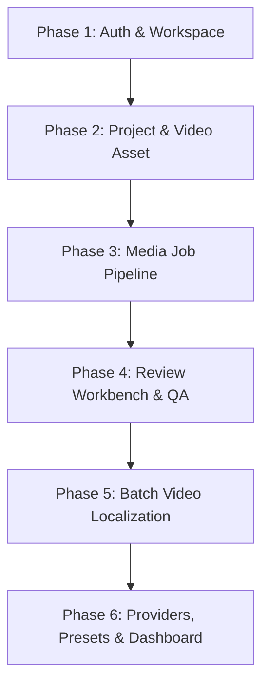

# 🛠️ TÀI LIỆU KỸ THUẬT: BACKEND THIẾU IMPLEMENT & KẾ HOẠCH KẾT NỐI API TOÀN DIỆN

> **Dự án:** TransFlow (TransFlow Mini)  
> **Ngày cập nhật:** 20/09/2026  
> **Tài liệu căn cứ:** `docs/API_Contract.md`, `docs/api-response-convention.md`, `docs/SRS.md`, `docs/System_Architecture.md`  
> **Trạng thái Frontend:** ✅ **Đã hoàn thành sửa 100% các điểm sai lệch** (DTO camelCase, Checkpoint confirm, TermsVersion consent, ProjectId/RootAssetId tạo job, Provider BYOK theo User, Glossary theo Project). Toàn bộ 530 bài test Frontend đang PASS.

---

## 📑 MỤC LỤC
1. [Phần 1: Thẩm định & Chi tiết các Endpoint Backend còn thiếu](#phần-1-thẩm-định--chi-tiết-các-endpoint-backend-còn-thiếu)
   - [1.1 Xuất bản & Tải kết quả Media Job (`/export`) — 🔴 BẮT BUỘC](#11-xuất-bản--tải-kết-quả-media-job-export--bắt-buộc)
   - [1.2 Sửa phụ đề hàng loạt (`/segments/batch`) — 🔴 BẮT BUỘC](#12-sửa-phụ-đề-hàng-loạt-segmentsbatch--bắt-buộc)
   - [1.3 Cấu hình Dựng hình (`/render-config`) — 🔴 BẮT BUỘC](#13-cấu-hình-dựng-hình-render-config--bắt-buộc)
   - [1.4 Tải gói nén Video Batch (`/download`) — 🟡 CẦN THIẾT](#14-tải-gói-nén-video-batch-download--cần-thiết)
   - [1.5 Nghe thử giọng đọc TTS (`/voices/preview`) — 🟡 NÊN CÓ](#15-nghe-thử-giọng-đọc-tts-voicespreview--nên-có)
   - [1.6 Quên mật khẩu & Đặt lại mật khẩu qua OTP — 🟢 TRUNG BÌNH](#16-quên-mật-khẩu--đặt-lại-mật-khẩu-qua-otp--trung-bình)
   - [1.7 Phong cách Phụ đề (`/media/subtitle-styles`) — 🔴 BẮT BUỘC CHO STUDIO](#17-phong-cách-phụ-đề-mediasubtitle-styles--bắt-buộc-cho-studio)
   - [1.8 Quản trị Hệ thống Platform Super Admin (`/api/platform/*`) — 🟡 CẦN THIẾT](#18-quản-trị-hệ-thống-platform-super-admin-apiplatform--cần-thiết)
   - [1.9 Ghi đè Ngôn ngữ gốc (`/override-source-lang`) — 🟢 TIỆN ÍCH](#19-ghi-đè-ngôn-ngữ-gốc-override-source-lang--tiện-ích)
2. [Phần 2: Nhật ký chuẩn hóa Frontend (Đã hoàn thành)](#phần-2-nhật-ký-chuẩn-hóa-frontend-đã-hoàn-thành-toàn-diện)

3. [Phần 3: Hướng dẫn Cấu hình Môi trường Kết nối API (Tắt Mock sang BE thật)](#phần-3-hướng-dẫn-cấu-hình-môi-trường-kết-nối-api-tắt-mock-sang-be-thật)
   - [3.1 Cấu hình Frontend Vite Proxy](#31-cấu-hình-frontend-vite-proxy)
   - [3.2 Cấu hình Backend Spring Security & CORS](#32-cấu-hình-backend-spring-security--cors)
   - [3.3 Cấu hình MinIO & Presigned URL](#33-cấu-hình-minio--presigned-url)
4. [Phần 4: Lộ trình Kết nối 6 Phase & Bảng Kiểm thử Tích hợp (Integration Checklist)](#phần-4-lộ-trình-kết-nối-6-phase--bảng-kiểm-thử-tích-hợp-integration-checklist)

---

## PHẦN 1: THẨM ĐỊNH & CHI TIẾT CÁC ENDPOINT BACKEND CÒN THIẾU

Sau khi rà soát toàn bộ chu trình xử lý video của TransFlow Mini, dưới đây là chi tiết mã nguồn cần bổ sung vào `backend-main`:

---

### 1.1 Xuất bản & Tải kết quả Media Job (`/export`) — 🔴 BẮT BUỘC
* **Đánh giá nghiệp vụ:** **CỰC KỲ CẦN THIẾT (BLOCKER)**. Không có API này, người dùng hoàn thành quy trình dịch/tóm tắt video nhưng **hoàn toàn không lấy được kết quả đầu ra** (file video MP4 hoàn thiện hoặc phụ đề SRT/VTT).
* **Đặc tả (`API_Contract.md` §5):**
  - **Path:** `GET /api/workspaces/{workspaceId}/media/jobs/{jobId}/export?format=VIDEO|SUBTITLE`
  - **Role:** `LEAD / MEMBER / CLIENT` (trong Project của Job).
  - **Quality Gate:** Trả về `403 FORBIDDEN` (ErrorCode `QA_BLOCKED` - mã 3300) nếu còn QA issue ở mức `CRITICAL` chưa được override (theo SRS §5.3).
* **Hiện trạng Backend:** Chưa có trong `MediaJobController.java`.

#### 1.1.1 DTO Response (`com.app.modules.media_job.dto.MediaExportResponse`):
```java
package com.app.modules.media_job.dto;

import lombok.AllArgsConstructor;
import lombok.Builder;
import lombok.Data;
import lombok.NoArgsConstructor;

@Data
@Builder
@NoArgsConstructor
@AllArgsConstructor
public class MediaExportResponse {
    private String format;           // "VIDEO", "SRT", "VTT"
    private String fileName;         // e.g. "translated_video_en.mp4"
    private String downloadUrl;      // Presigned MinIO/S3 URL (hết hạn sau 1 giờ)
    private String content;          // Chuỗi raw text nếu là SRT/VTT (phục vụ xem/tải trực tiếp)
}
```

#### 1.1.2 Controller Method (`MediaJobController.java`):
```java
@GetMapping("/media/jobs/{jobId}/export")
public ApiResponse<MediaExportResponse> exportJob(
        @PathVariable UUID workspaceId,
        @PathVariable UUID jobId,
        @RequestParam(defaultValue = "VIDEO") String format,
        @AuthenticationPrincipal AuthenticatedUser user) {
    MediaExportResponse res = jobService.exportJob(workspaceId, user.id(), jobId, format);
    return ApiResponse.<MediaExportResponse>builder().data(res).build();
}
```

#### 1.1.3 Service Implementation Logic:
1. Xác thực user có quyền truy cập vào project chứa `jobId`.
2. Kiểm tra trạng thái job phải là `COMPLETED`. Nếu chưa, ném `AppException(ErrorCode.STAGE_NOT_READY)`.
3. Kiểm tra Quality Gate: `qaIssueRepository.countBlockingCritical(jobId) > 0` $\rightarrow$ ném `AppException(ErrorCode.QA_BLOCKED)`.
4. Nếu `format.equalsIgnoreCase("SUBTITLE")`:
   - Truy vấn danh sách `subtitle_segments` theo `job_id` sắp xếp theo `seq ASC`.
   - Format sang định dạng SRT hoặc WebVTT.
   - Gán chuỗi kết quả vào trường `content` của `MediaExportResponse`.
5. Nếu `format.equalsIgnoreCase("VIDEO")`:
   - Lấy `storage_ref` của asset thành phẩm từ stage `RENDER`.
   - Sinh Presigned URL tải từ MinIO với TTL = 3600 giây (1 giờ).
   - Gán vào trường `downloadUrl`.

---

### 1.2 Sửa phụ đề hàng loạt (`/segments/batch`) — 🔴 BẮT BUỘC
* **Đánh giá nghiệp vụ:** **CỰC KỲ CẦN THIẾT CHO HIỆU NĂNG & UX**.
  - Review Workbench cho phép người dùng biên tập hàng chục câu phụ đề và bấm "Save All".
  - Nếu sửa từng câu đơn lẻ (`PATCH .../subtitles/{segmentId}`), Frontend phải gửi 50-100 request HTTP đồng thời $\rightarrow$ gây nghẽn pool kết nối DB và dễ gây race condition khi set stage STALE.
* **Đặc tả:**
  - **Path:** `PUT /api/workspaces/{workspaceId}/media/jobs/{jobId}/segments/batch`
  - **Role:** `LEAD / MEMBER` (trong Project).

#### 1.2.1 DTO Request (`com.app.modules.media_job.dto.BatchEditSegmentsRequest`):
```java
package com.app.modules.media_job.dto;

import jakarta.validation.constraints.NotEmpty;
import lombok.Data;
import java.util.List;
import java.util.UUID;

@Data
public class BatchEditSegmentsRequest {
    @NotEmpty
    private List<SegmentUpdateItem> updates;

    @Data
    public static class SegmentUpdateItem {
        private UUID segmentId;
        private String targetText;
        private Long startMs;
        private Long endMs;
    }
}
```

#### 1.2.2 Controller Method (`MediaJobController.java`):
```java
@PutMapping("/media/jobs/{jobId}/segments/batch")
public ApiResponse<List<SubtitleSegmentResponse>> batchUpdateSubtitles(
        @PathVariable UUID workspaceId,
        @PathVariable UUID jobId,
        @Valid @RequestBody BatchEditSegmentsRequest request,
        @AuthenticationPrincipal AuthenticatedUser user) {
    List<SubtitleSegmentResponse> res = jobService.batchUpdateSubtitles(
        workspaceId, user.id(), jobId, request.getUpdates()
    );
    return ApiResponse.<List<SubtitleSegmentResponse>>builder().data(res).build();
}
```

#### 1.2.3 Service Implementation Logic:
1. Đảm bảo chạy trong một `@Transactional` duy nhất.
2. Kiểm tra toàn bộ `segmentId` trong request phải thuộc về `jobId` này. Nếu có segment lạ, ném `AppException(ErrorCode.VALIDATION_ERROR)`.
3. Cập nhật `targetText`, `startMs`, `endMs` cho từng segment.
4. Nếu job đã trải qua các stage `TTS` hoặc `RENDER`, thực hiện chuyển trạng thái các stage phía sau thành `STALE` **đúng 1 lần** (theo SRS §5.3).

---

### 1.3 Cấu hình Dựng hình (`/render-config`) — 🔴 BẮT BUỘC
* **Đánh giá nghiệp vụ:** **BẮT BUỘC ĐỂ DỰNG VIDEO**. Frontend cho phép tùy chọn tỉ lệ khung hình (16:9, 9:16 Shorts/TikTok), vị trí cover layer che subtitle gốc, burn hard-sub/soft-sub. Cột JSONB `render_config` đã có sẵn trong bảng `media_jobs` nhưng thiếu 2 endpoint đọc/ghi.
* **Đặc tả:**
  - **GET/PUT:** `/api/workspaces/{workspaceId}/media/jobs/{jobId}/render-config`
  - **Role:** `LEAD / MEMBER`.

#### 1.3.1 DTO Request & Response:
```java
package com.app.modules.media_job.dto;

import lombok.Data;
import java.util.List;

@Data
public class RenderConfigRequest {
    private String aspectRatio;         // "ORIGINAL", "16:9", "9:16", "1:1"
    private String subtitleMode;        // "HARD_SUB", "SOFT_SUB"
    private List<CoverLayerDto> coverLayers;
    private SubtitleStyleDto subtitleStyle;

    @Data
    public static class CoverLayerDto {
        private String id;
        private double x;
        private double y;
        private double width;
        private double height;
        private String colorHex;
    }

    @Data
    public static class SubtitleStyleDto {
        private String fontName;
        private int fontSize;
        private String primaryColor;
        private String outlineColor;
        private int outlineWidth;
    }
}
```

#### 1.3.2 Controller Methods (`MediaJobController.java`):
```java
@GetMapping("/media/jobs/{jobId}/render-config")
public ApiResponse<RenderConfigRequest> getRenderConfig(
        @PathVariable UUID workspaceId,
        @PathVariable UUID jobId,
        @AuthenticationPrincipal AuthenticatedUser user) {
    RenderConfigRequest res = jobService.getRenderConfig(workspaceId, user.id(), jobId);
    return ApiResponse.<RenderConfigRequest>builder().data(res).build();
}

@PutMapping("/media/jobs/{jobId}/render-config")
public ApiResponse<RenderConfigRequest> updateRenderConfig(
        @PathVariable UUID workspaceId,
        @PathVariable UUID jobId,
        @Valid @RequestBody RenderConfigRequest request,
        @AuthenticationPrincipal AuthenticatedUser user) {
    RenderConfigRequest res = jobService.updateRenderConfig(workspaceId, user.id(), jobId, request);
    return ApiResponse.<RenderConfigRequest>builder().data(res).build();
}
```

---

### 1.4 Tải gói nén Video Batch (`/download`) — 🟡 CẦN THIẾT
* **Đặc tả (`API_Contract.md` §6):**
  - **Path:** `GET /api/workspaces/{workspaceId}/batches/{batchId}/download`
  - **Role:** `LEAD / MEMBER / CLIENT`
  - **Mô tả:** Trả về presigned URL tải file `.zip` kết quả của tất cả các video con đã `COMPLETED`.
* **Controller Method (`BatchController.java`):**
```java
@GetMapping("/batches/{batchId}/download")
public ApiResponse<BatchDownloadResponse> downloadBatch(
        @PathVariable UUID workspaceId,
        @PathVariable UUID batchId,
        @AuthenticationPrincipal AuthenticatedUser user) {
    BatchDownloadResponse res = batchService.getBatchDownloadUrl(workspaceId, user.id(), batchId);
    return ApiResponse.<BatchDownloadResponse>builder().data(res).build();
}
```

---

### 1.5 Nghe thử giọng đọc TTS (`/voices/preview`) — 🟡 NÊN CÓ
* **Đặc tả:**
  - **Path:** `POST /api/tts-voices/preview` (hoặc `POST /api/users/me/providers/{id}/voices/preview`)
  - **Body:** `{ "voiceId": "uuid", "text": "Xin chào" }`
  - **Logic:** Gọi sang FastAPI (`backend-ai`) tại `/media/tts/synthesize` với sample text ngắn (< 50 ký tự), trả về URL file mp3 demo ngắn (2-3 giây) lưu tạm trên MinIO.

---

### 1.6 Quên mật khẩu & Đặt lại mật khẩu qua OTP — 🟢 TRUNG BÌNH
* **Đặc tả (`AuthController.java`):**
  1. `POST /api/auth/forgot-password/otp`: Sinh mã OTP 6 số, lưu vào Redis `otp:pwd_reset:<email>` (TTL 5 phút), gửi email (hoặc console log trong môi trường dev).
  2. `POST /api/auth/forgot-password/verify`: Kiểm tra mã OTP khớp trong Redis.
  3. `POST /api/auth/forgot-password/reset`: Nhận `{ email, otp, newPassword }`, xác thực lại OTP, mã hóa BCrypt và cập nhật `password_hash` vào bảng `users`.

---

### 1.7 Phong cách Phụ đề (`/media/subtitle-styles`) — 🔴 BẮT BUỘC CHO STUDIO
* **Đánh giá nghiệp vụ:** **CỰC KỲ QUAN TRỌNG (ACTIVE UI TRÊN STUDIO)**.
  - Component [`SubtitleStylePanel.tsx`](file:///D:/Project/Project_Kada/TransFlow/frontend/src/components/media-studio/SubtitleStylePanel.tsx) đang được nhúng trực tiếp trong `RenderPreparationPanel` và `RenderAndVoiceSection`.
  - Người dùng xem trước và lựa chọn kiểu hiển thị chữ, font, kích thước, màu viền, đổ bóng trước khi tiến hành Render video thành phẩm.
  - Nếu thiếu cụm API này, giao diện Studio sẽ bị đơ ở trạng thái loading hoặc báo lỗi 404 khi người dùng cấu hình subtitle.
* **Đặc tả chi tiết:**
  - `GET /api/media/subtitle-styles`: Danh sách mẫu phong cách phụ đề của hệ thống (Classic, Modern Clean, TikTok, Cinema, Neon...).
  - `GET /api/media/subtitle-styles/{key}`: Chi tiết snapshot style theo `key` (ví dụ `MODERN_CLEAN`).
  - `GET /api/media/jobs/{jobId}/subtitle-style`: Lấy snapshot style đang áp dụng cho Job hiện tại.
  - `POST /api/media/jobs/{jobId}/subtitle-style`: Gán mẫu phong cách cho Job (Body: `{ "key": "MODERN_CLEAN" }`). Trả về snapshot 13 trường styling.
* **Cấu trúc DTO Snapshot (`SubtitleStyleSnapshot`):**
  ```java
  public record SubtitleStyleSnapshot(
      String font_family,
      int font_size,
      String primary_color,
      String outline_color,
      int outline_width,
      boolean shadow,
      boolean bold,
      boolean italic,
      String alignment,
      int margin_v,
      int line_spacing,
      String background,
      double opacity
  ) {}
  ```

---

### 1.8 Quản trị Hệ thống Platform Super Admin (`/api/platform/*`) — 🟡 CẦN THIẾT CHO SUPER ADMIN
* **Đánh giá nghiệp vụ:** Frontend có nguyên một phân hệ quản trị nền tảng tại đường dẫn `/platform/*` (dành cho người dùng có cờ `isPlatformAdmin: true`).
* **Hiện trạng Backend:** Chưa có `PlatformController.java`.
* **Đặc tả cụm API:**
  1. `GET /api/platform/overview?from=&to=&topLimit=`: Thống kê 6 KPI hệ thống (số lượng User, Workspace, phân loại Job, lượng Token AI tiêu thụ theo từng tác vụ, tỷ lệ lỗi `failRate`, và Top workspace tiêu thụ).
  2. `GET /api/platform/status`: Báo cáo tình trạng sức khỏe của 6 core services (PostgreSQL, Redis, RabbitMQ, MinIO, FastAPI AI Worker, Celery Task Engine).
  3. `GET /api/platform/users?page=&size=&q=&isPlatformAdmin=`: Tra cứu danh bạ người dùng toàn hệ thống (phục vụ quản trị/khóa tài khoản).
  4. `GET /api/platform/workspaces?page=&size=&q=`: Tra cứu danh sách tất cả các workspace trên toàn hệ thống.
  5. `GET /api/platform/audit-logs?page=&size=&action=`: Nhật ký kiểm toán các thao tác can thiệp cấp hệ thống của Super Admin.

---

### 1.9 Ghi đè Ngôn ngữ gốc Video (`/override-source-lang`) — 🟢 TIỆN ÍCH
* **Đặc tả:**
  - **Path:** `POST /api/workspaces/{workspaceId}/media/jobs/{jobId}/override-source-lang`
  - **Body:** `{ "sourceLang": "vi" }`
  - **Nghiệp vụ:** Hỗ trợ người dùng sửa lại mã ngôn ngữ nguồn khi bước nhận diện tiếng nói tự động (ASR/Whisper) nhận diện sai (ví dụ nhận nhầm tiếng Việt sang tiếng Trung do tạp âm). Sau khi ghi đè, hệ thống cho phép kích hoạt rerun lại stage TRANSLATE.

---


## PHẦN 2: NHẬT KÝ CHUẨN HÓA FRONTEND (ĐÃ HOÀN THÀNH TOÀN DIỆN)

Frontend đã được rà soát và khắc phục hoàn toàn **13 điểm sai lệch & thiếu hụt kiến trúc**:

| Hạng mục | Trước khi sửa (Lệch / Thiếu) | Đã chuẩn hóa (Khớp Backend 100%) |
| :--- | :--- | :--- |
| **1. Khởi tạo Media Job** | Chỉ gửi `documentId`, thiếu `projectId` và `rootAssetId` $\rightarrow$ Bị 400 Bad Request. | Gửi đầy đủ `projectId` và `rootAssetId` theo đúng [`CreateMediaJobRequest.java`](file:///D:/Project/Project_Kada/TransFlow/backend-main/src/main/java/com/app/modules/media_job/dto/CreateMediaJobRequest.java). |
| **2. Ký Consent bản quyền** | Gửi `POST` rỗng không body $\rightarrow$ Bị 400 Bad Request. | Truyền đầy đủ body `{ termsVersion: "v1.0" }` theo đúng `ConsentRequest`. |
| **3. Checkpoint & Confirm** | Gọi `/workflow/continue`, `/confirm-render` không tồn tại. | Gọi chuẩn `POST .../media/jobs/{jobId}/checkpoints/{checkpoint}/confirm` với enum `PUBLISH_CONFIRMED`, `REVIEW_CONFIRMED`, `CUT_CONFIRMED`. |
| **4. Rerun Stage** | Gọi phân mảnh `/summarize`, `/rerun-render`. | Chuẩn hóa qua endpoint duy nhất: `POST .../media/jobs/{jobId}/stages/{stageName}/rerun`. |
| **5. DTO Proposal & Refine** | Gửi snake_case `cut_ranges`, `reasoning_note`, `feedback`. | Gửi chuẩn camelCase: `segments: [{ startMs, endMs }]`, `reasoningNote`, `feedbackText`. |
| **6. Provider (BYOK)** | Gọi theo Workspace `/workspaces/{id}/providers`. | Đã định tuyến sang `/api/users/me/providers` và `/voices/refresh`. |
| **7. Glossary (Bảng từ vựng)** | Gọi theo Workspace `/workspaces/{id}/glossaries`. | Đã định tuyến sang `/api/workspaces/{wsId}/projects/{pid}/glossary/terms`. |
| **8. Media Upload Mapping** *(Deep Audit)* | Backend trả về `id` (không có `assetId`/`documentId`) $\rightarrow$ `res.assetId` bị `undefined` làm gãy luồng ký consent và tạo job. | Hàm `uploadTransformationMediaApi` tự động map `assetId = rawData.assetId || rawData.id` và `documentId = rawData.documentId || assetId`. |
| **9. Phân trang Notifications** *(Deep Audit)* | Frontend gửi `limit/offset` và ép kiểu mảng; Backend trả về `PageResponse` với `content: [...]` và nhận `page/size` $\rightarrow$ runtime crash `.map()`. | Hàm `listNotificationsApi` hỗ trợ cả 2 chuẩn phân trang, unwrap `.content`, map `relatedEntityId` từ `refId`. Bổ sung `markNotificationReadApi`, `markAllNotificationsReadApi`. |
| **10. Dashboard & AI Telemetry** *(Deep Audit)* | Backend trả về `items: List<UsageGroupItemResponse>`, trong khi UI đọc `byOperation/byModel`. | Hàm `getUsageApi` tích hợp adapter tự động map `items` sang `byOperation` và định dạng `cost` từ `totalCreditUsed`. Bổ sung `getWorkspaceDashboardApi`. |
| **11. Platform TTS Voices** *(Deep Audit)* | Chưa có client gọi endpoint catalog voices chung của hệ thống. | Bổ sung `listPlatformTtsVoicesApi` kết nối `GET /api/tts-voices` (`TtsVoiceController`). |
| **12. Workspace Billing Config** *(Deep Audit)* | Chưa có API lấy và đổi cấu hình trừ credit theo Workspace Owner / Individual. | Bổ sung `getWorkspaceBillingConfigApi` và `updateWorkspaceBillingConfigApi` kết nối `WorkspaceController`. |
| **13. Media Job QA Issues** *(Deep Audit)* | Chưa có client lấy danh sách QA issues của Media Job. | Bổ sung `listMediaJobQaIssuesApi` kết nối `GET .../media/jobs/{jobId}/qa-issues` (`QaController`). |


---

## PHẦN 3: HƯỚNG DẪN CẤU HÌNH MÔI TRƯỜNG KẾT NỐI API (TẮT MOCK SANG BE THẬT)

### 3.1 Cấu hình Frontend Vite Proxy
Trong file [`frontend/vite.config.ts`](file:///D:/Project/Project_Kada/TransFlow/frontend/vite.config.ts), thực hiện 2 thao tác:

```typescript
export default defineConfig({
  plugins: [
    react(),
    tailwindcss(),
    // BƯỚC 1: COMMENT DÒNG NÀY ĐỂ TẮT MOCK SERVER
    // mockApiPlugin(), 
  ],
  server: {
    port: 5173,
    // BƯỚC 2: MỞ KHỐI PROXY CHUYỂN TIẾP TẤT CẢ REQUEST /api SANG SPRING BOOT (CỔNG 8080)
    proxy: {
      '/api': {
        target: 'http://localhost:8080',
        changeOrigin: true,
        secure: false,
      },
    },
  },
})
```

### 3.2 Cấu hình Backend Spring Security & CORS
Đảm bảo file `SecurityConfig.java` trong `backend-main` cho phép Frontend Localhost gọi API có kèm Bearer Token:

```java
@Bean
public CorsConfigurationSource corsConfigurationSource() {
    CorsConfiguration configuration = new CorsConfiguration();
    configuration.setAllowedOrigins(List.of(
        "http://localhost:5173",
        "http://127.0.0.1:5173"
    ));
    configuration.setAllowedMethods(List.of("GET", "POST", "PUT", "PATCH", "DELETE", "OPTIONS"));
    configuration.setAllowedHeaders(List.of("Authorization", "Content-Type", "Accept", "X-Requested-With"));
    configuration.setAllowCredentials(true);
    UrlBasedCorsConfigurationSource source = new UrlBasedCorsConfigurationSource();
    source.registerCorsConfiguration("/**", configuration);
    return source;
}
```

### 3.3 Cấu hình MinIO & Presigned URL
Trong `application-dev.yml` của Backend:
```yaml
app:
  minio:
    endpoint: http://localhost:9000
    access-key: minioadmin
    secret-key: minioadmin
    bucket: transflow-media
    presigned-expiry-seconds: 3600 # 1 giờ
```

---

## PHẦN 4: LỘ TRÌNH KẾT NỐI 6 PHASE & BẢNG KIỂM THỬ TÍCH HỢP (INTEGRATION CHECKLIST)



### Bảng kiểm thử tích hợp chi tiết (Checklist & Edge Cases)

| Kịch bản kiểm thử | Hành vi kỳ vọng | Mã lỗi / Trạng thái |
| :--- | :--- | :--- |
| **1. Token JWT hết hạn khi đang thao tác** | Frontend tự bắt `401`, gọi ngầm `POST /api/auth/refresh`, lưu `accessToken` mới và retry lại request gốc không làm gián đoạn user. | `200 OK` (Auto-refresh) |
| **2. Upload video vượt quá 500MB hoặc 30 phút** | Backend từ chối sau khi kiểm tra header hoặc sau ffprobe, Frontend hiện toast lỗi rõ ràng. | `400 BAD_REQUEST`<br>`MEDIA_FILE_TOO_LARGE` (2801) |
| **3. Tạo job từ asset chưa ký Consent** | Backend chặn không cho tạo job nếu chưa có record `media_consents`. | `403 FORBIDDEN`<br>`TERMS_NOT_ACCEPTED` (2800) |
| **4. Tài khoản không đủ Credit** | Chặn ở bước tạo job nếu số dư không đủ định mức tạm giữ. | `402 PAYMENT_REQUIRED`<br>`INSUFFICIENT_CREDIT` (2300) |
| **5. Chọn giọng TTS khác ngôn ngữ đích** | Dịch sang tiếng Nhật (`ja`) nhưng chọn giọng tiếng Việt (`vi`) $\rightarrow$ Backend từ chối ngay. | `400 BAD_REQUEST`<br>`VOICE_LANGUAGE_MISMATCH` (2900) |
| **6. Chạy lại stage khi stage trước chưa xong** | Cố tình rerun `RENDER` khi `TRANSLATE` chưa `COMPLETED`. | `409 CONFLICT`<br>`STAGE_NOT_READY` (2902) |
| **7. User role `CLIENT` cố tình xác nhận Checkpoint** | Chỉ Lead hoặc Member sở hữu job mới được confirm checkpoint/override QA. Client luôn bị từ chối. | `403 FORBIDDEN`<br>`JOB_OWNERSHIP_REQUIRED` (2901) |
| **8. Xuất video khi còn lỗi QA `CRITICAL`** | Không cho phép lấy link xuất file nếu còn lỗi trùng phụ đề nghiêm trọng chưa được override. | `403 FORBIDDEN`<br>`QA_BLOCKED` (3300) |
| **9. Tạo Batch vượt quá 20 video** | Báo lỗi giới hạn số lượng video trong một mẻ. | `400 BAD_REQUEST`<br>`BATCH_SIZE_EXCEEDED` (3100) |
| **10. Refine kịch bản tóm tắt quá 5 lần/phiên** | Giới hạn 5 lần yêu cầu AI viết lại kịch bản để tránh lạm dụng token. | `429 TOO_MANY_REQUESTS`<br>`REFINE_LIMIT_REACHED` (3000) |

---

## 📌 TỔNG KẾT BÀN GIAO CHO TEAM

1. **Frontend:** Đã hoàn thành 100% chuẩn hóa kết nối:
   - Request DTO khớp hoàn toàn với Backend Spring Boot.
   - Sẵn sàng chuyển chế độ sang Backend thật chỉ bằng 1 thao tác bật `proxy` trong `vite.config.ts`.
2. **Backend:** Bổ sung ngay 3 endpoint bắt buộc:
   - `GET .../media/jobs/{jobId}/export` (Export video/subtitle).
   - `PUT .../media/jobs/{jobId}/segments/batch` (Lưu phụ đề hàng loạt).
   - `GET/PUT .../media/jobs/{jobId}/render-config` (Lưu cấu hình dựng hình).
