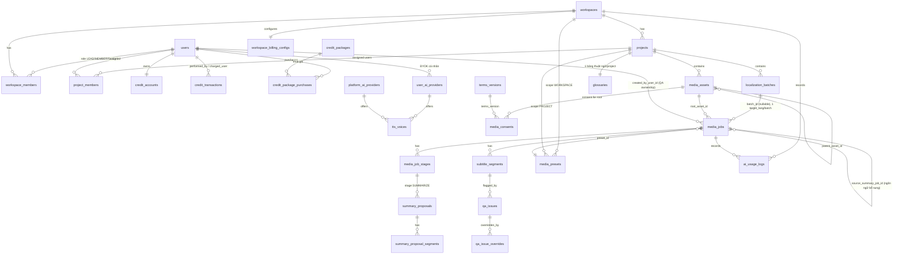

# Thiết kế CSDL — TransFlow Media

> Phiên bản: **3.3** · Ngày cập nhật: 2026-09-12 · Bám sát SRS v1.4 + bản chỉnh lý 1.4b.
> Giữ nguyên mô hình RBAC 3 role của 3.2, đồng thời thu gọn phần dịch thuật:
> 1. **Không có `documents` / Text Translation Job / Batch dịch file**.
> 2. **Bỏ `translation_memory`** và do đó không còn yêu cầu `pgvector`.
> 3. **Giữ `localization_batches`** vì đây là Video Batch Localization (N video × 1 target language).
> 4. **Giữ Glossary và QA** như dữ liệu hỗ trợ Media Studio; QA không còn `BLOCK_TM_WRITEBACK`.
> PostgreSQL 16. Redis chỉ cache phiên Refine (không phải SoT).

---

## 1. Nguyên tắc thiết kế
- Shared DB, multi-tenant qua `workspace_id` trên mọi bảng nghiệp vụ.
- UUID PK (`gen_random_uuid()`); `created_at`/`updated_at` (timestamptz) mặc định.
- **Không có `documents` / Text Translation flow** — `media_assets` là entry point trực tiếp.
- **Không có Batch dịch file**; `localization_batches` chỉ dùng cho nhiều video.
- **Không có `translation_jobs` trung gian** — `subtitle_segments` là con trực tiếp của `media_jobs`.
- **Không có `translation_memory`** — bỏ embedding/similarity/TM write-back; Glossary vẫn giữ theo Project.
- **`media_jobs.created_by_user_id` là cột trung tâm cho authorization QA** (SRS §3.3) — không suy ra quyền
  từ nơi khác, mọi service QA/checkpoint phải join trực tiếp cột này.
- Số liệu nghiệp vụ còn để mở trong SRS (hệ số Credit `y`, chi tiết gói...) → đưa vào bảng cấu hình runtime,
  không hard-code trong CHECK/migration.
- JSONB chỉ cho phần thực sự động (payload AI, script/segment linh hoạt) — có writer/validator xác định.

---

## 2. ERD tổng quan



---

## 3. Auth / Workspace / Project — RBAC 3 vai trò cấp Workspace + Project assignment

```sql
users(
  id UUID PK,
  email VARCHAR(320) NOT NULL,
  password_hash VARCHAR,           -- NULL nếu chỉ đăng nhập Google
  full_name VARCHAR(200) NOT NULL,
  google_sub VARCHAR,
  google_linked BOOLEAN NOT NULL DEFAULT false,
  status VARCHAR CHECK (status IN ('ACTIVE','DISABLED')) NOT NULL DEFAULT 'ACTIVE',
  created_at TIMESTAMPTZ DEFAULT now(),
  updated_at TIMESTAMPTZ DEFAULT now(),
  CONSTRAINT ck_users_auth_method CHECK (password_hash IS NOT NULL OR google_sub IS NOT NULL)
)
CREATE UNIQUE INDEX ux_users_email ON users (lower(email));
CREATE UNIQUE INDEX ux_users_google_sub ON users (google_sub) WHERE google_sub IS NOT NULL;

workspaces(
  id UUID PK,
  name VARCHAR(200) NOT NULL,
  slug VARCHAR(120) NOT NULL,
  owner_user_id UUID NOT NULL REFERENCES users(id),   -- đồng bộ với workspace_members role=LEAD
  created_at TIMESTAMPTZ DEFAULT now(),
  updated_at TIMESTAMPTZ DEFAULT now()
)
CREATE UNIQUE INDEX ux_workspaces_slug ON workspaces (slug);

-- Role chỉ tồn tại ở cấp Workspace.
workspace_members(
  id UUID PK,
  workspace_id UUID NOT NULL REFERENCES workspaces(id) ON DELETE CASCADE,
  user_id UUID NOT NULL REFERENCES users(id) ON DELETE CASCADE,
  role VARCHAR CHECK (role IN ('LEAD','MEMBER','CLIENT')) NOT NULL,
  created_at TIMESTAMPTZ DEFAULT now(),
  updated_at TIMESTAMPTZ DEFAULT now(),
  UNIQUE (workspace_id, user_id)
)
CREATE UNIQUE INDEX ux_workspace_members_one_lead
  ON workspace_members(workspace_id) WHERE role = 'LEAD';
CREATE INDEX ix_workspace_members_user ON workspace_members(user_id);

projects(
  id UUID PK,
  workspace_id UUID NOT NULL REFERENCES workspaces(id) ON DELETE CASCADE,
  name VARCHAR(200) NOT NULL,
  source_lang VARCHAR(20),
  created_at TIMESTAMPTZ DEFAULT now(),
  updated_at TIMESTAMPTZ DEFAULT now()
)
CREATE INDEX ix_projects_workspace ON projects(workspace_id);

-- Assignment Project: KHÔNG có role.
-- Lead mặc định truy cập mọi Project; Member/Client cần row ở đây.
project_members(
  id UUID PK,
  project_id UUID NOT NULL REFERENCES projects(id) ON DELETE CASCADE,
  user_id UUID NOT NULL REFERENCES users(id) ON DELETE CASCADE,
  added_by UUID NOT NULL REFERENCES users(id),       -- Lead thực hiện assignment
  created_at TIMESTAMPTZ DEFAULT now(),
  UNIQUE (project_id, user_id)
)
CREATE INDEX ix_project_members_user ON project_members(user_id);
CREATE INDEX ix_project_members_project ON project_members(project_id);
```

**Invariant service-layer:**
- user được assign vào Project phải tồn tại trong `workspace_members` của Workspace chứa Project;
- `LEAD` không cần row `project_members`;
- `MEMBER`/`CLIENT` phải có row `project_members` mới được đọc Project;
- quyền ghi lấy từ `workspace_members.role`: `LEAD|MEMBER` được thao tác, `CLIENT` read-only;
- Project assignment không thay đổi role và không tạo thêm một lớp role thứ hai.

## 4. Credit & Thanh toán (không đổi so với thiết kế trước)

```sql
credit_accounts(
  id UUID PK,
  user_id UUID NOT NULL UNIQUE REFERENCES users(id),
  balance NUMERIC(14,4) NOT NULL DEFAULT 0 CHECK (balance >= 0),
  created_at TIMESTAMPTZ DEFAULT now(),
  updated_at TIMESTAMPTZ DEFAULT now()
)

credit_transactions(
  id UUID PK,
  user_id UUID NOT NULL REFERENCES users(id),          -- = charged_user (người bị trừ/được cộng)
  amount NUMERIC(14,4) NOT NULL,
  balance_after NUMERIC(14,4) NOT NULL,
  type VARCHAR CHECK (type IN ('INITIAL_GRANT','PACKAGE_PURCHASE','AI_USAGE','ADJUSTMENT')) NOT NULL,
  performed_by_user_id UUID REFERENCES users(id),       -- người TRỰC TIẾP thực hiện thao tác AI (công thức x/x+y)
  ref_type VARCHAR,
  ref_id UUID,
  created_at TIMESTAMPTZ DEFAULT now()
)
CREATE INDEX ix_credit_tx_user_time ON credit_transactions(user_id, created_at DESC);
CREATE INDEX ix_credit_tx_ref ON credit_transactions(ref_type, ref_id) WHERE ref_type IS NOT NULL;

workspace_billing_configs(
  workspace_id UUID PK REFERENCES workspaces(id) ON DELETE CASCADE,
  cost_mode VARCHAR CHECK (cost_mode IN ('LEAD_PAYS_ALL','PAY_PER_USER')) NOT NULL DEFAULT 'PAY_PER_USER',
  configured_by UUID REFERENCES users(id),
  updated_at TIMESTAMPTZ DEFAULT now()
)

credit_pricing_config(
  id UUID PK,
  capability VARCHAR CHECK (capability IN ('STT','TRANSLATE','TTS','SUMMARIZE_SCRIPT','RENDER','VISION')) NOT NULL,
  provider_scope VARCHAR,
  infra_coefficient_x NUMERIC(10,6) NOT NULL,
  token_coefficient_y NUMERIC(10,6),
  effective_from TIMESTAMPTZ NOT NULL DEFAULT now(),
  effective_to TIMESTAMPTZ,
  created_at TIMESTAMPTZ DEFAULT now()
)
CREATE INDEX ix_credit_pricing_active
  ON credit_pricing_config(capability, provider_scope) WHERE effective_to IS NULL;

credit_packages(
  id UUID PK,
  name VARCHAR(120) NOT NULL,
  credit_amount NUMERIC(14,4) NOT NULL CHECK (credit_amount > 0),
  price_amount NUMERIC(14,2) NOT NULL CHECK (price_amount > 0),
  price_currency VARCHAR(3) NOT NULL DEFAULT 'VND',
  is_active BOOLEAN NOT NULL DEFAULT true,
  created_at TIMESTAMPTZ DEFAULT now()
)

credit_package_purchases(
  id UUID PK,
  user_id UUID NOT NULL REFERENCES users(id),
  package_id UUID NOT NULL REFERENCES credit_packages(id),
  credit_amount NUMERIC(14,4) NOT NULL,
  price_paid NUMERIC(14,2) NOT NULL,
  payment_reference VARCHAR,
  purchased_at TIMESTAMPTZ DEFAULT now()
)
CREATE INDEX ix_credit_package_purchases_user ON credit_package_purchases(user_id, purchased_at DESC);
```

---

## 5. Nguồn AI — chỉ cá nhân (BYOK) + nền tảng (không đổi)

```sql
user_ai_providers(
  id UUID PK,
  user_id UUID NOT NULL REFERENCES users(id) ON DELETE CASCADE,
  protocol VARCHAR CHECK (protocol IN (
    'openai_compatible','anthropic','elevenlabs_native','azure_speech','google_speech','dashscope_native'
  )) NOT NULL,
  capabilities VARCHAR[] NOT NULL CHECK (capabilities <@ ARRAY['STT','TRANSLATE','TTS','VISION']::VARCHAR[]),
  base_url VARCHAR(500) NOT NULL,
  api_key_enc BYTEA NOT NULL,
  api_key_hint VARCHAR(20) NOT NULL,
  default_model VARCHAR(200),
  is_active BOOLEAN NOT NULL DEFAULT true,
  created_at TIMESTAMPTZ DEFAULT now(),
  updated_at TIMESTAMPTZ DEFAULT now()
)
CREATE INDEX ix_user_ai_providers_user ON user_ai_providers(user_id) WHERE is_active;

platform_ai_providers(
  id UUID PK,
  protocol VARCHAR NOT NULL,
  capabilities VARCHAR[] NOT NULL CHECK (capabilities <@ ARRAY['STT','TRANSLATE','TTS','VISION']::VARCHAR[]),
  base_url VARCHAR(500) NOT NULL,
  api_key_enc BYTEA NOT NULL,
  default_model VARCHAR(200),
  is_active BOOLEAN NOT NULL DEFAULT true,
  created_at TIMESTAMPTZ DEFAULT now()
)

tts_voices(
  id UUID PK,
  provider_source VARCHAR CHECK (provider_source IN ('USER','PLATFORM')) NOT NULL,
  user_provider_id UUID REFERENCES user_ai_providers(id) ON DELETE CASCADE,
  platform_provider_id UUID REFERENCES platform_ai_providers(id) ON DELETE CASCADE,
  voice_id VARCHAR NOT NULL,
  language VARCHAR NOT NULL,
  languages VARCHAR[] DEFAULT '{}',
  gender VARCHAR CHECK (gender IN ('MALE','FEMALE','UNKNOWN')) DEFAULT 'UNKNOWN',
  is_active BOOLEAN NOT NULL DEFAULT true,
  cached_at TIMESTAMPTZ DEFAULT now(),
  CONSTRAINT ck_tts_voice_source CHECK (
    (provider_source='USER' AND user_provider_id IS NOT NULL AND platform_provider_id IS NULL) OR
    (provider_source='PLATFORM' AND platform_provider_id IS NOT NULL AND user_provider_id IS NULL)
  )
)
```

---

## 6. Media core

```sql
terms_versions(
  version VARCHAR PK,
  content_ref VARCHAR NOT NULL,
  is_current BOOLEAN NOT NULL DEFAULT false,
  published_at TIMESTAMPTZ NOT NULL DEFAULT now()
)
CREATE UNIQUE INDEX ux_terms_versions_current ON terms_versions(is_current) WHERE is_current;

media_assets(
  id UUID PK,
  workspace_id UUID NOT NULL REFERENCES workspaces(id),
  project_id UUID NOT NULL REFERENCES projects(id),
  parent_asset_id UUID REFERENCES media_assets(id) ON DELETE RESTRICT,
  asset_type VARCHAR CHECK (asset_type IN (
    'SOURCE_VIDEO','EXTRACTED_AUDIO','SEPARATED_STEM','DUBBED_AUDIO','MIXED_AUDIO',
    'RENDERED_VIDEO','KEYFRAME_IMAGE'
  )) NOT NULL,
  storage_provider VARCHAR NOT NULL,
  bucket_name VARCHAR NOT NULL,
  object_storage_key VARCHAR(1000) NOT NULL,
  file_name VARCHAR(300) NOT NULL,
  mime_type VARCHAR(150) NOT NULL,
  file_size_bytes BIGINT NOT NULL CHECK (file_size_bytes >= 0 AND file_size_bytes <= 524288000),  -- 500MB (SRS §6)
  duration_ms BIGINT CHECK (duration_ms IS NULL OR duration_ms <= 1800000),                        -- 30 phút (SRS §6)
  uploaded_by_user_id UUID NOT NULL REFERENCES users(id),
  processing_status VARCHAR CHECK (processing_status IN ('UPLOADED','VALIDATING','READY','FAILED')) NOT NULL,
  created_at TIMESTAMPTZ DEFAULT now(),
  updated_at TIMESTAMPTZ DEFAULT now(),
  UNIQUE (storage_provider, bucket_name, object_storage_key)
)
CREATE INDEX ix_media_assets_workspace_project ON media_assets(workspace_id, project_id);
CREATE INDEX ix_media_assets_parent ON media_assets(parent_asset_id);

media_consents(
  id UUID PK,
  workspace_id UUID NOT NULL REFERENCES workspaces(id),
  root_asset_id UUID NOT NULL REFERENCES media_assets(id),
  user_id UUID NOT NULL REFERENCES users(id),
  terms_version VARCHAR NOT NULL REFERENCES terms_versions(version),
  ip_address VARCHAR(45),
  consented_at TIMESTAMPTZ DEFAULT now(),
  UNIQUE (root_asset_id, terms_version)
)
```

### 6.1 `localization_batches` — **1 ngôn ngữ đích/lô** (thay đổi bản chất ở v1.4)
```sql
localization_batches(
  id UUID PK,
  workspace_id UUID NOT NULL REFERENCES workspaces(id),
  project_id UUID NOT NULL REFERENCES projects(id),
  name VARCHAR(200),
  source_asset_ids UUID[] NOT NULL,
  target_lang VARCHAR NOT NULL,          -- v1.4: 1 GIÁ TRỊ ĐƠN (trước là target_langs VARCHAR[])
  shared_config JSONB NOT NULL DEFAULT '{}',
  status VARCHAR CHECK (status IN (
    'PENDING','PROCESSING','PARTIALLY_FAILED','COMPLETED','FAILED','CANCELLED'
  )) NOT NULL DEFAULT 'PENDING',
  created_by UUID NOT NULL REFERENCES users(id),
  created_at TIMESTAMPTZ DEFAULT now(),
  CHECK (array_length(source_asset_ids,1) BETWEEN 1 AND 20)   -- khớp SRS §6: tối đa 20 video/lô
  -- KHÔNG còn CHECK giới hạn số ngôn ngữ — chỉ 1 target_lang/lô, giới hạn "10 ngôn ngữ" của thiết kế trước không còn ý nghĩa
)
CREATE INDEX ix_localization_batches_workspace ON localization_batches(workspace_id, status);
```
- **Khác biệt so với v1.2:** `target_langs VARCHAR[]` (nhiều ngôn ngữ) → `target_lang VARCHAR` (1 ngôn ngữ
  duy nhất). Muốn cùng bộ video ra ngôn ngữ khác → tạo **1 hàng `localization_batches` mới** (SRS §5.4 xác
  nhận đây là đánh đổi đơn giản hoá có chủ đích).
- Mỗi `media_jobs` con sinh ra từ batch có `target_lang` = **đúng** giá trị `localization_batches.target_lang`
  của lô cha (không tự ý khác).

### 6.2 `media_jobs` — orchestrator duy nhất (Localization + Summarization)
```sql
media_jobs(
  id UUID PK,
  workspace_id UUID NOT NULL REFERENCES workspaces(id),
  project_id UUID NOT NULL REFERENCES projects(id),
  root_asset_id UUID NOT NULL REFERENCES media_assets(id) ON DELETE RESTRICT,
  batch_id UUID REFERENCES localization_batches(id) ON DELETE SET NULL,

  recipe_id VARCHAR CHECK (recipe_id IN ('localization.full','summary.script_match')) NOT NULL,
  processing_mode VARCHAR CHECK (processing_mode IN ('TRANSLATE_ONLY','HYBRID')),

  source_language VARCHAR,
  target_lang VARCHAR NOT NULL,

  status VARCHAR CHECK (status IN (
    'PENDING','PROCESSING','COMPLETED','FAILED','CANCELLED'
  )) NOT NULL DEFAULT 'PENDING',

  requested_duration_seconds INT CHECK (requested_duration_seconds > 0),

  selected_proposal_id UUID REFERENCES summary_proposals(id) ON DELETE SET NULL,
  source_summary_job_id UUID REFERENCES media_jobs(id),

  subtitle_mode VARCHAR CHECK (subtitle_mode IN ('HARD_SUB','SOFT_SUB')) NOT NULL DEFAULT 'SOFT_SUB',

  output_audio_mode VARCHAR CHECK (output_audio_mode IN ('ORIGINAL_ONLY','DUB_REPLACE','DUB_MIX'))
                    NOT NULL DEFAULT 'ORIGINAL_ONLY',
  source_separation_enabled BOOLEAN NOT NULL DEFAULT false,

  tts_provider_id UUID,
  tts_voice_id UUID REFERENCES tts_voices(id),

  visual_context_enabled BOOLEAN NOT NULL DEFAULT false,

  preset_id UUID REFERENCES media_presets(id),
  preset_snapshot JSONB NOT NULL DEFAULT '{}',
  render_config JSONB NOT NULL DEFAULT '{}',   -- Render Studio config của job (V9); {} = chưa cấu hình
  subtitle_style JSONB,                          -- snapshot 13 trường style phụ đề đã gán (V8); NULL = chưa gán
  publish_package JSONB,                         -- bản nháp thông tin đăng bài (V10): {title,description,language,tags,thumbnailRef}; NULL = chưa lưu

  workflow_mode VARCHAR CHECK (workflow_mode IN ('MANUAL','AUTO')) NOT NULL DEFAULT 'MANUAL',

  performed_by_user_id UUID NOT NULL REFERENCES users(id),   -- người thực hiện thật — quyết định công thức Credit
  created_by_user_id UUID NOT NULL REFERENCES users(id),     -- BẮT BUỘC — cơ sở duy nhất cho authorization QA (SRS §3.3)
  created_at TIMESTAMPTZ DEFAULT now(),
  updated_at TIMESTAMPTZ DEFAULT now(),

  CONSTRAINT ck_job_recipe_mode CHECK (
    (recipe_id = 'localization.full' AND processing_mode IN ('TRANSLATE_ONLY','HYBRID'))
    OR (recipe_id = 'summary.script_match' AND processing_mode IS NULL AND requested_duration_seconds IS NOT NULL)
  ),
  CONSTRAINT ck_audio_mode_sep CHECK (output_audio_mode <> 'DUB_MIX' OR source_separation_enabled = true),
  CONSTRAINT ck_audio_mode_voice CHECK ((output_audio_mode = 'ORIGINAL_ONLY') = (tts_voice_id IS NULL)),
  CONSTRAINT ck_media_jobs_tts_binding CHECK ((tts_provider_id IS NULL) = (tts_voice_id IS NULL)),
  CONSTRAINT ck_source_summary_job CHECK (
    source_summary_job_id IS NULL OR recipe_id = 'summary.script_match'
  )
)
CREATE INDEX ix_media_jobs_workspace_status ON media_jobs(workspace_id, status);
CREATE INDEX ix_media_jobs_batch ON media_jobs(batch_id) WHERE batch_id IS NOT NULL;
CREATE INDEX ix_media_jobs_project_created ON media_jobs(project_id, created_at DESC);
CREATE INDEX ix_media_jobs_source_summary ON media_jobs(source_summary_job_id) WHERE source_summary_job_id IS NOT NULL;
-- Phục vụ trực tiếp truy vấn "job của tôi" cho authorization QA/checkpoint (SRS §3.3)
CREATE INDEX ix_media_jobs_created_by ON media_jobs(created_by_user_id);
```
- `created_by_user_id` **không được update sau khi tạo** (immutable ở service layer) — là nguồn sự thật duy
  nhất cho quy tắc "Member chỉ duyệt QA/checkpoint job của chính mình" (SRS §3.3, khác `performed_by_user_id`
  vốn chỉ phục vụ công thức Credit).
- Voice ngôn ngữ khớp `target_lang`: enforce ở service layer (cần join `tts_voices.language`).

### 6.3 `media_job_stages`
```sql
media_job_stages(
  id UUID PK,
  media_job_id UUID NOT NULL REFERENCES media_jobs(id) ON DELETE CASCADE,
  stage_name VARCHAR CHECK (stage_name IN (
    'EXTRACT_AUDIO','SOURCE_SEPARATION','STT','SUMMARIZE','TRANSLATE','TTS','AUDIO_MIX','RENDER'
  )) NOT NULL,
  stage_order SMALLINT NOT NULL CHECK (stage_order BETWEEN 1 AND 8),
  status VARCHAR CHECK (status IN (
    'PENDING','PROCESSING','COMPLETED','FAILED','STALE','SKIPPED','CANCEL_REQUESTED','CANCELLED'
  )) NOT NULL DEFAULT 'PENDING',
  progress_percent SMALLINT CHECK (progress_percent BETWEEN 0 AND 100) DEFAULT 0,
  input_ref JSONB,     -- gồm checkpoint marker (cut_confirmed/review_confirmed/publish_confirmed) + visual_context[]
  output_ref JSONB,
  worker_id VARCHAR,
  attempt_count SMALLINT NOT NULL DEFAULT 0 CHECK (attempt_count >= 0),
  execution_time_ms BIGINT,
  error_message TEXT,
  started_at TIMESTAMPTZ,
  completed_at TIMESTAMPTZ,
  UNIQUE (media_job_id, stage_name),
  UNIQUE (media_job_id, stage_order)
)
CREATE INDEX ix_media_job_stages_job ON media_job_stages(media_job_id, stage_name);
```
- Điều kiện kích hoạt: `SOURCE_SEPARATION` khi `source_separation_enabled=true`; `AUDIO_MIX` khi
  `output_audio_mode='DUB_MIX'`; `SUMMARIZE` khi (`localization.full` + `HYBRID`) hoặc
  (`summary.script_match` + `source_summary_job_id IS NULL`).

---

## 7. Tóm tắt — Script-first + chọn đoạn khớp (không đổi so với thiết kế trước)

```sql
summary_proposals(
  id UUID PK,
  media_job_stage_id UUID NOT NULL REFERENCES media_job_stages(id) ON DELETE CASCADE,
  generated_by VARCHAR CHECK (generated_by IN ('AI','HUMAN')) NOT NULL,
  generation_round SMALLINT NOT NULL DEFAULT 1 CHECK (generation_round >= 1),
  feedback_text TEXT,
  script_content TEXT,
  script_language VARCHAR,
  reasoning_note TEXT,
  total_duration_ms BIGINT CHECK (total_duration_ms >= 0),
  confidence NUMERIC(3,2) CHECK (confidence BETWEEN 0 AND 1),
  warnings JSONB NOT NULL DEFAULT '[]',
  archived_at TIMESTAMPTZ,
  created_at TIMESTAMPTZ DEFAULT now(),
  CONSTRAINT ck_proposal_origin_fields CHECK (
    (generated_by = 'AI') OR
    (generated_by = 'HUMAN' AND script_content IS NULL AND script_language IS NULL
                            AND confidence IS NULL AND feedback_text IS NULL)
  )
)
CREATE UNIQUE INDEX ux_proposal_round_ai
  ON summary_proposals(media_job_stage_id, generation_round) WHERE generated_by = 'AI';

summary_proposal_segments(
  id UUID PK,
  proposal_id UUID NOT NULL REFERENCES summary_proposals(id) ON DELETE CASCADE,
  seq INT NOT NULL,
  start_ms BIGINT NOT NULL,
  end_ms BIGINT NOT NULL CHECK (end_ms > start_ms),
  script_excerpt TEXT,
  source_sentence_refs JSONB NOT NULL DEFAULT '[]',
  reasoning_note TEXT,
  created_at TIMESTAMPTZ DEFAULT now(),
  UNIQUE (proposal_id, seq)
)
CREATE INDEX ix_summary_proposal_segments_proposal ON summary_proposal_segments(proposal_id);
```
- Localization HYBRID dùng chung 2 bảng này ở dạng tối giản (`script_content=NULL`, không refine, không
  giới hạn 5 vòng). Phiên Refine tạm thời lưu ở Redis, không phải bảng SQL.

---

## 8. Phụ đề & Nền tảng dịch thuật

### 8.1 `subtitle_segments` — 3 nguồn nội dung khác bản chất
```sql
subtitle_segments(
  id UUID PK,
  media_job_id UUID NOT NULL REFERENCES media_jobs(id) ON DELETE CASCADE,
  seq INT NOT NULL,
  content_source VARCHAR CHECK (content_source IN (
    'TRANSLATED_ORIGINAL', 'AUTHORED_SCRIPT', 'TRANSLATED_SCRIPT'
  )) NOT NULL,
  source_text TEXT,
  target_text TEXT NOT NULL,
  start_ms BIGINT NOT NULL,
  end_ms BIGINT NOT NULL CHECK (end_ms > start_ms),
  tts_audio_ref VARCHAR,
  word_timings JSONB,
  created_at TIMESTAMPTZ DEFAULT now(),
  UNIQUE (media_job_id, seq)
)
CREATE INDEX ix_subtitle_segments_job ON subtitle_segments(media_job_id);
```

### 8.2 Glossary — 1 bảng thuật ngữ/Project (giữ cho Media Studio)

Translation Memory đã được loại khỏi phạm vi 1.4b; schema không còn `translation_memory` và không cần
`pgvector` cho use case này.

```sql
glossaries(
  id UUID PK,
  project_id UUID NOT NULL UNIQUE REFERENCES projects(id) ON DELETE CASCADE,
  created_at TIMESTAMPTZ DEFAULT now()
)

glossary_terms(
  id UUID PK,
  glossary_id UUID NOT NULL REFERENCES glossaries(id) ON DELETE CASCADE,
  source_term VARCHAR NOT NULL,
  target_term VARCHAR NOT NULL,
  target_lang VARCHAR NOT NULL
)
```

### 8.3 QA — override theo quyền sở hữu job (thay đổi authorization ở v1.3, schema cột không đổi)
```sql
qa_issues(
  id UUID PK,
  subtitle_segment_id UUID NOT NULL REFERENCES subtitle_segments(id) ON DELETE CASCADE,
  issue_type VARCHAR NOT NULL,
  severity VARCHAR CHECK (severity IN ('LOW','MEDIUM','HIGH','CRITICAL')) NOT NULL,
  blocking_actions VARCHAR[] NOT NULL,   -- subset BLOCK_APPROVAL|BLOCK_PUBLISH|BLOCK_RENDER
  detail JSONB,
  resolved_at TIMESTAMPTZ,
  created_at TIMESTAMPTZ DEFAULT now()
)
CREATE INDEX ix_qa_issues_segment ON qa_issues(subtitle_segment_id) WHERE resolved_at IS NULL;

qa_issue_overrides(
  id UUID PK,
  qa_issue_id UUID NOT NULL REFERENCES qa_issues(id) ON DELETE CASCADE,
  overridden_by UUID NOT NULL REFERENCES users(id),
  reason TEXT NOT NULL CHECK (char_length(reason) >= 10),
  created_at TIMESTAMPTZ DEFAULT now()
)
```
- **Authorization (service-layer, không CHECK DB vì cần join xuyên bảng):**
  1. resolve role từ `workspace_members` của Workspace chứa job;
  2. nếu role=`CLIENT` → từ chối;
  3. nếu role=`LEAD` → cho phép trên mọi job trong Workspace;
  4. nếu role=`MEMBER` → bắt buộc user được assign vào Project chứa job **và**
     `overridden_by = media_jobs.created_by_user_id`.
  `project_members` chỉ chứng minh Project access, không mang role.
- Lỗi kỹ thuật đặc biệt nghiêm trọng (vd `subtitle_overlap` CRITICAL) — chặn insert override cho `issue_type`
  đó ở service layer, **không ai override được, kể cả Lead**.

---

## 9. Preset — 1 mô hình duy nhất, 3 cấp + System Template

```sql
media_presets(
  id UUID PK,
  scope VARCHAR CHECK (scope IN ('SYSTEM','WORKSPACE','PROJECT')) NOT NULL,
  workspace_id UUID REFERENCES workspaces(id),
  project_id UUID REFERENCES projects(id),
  name VARCHAR NOT NULL,
  subtitle_style JSONB NOT NULL,
  voice_config JSONB NOT NULL DEFAULT '{}',
  render_config JSONB NOT NULL DEFAULT '{}',
  is_default BOOLEAN NOT NULL DEFAULT false,
  active BOOLEAN NOT NULL DEFAULT true,
  created_by UUID REFERENCES users(id),
  updated_by UUID REFERENCES users(id),
  created_at TIMESTAMPTZ DEFAULT now(),
  updated_at TIMESTAMPTZ DEFAULT now(),
  CONSTRAINT ck_preset_scope_owner CHECK (
    (scope = 'SYSTEM' AND workspace_id IS NULL AND project_id IS NULL) OR
    (scope = 'WORKSPACE' AND workspace_id IS NOT NULL AND project_id IS NULL) OR
    (scope = 'PROJECT' AND project_id IS NOT NULL)
  )
)
CREATE UNIQUE INDEX ux_preset_default_per_scope
  ON media_presets(scope, COALESCE(workspace_id,'00000000-0000-0000-0000-000000000000'),
                    COALESCE(project_id,'00000000-0000-0000-0000-000000000000'))
  WHERE is_default;
```

- Preset `scope='SYSTEM'` có thể được hiển thị như template dùng chung/public catalog trong ứng dụng.
- `SYSTEM` preset không gắn tenant và tuyệt đối không chứa API key, media asset, job hoặc dữ liệu riêng.
- Khi user dùng template, hệ thống snapshot config vào `media_jobs.preset_snapshot`; không tạo membership
  vào Workspace/Project khác.

---

## 10. Thông báo & Bảng theo dõi mức sử dụng AI

```sql
notifications(
  id UUID PK,
  workspace_id UUID NOT NULL REFERENCES workspaces(id),
  user_id UUID NOT NULL REFERENCES users(id),
  type VARCHAR CHECK (type IN (
    'JOB_COMPLETED','JOB_FAILED','JOB_NEEDS_RERUN','BATCH_COMPLETED','BATCH_PARTIALLY_FAILED','BATCH_FAILED'
  )) NOT NULL,
  ref_id UUID,
  message TEXT NOT NULL,
  read_at TIMESTAMPTZ,
  created_at TIMESTAMPTZ DEFAULT now()
)
CREATE INDEX ix_notifications_user_unread ON notifications(user_id) WHERE read_at IS NULL;

ai_usage_logs(
  id UUID PK,
  workspace_id UUID NOT NULL REFERENCES workspaces(id),
  project_id UUID NOT NULL REFERENCES projects(id),
  media_job_id UUID REFERENCES media_jobs(id),
  performed_by_user_id UUID NOT NULL REFERENCES users(id),
  operation VARCHAR CHECK (operation IN ('STT','TRANSLATE','TTS','SUMMARIZE_SCRIPT','RENDER','VISION')) NOT NULL,
  used_personal_api_key BOOLEAN NOT NULL,
  input_tokens INT,
  output_tokens INT,
  credit_used NUMERIC(14,4) NOT NULL,
  created_at TIMESTAMPTZ DEFAULT now()
)
CREATE INDEX ix_ai_usage_logs_workspace_op ON ai_usage_logs(workspace_id, operation, created_at DESC);
CREATE INDEX ix_ai_usage_logs_user ON ai_usage_logs(performed_by_user_id, created_at DESC);
```

---

## 11. Bảng/cột KHÔNG còn tồn tại (so với thiết kế trước — lý do)

| Bảng/cột cũ | Lý do loại bỏ theo SRS mới nhất (v1.3/v1.4) |
|---|---|
| `project_members.functional_role` / `project_members.role` | Bỏ hoàn toàn role cấp Project. Role duy nhất nằm ở `workspace_members`; `project_members` chỉ lưu assignment. |
| Quy tắc override "chỉ Lead/PM" | Thay bằng quy tắc job-ownership: Lead mọi job, Member chỉ job do chính mình tạo, Client không bao giờ được (§8.3) |
| `localization_batches.target_langs VARCHAR[]` | v1.4: đổi thành `target_lang VARCHAR` — batch chỉ còn 1 ngôn ngữ đích |
| CHECK giới hạn "10 ngôn ngữ/lô" | Không còn ý nghĩa vì batch chỉ có 1 ngôn ngữ (v1.4) |
| `workspace_members.role` 5 giá trị (ADMIN/PM/TRANSLATOR/PROOFREADER/CLIENT) | Thay bằng 3 vai trò đơn giản `LEAD/MEMBER/CLIENT` ở cấp Workspace. |
| `subscription_plans`/`workspace_subscriptions` | Thay bằng mô hình Credit |
| `providers` scope theo `workspace_id`, Piper/`system_voices` | Thay bằng `user_ai_providers`(cá nhân) + `platform_ai_providers` |
| `media_summary_proposals` với `proposal_index 1..3` | Thay bằng `summary_proposals`(1 phương án/round) + `summary_proposal_segments` |
| `documents`, Text `translation_jobs` | Bỏ Dịch file/Text Translation độc lập; Media Studio dùng `media_assets` + `media_jobs` + `subtitle_segments` |
| Batch dịch file/Text | Bỏ toàn bộ; `localization_batches` còn lại chỉ là Video Batch Localization |
| `translation_memory` | Bỏ khỏi phạm vi 1.4b; không còn embedding similarity, TM lookup/write-back và không cần pgvector cho TM |
| `BLOCK_EXPORT` | Đổi tên `BLOCK_PUBLISH` |

---

## 12. Ràng buộc & Index quan trọng (tổng hợp)

| Bảng | Ràng buộc | Lý do |
|---|---|---|
| `workspace_members` | CHECK role IN (LEAD,MEMBER,CLIENT) + UNIQUE partial WHERE role='LEAD' | Đúng 1 Lead/workspace, role chỉ tồn tại ở Workspace |
| `project_members` | UNIQUE(project_id,user_id), không có cột role | Chỉ xác định phạm vi Project của Member/Client |
| `glossaries` | UNIQUE(project_id) | Đúng 1 bảng thuật ngữ/project; hỗ trợ Localization |
| `translation_memory` | Không tồn tại | Đã loại khỏi phạm vi; translation không phụ thuộc vector/TM lookup |
| `media_assets` | CHECK file_size≤500MB, duration≤30 phút | Giới hạn video |
| `localization_batches` | CHECK array_length nguồn≤20; `target_lang` là scalar không phải mảng | Giới hạn lô + đúng bản chất "1 ngôn ngữ/lô" (v1.4) |
| `media_jobs` | CHECK `ck_job_recipe_mode`, không có `PARTIALLY_FAILED` trong status | "1 yêu cầu không có lỗi một phần" |
| `media_jobs` | `created_by_user_id NOT NULL`, immutable ở service | Cơ sở duy nhất cho authorization QA/checkpoint (SRS §3.3) |
| `media_jobs` | CHECK `ck_audio_mode_sep`/`ck_audio_mode_voice`/`ck_media_jobs_tts_binding` | Ràng buộc DUB_MIX cần tách nguồn, mode cần giọng và provider/voice phải luôn đi theo cặp |
| `summary_proposals` | CHECK `ck_proposal_origin_fields`, UNIQUE partial (stage,round) WHERE AI | Phân biệt AI (có script) vs HUMAN |
| `qa_issue_overrides.reason` | CHECK char_length ≥ 10 | Bắt buộc lý do override rõ ràng |
| `credit_accounts.balance` | CHECK ≥ 0 | Không âm — chặn tạo job nếu không đủ |
| `media_presets` | CHECK scope-owner, UNIQUE partial default-per-scope | 1 mặc định/cấp |

---

## 13. Ghi chú migration
- Schema **mới hoàn toàn** — không migrate dữ liệu từ base gốc.
- **Thứ tự tạo bảng chính (do FK chéo):**
  1. `users` → `workspaces` → `workspace_members` → `projects` → `project_members`.
  2. `terms_versions`, `credit_packages`, `platform_ai_providers` (độc lập).
  3. `credit_accounts`, `workspace_billing_configs`, `credit_pricing_config`.
  4. `user_ai_providers` → `tts_voices`.
  5. `media_presets`, `localization_batches`.
  6. `media_assets` → `media_consents`.
  7. `media_jobs` + `media_job_stages` (phá vòng lặp FK `selected_proposal_id` ↔ `summary_proposals` bằng
     cách tạo `media_jobs`/`media_job_stages` trước, `summary_proposals`+`summary_proposal_segments` sau,
     rồi `ALTER TABLE media_jobs ADD CONSTRAINT` FK `selected_proposal_id`).
  8. `subtitle_segments`, `qa_issues`, `qa_issue_overrides`, `glossaries`, `glossary_terms`,
     `credit_transactions`, `credit_package_purchases`, `ai_usage_logs`, `notifications`.
  9. Không tạo `documents`, Text `translation_jobs`, Batch dịch file hoặc `translation_memory`.
