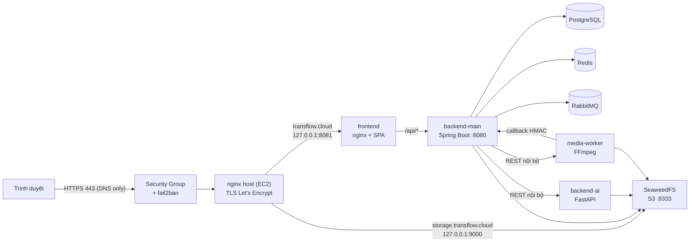
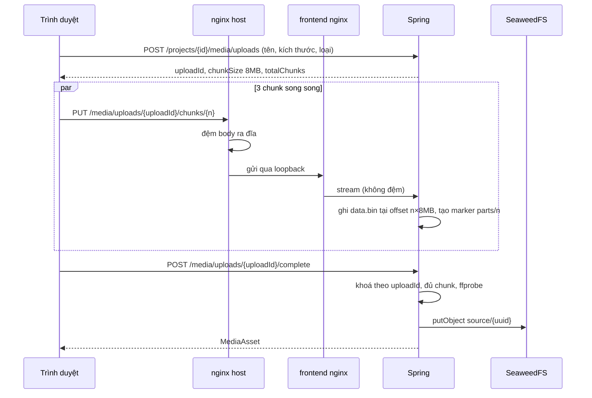
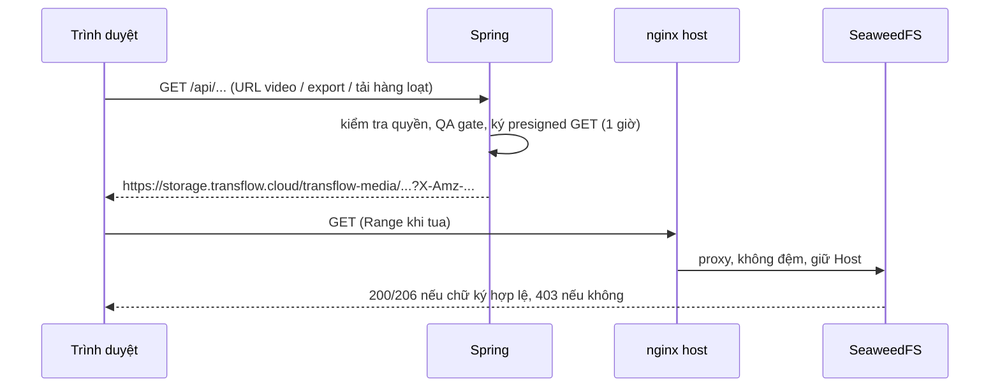

# Deployment Network — TransFlow

Request từ trình duyệt đi qua những tầng nào ở production, mỗi tầng cấu hình gì, và code xử lý upload/download video ra sao.
Viết sau hai đợt chẩn đoán ngày 29/09/2026: "web và upload đôi khi chậm", rồi "upload video treo ở 10–25%". Cấu hình bảo mật từng hạng mục nằm ở `Security_Hardening.md`; hợp đồng upload chunk ở `API_Contract.md` §4.

> Không ghi IP / hostname EC2 vào repo. Chạy DNS only thì IP đã công khai qua DNS, nhưng khi chuyển sang CDN (§9.3) sẽ đổi Elastic IP để giấu lại — IP mới không được nằm trong lịch sử git.

## 1. Tóm tắt

VPS (EC2 `c5a.xlarge`, 4 vCPU / 8GB, `ap-southeast-1`) **không phải** nguyên nhân chậm: CPU rảnh ~97%, RAM trống 5.6GB, EBS ghi 256MB/s, không lỗi nginx hay OOM.

| Nguyên nhân | Bằng chứng đo được | Trạng thái |
|---|---|---|
| **Upload qua proxy Cloudflare Free treo** với người dùng Viettel: tuyến Viettel → dải IP zone Free (`104.21.x`, `172.67.x`) chỉ đạt 7–90KB/s chiều lên | PUT 8MB qua Cloudflare 94s → timeout 120s; cùng lúc `speed.cloudflare.com` 2.5MB/s; gọi thẳng EC2 3.1s (§6.3) | ✅ Chuyển DNS only |
| Cloudflare Free đưa một phần người dùng Việt Nam qua PoP Tokyo/Hong Kong | `colo=NRT`; `index.html` 0.66–0.93s qua Cloudflare so với 0.16s gọi thẳng | ✅ Hết khi DNS only |
| Landing tự phát ~66MB video, hero tải cả video dark lẫn light | `dist` 84MB; video 16MB / 15MB | ✅ Nén + lazy-load, `dist` 12MB |
| Site sập toàn bộ ~90s mỗi lần deploy | 479 lỗi 502, log "Connection refused" | ✅ Frontend không chờ backend-main |

Đánh đổi của DNS only: IP EC2 công khai, mất lớp chống DDoS volumetric và cache edge của Cloudflare. Các lớp thay thế ở §9.

## 2. Sơ đồ tổng thể

Trình duyệt kết nối thẳng tới EC2 (DNS only). EC2 mở 80/443 cho mọi IP, 22 chỉ cho IP quản trị; mọi container chỉ bind `127.0.0.1` hoặc chỉ nằm trong mạng Docker.



## 3. Đường đi từng loại request

### 3.1 Mở trang (HTML, JS/CSS, ảnh, video landing)

| Tầng | Xử lý |
|---|---|
| nginx host | Terminate TLS, `limit_conn 64`/IP, proxy sang `127.0.0.1:8081` |
| frontend nginx | Phục vụ file tĩnh, route lạ trả `index.html` (SPA), gắn header bảo mật (CSP, HSTS, X-Frame-Options…). `/assets/*` (có hash): `Cache-Control` 1 năm, `immutable`. Ảnh/video trong `public/`: 1 ngày |
| React | Video landing dùng `LazyVideo`: chỉ tải khi sắp cuộn tới, dừng khi ra khỏi màn hình; hero chỉ tải video của theme đang dùng |

Không còn cache edge: lần tải đầu của mỗi người dùng tính vào băng thông ra của EC2. Cache trình duyệt vẫn giữ.

### 3.2 Gọi API (`/api/*`)

| Tầng | Xử lý |
|---|---|
| nginx host | Rate-limit theo IP: `/api/*` 20r/s burst 80; `/api/auth/(login\|register\|forgot-password/\|google/exchange)` 10r/phút burst 10. Body ≤ 10MB. `/internal/` → 404. Vượt ngưỡng → 429, lặp lại nhiều → fail2ban chặn IP (§5.5) |
| frontend nginx | Proxy sang `backend-main:8080`, resolve DNS Docker lúc request (`resolver 127.0.0.11 valid=10s`); `proxy_request_buffering off`; timeout 600s |
| Spring Boot | JWT + RBAC tại service; throttle đăng nhập 30 lần / 5 phút / IP; khoá tài khoản sau 5 lần sai (15 phút). Frontend polling job ~5s, thông báo 30s |

### 3.3 Upload video

Trình duyệt → nginx host (đệm từng chunk 8MB ra đĩa) → frontend nginx (stream) → Spring (ghi vào file staging) → đủ chunk: ffprobe → SeaweedFS. Chi tiết ở §6.

### 3.4 Xem và tải video đã xử lý

Trình duyệt xin URL qua `/api` → Spring ký presigned URL (1 giờ) trên `storage.transflow.cloud` → trình duyệt tải thẳng → nginx host → SeaweedFS. Dữ liệu video không đi qua Spring. Chi tiết ở §7.

## 4. Cấu hình DNS / Cloudflare

Cloudflare giờ chỉ làm DNS.

| Bản ghi | Chế độ | Ghi chú |
|---|---|---|
| `transflow.cloud`, `www`, `storage` | **DNS only** (mây xám) → Elastic IP của EC2 | Bắt buộc cả `storage`: xem/tua video qua proxy cũng bị nghẽn như upload |

Cache Rule 1/2, Caching Level và Purge không còn tác dụng khi DNS only (request không đi qua edge). **Nếu bật lại proxy**, phải bật lại đủ các mục dưới trước, và đo upload từ Viettel (§6.3) — nguyên nhân treo upload chưa hết:

| Mục | Giá trị | Lý do |
|---|---|---|
| Cache Rule 1 `static media - ignore query string` | `(http.host eq "transflow.cloud" and (starts_with(http.request.uri.path, "/landing/") or ends_with(http.request.uri.path, ".mp4")))` · Eligible for cache | Cache media landing |
| Cache Rule 2 `storage - bypass cache` | `(http.host eq "storage.transflow.cloud")` · Bypass cache | **Bắt buộc.** Presigned URL có chữ ký trong query string; nếu storage bị cache mà bỏ qua query string, ai biết đường dẫn cũng tải được video riêng tư |
| Caching Level | Ignore Query String | Chặn kiểu gắn `?r=<ngẫu nhiên>` để buộc origin gửi file liên tục. An toàn nhờ Rule 2 |
| Security Group 80/443 | Chỉ dải Cloudflare | Không cho vượt proxy |

Giới hạn Cloudflare Free vẫn được code tôn trọng để bật lại được: body ≤ 100MB (chunk 8MB), chờ phản hồi ≤ 100s (`complete` idempotent để retry sau 524). nginx vẫn cài `cloudflare-realip.conf`: chỉ tin `CF-Connecting-IP` khi kết nối đến từ dải Cloudflare, nên khi DNS only không ai giả mạo được IP qua header này.

## 5. Cấu hình EC2

### 5.1 Instance và Security Group

| Mục | Giá trị |
|---|---|
| Instance | `c5a.xlarge` · 4 vCPU · 8GB · không swap · EBS 70GB · Elastic IP |
| Inbound 80, 443 | `0.0.0.0/0` (DNS only). Cổng 80 cần cho Let's Encrypt (`/.well-known/acme-challenge/`) và redirect HTTPS |
| Inbound 22 | Chỉ IP quản trị. GitHub Actions CD SSH từ IP runner thay đổi liên tục → mở tạm `0.0.0.0/0` trong lúc deploy (§11) |
| TLS | Let's Encrypt, 1 cert cho `transflow.cloud`, `www`, `storage` (`/etc/letsencrypt/live/transflow/`), `certbot.timer` tự gia hạn |
| DDoS L3/L4 | AWS Shield Standard (miễn phí, tự bật cho mọi tài khoản) |

### 5.2 nginx trên host — `deploy/nginx/transflow.conf.template`

| Server | Cấu hình | Mục đích |
|---|---|---|
| Chung | `cloudflare-realip.conf` (chỉ tác dụng khi bật proxy); `client_header_timeout 15s`, `client_body_timeout 30s`, `send_timeout 60s` | Rate-limit theo người dùng thật; chống slowloris |
| `:80` | Chỉ ACME challenge, còn lại 301 → HTTPS | Gia hạn chứng chỉ |
| `www.transflow.cloud` | 301 → `transflow.cloud` | |
| `transflow.cloud` | `client_max_body_size 10m`; `client_body_buffer_size 1m` (đệm body ra đĩa); timeout proxy 600s; `limit_conn 64`/IP. Chunk upload `limit_conn 6`/IP; API 20r/s burst 80; auth 10r/phút burst 10 | Body lớn không lọt vào trước khi Spring kiểm tra JWT. Đệm ra đĩa tránh upload HTTP/2 chỉ đạt 100–200KB/s (`692e44a`) |
| `storage.transflow.cloud` | `client_max_body_size 1m` (chỉ GET); `proxy_buffering off`; `limit_conn 32`/IP; 30r/s burst 100; giữ nguyên `Host` | Stream video, hỗ trợ tua (Range). Chữ ký presigned tính cả Host |

### 5.3 Container — `docker-compose.prod.yml`

| Service | Cổng trên host | Tài nguyên |
|---|---|---|
| frontend (nginx) | `127.0.0.1:8081` | Không giới hạn · không `depends_on` backend-main |
| backend-main (Spring) | chỉ mạng Docker | RAM 2GB (heap ~1.5GB) · `cpu_shares 1024` |
| seaweedfs (S3) | `127.0.0.1:9000` → 8333; admin 23646 chỉ qua SSH tunnel | `tmp/downloads/` TTL 1 ngày (`seaweedfs-init`) |
| media-worker (FFmpeg) | chỉ mạng Docker | ≤ 3 vCPU · 2.5GB · `cpu_shares 512` · render 1 job/lần |
| backend-ai (FastAPI) | chỉ mạng Docker | ≤ 2 vCPU · 1.5GB · `cpu_shares 512` · tách âm 1 job/lần |
| postgres, redis, rabbitmq, freellmapi | RabbitMQ UI 15672, FreeLLMAPI 3001 chỉ qua SSH tunnel | `cpu_shares 1024` |

`cpu_shares` thấp cho worker/AI: khi render nặng, API và DB vẫn được ưu tiên CPU.

### 5.4 nginx trong container frontend — `frontend/nginx.conf`

```nginx
client_max_body_size 10m;
resolver 127.0.0.11 valid=10s ipv6=off;          # DNS Docker, resolve lúc request
set $backend_main http://backend-main:8080;

location /api/       { proxy_pass $backend_main; proxy_request_buffering off;
                       proxy_send_timeout 600s; proxy_read_timeout 600s; }
location /internal/  { return 404; }
location ^~ /assets/ { add_header Cache-Control "public, max-age=31536000, immutable"; }
location ~* \.(mp4|webp|png|jpe?g|svg|ico)$ { add_header Cache-Control "public, max-age=86400"; }
location /           { try_files $uri /index.html; }   # SPA fallback
```

Nhờ resolve lúc request, frontend khởi động được khi backend-main chưa lên (chỉ `/api` trả 502 trong ~90s Spring khởi động) và tự theo IP mới khi backend-main được tạo lại.

### 5.5 fail2ban — `deploy/fail2ban/`

`server-deploy.sh` cài gói `fail2ban` nếu chưa có, chép filter + jail rồi reload. Lỗi ở bước này chỉ cảnh báo, không làm hỏng deploy.

| File | Nội dung |
|---|---|
| `filter.d/transflow-nginx-limit.conf` | Bắt dòng `limiting requests, excess: …` / `limiting connections` trong `/var/log/nginx/error.log` (request đã bị trả 429). `delaying request` không tính |
| `jail.d/transflow.local` | ≥ 30 lần vượt ngưỡng trong 60s → chặn IP ở cổng 80/443 trong 1 giờ. Bỏ qua `127.0.0.1`, `::1` |

Ngưỡng cao hơn nhiều so với người dùng thật (SPA mở trang, upload 3 chunk song song). Jail `sshd` mặc định của Ubuntu cũng bật khi cài gói.

```bash
sudo fail2ban-client status transflow-nginx-limit      # IP đang bị chặn
sudo fail2ban-client set transflow-nginx-limit unbanip <ip>
```

Chỉ có tác dụng khi DNS only: nếu bật lại proxy Cloudflare, kết nối đến từ IP Cloudflare nên chặn theo IP thật không có hiệu lực.

## 6. Upload video

Giới hạn nghiệp vụ: ≤ 500MB, ≤ 30 phút (SRS §6). nginx host chặn body > 10MB (không cho body lớn lọt vào trước khi xác thực) → chia chunk 8MB.



### 6.1 Frontend — `frontend/src/api/transformation.ts`

- 3 chunk song song (`UPLOAD_CONCURRENCY = 3`), dưới giới hạn nginx 6 chunk/IP.
- Retry 4 lần mỗi chunk, backoff 1s / 2s / 4s cho lỗi tạm thời (mất mạng, 408, 429, 5xx).
- Mỗi chunk mang access token mới: upload dài không bị hết hạn token giữa chừng.
- Tiến độ theo byte đã gửi (XHR upload progress), dừng ở 99% đến khi `complete` trả về.
- `complete` retry an toàn: server idempotent, gọi lại sau timeout nhận đúng asset.
- Lỗi hoặc huỷ → `DELETE /media/uploads/{uploadId}` giải phóng đĩa và slot upload.

### 6.2 Backend — `MediaUploadSessionServiceImpl`

| Bước | Kiểm tra / xử lý |
|---|---|
| `start` | Quyền ghi project · 0 < kích thước ≤ 500MB · content-type là video · tối đa 3 phiên đang mở / người dùng · đĩa staging còn ≥ kích thước file + 1GB · tạo `<staging>/<uploadId>/{meta.json, data.bin, parts/}` |
| `putChunk` | Chỉ chủ phiên · index hợp lệ · độ dài chunk khớp chính xác · ghi thẳng vào `data.bin` tại offset · tạo marker `parts/n`; gửi lại cùng chunk không lỗi |
| `complete` | Khoá theo `uploadId` · đã có asset thì trả lại (idempotent) · đủ chunk · kiểm tra lại quyền · ffprobe (`MediaAssetServiceImpl`): không phải video thật → xoá, > 30 phút → từ chối · `putObject` key `source/<uuid>` · xoá dữ liệu staging, giữ `meta.json` |
| Dọn dẹp | Phiên quá 24h không hoạt động bị xoá (`session-ttl PT24H`) |

Cấu hình (`application.yaml`, `app.media.upload.*`): `chunk-size-bytes=8388608`, `session-ttl=PT24H`, `max-active-per-user=3`, `min-free-disk-bytes=1GB`. Staging nằm trên đĩa backend-main → chỉ đúng khi chạy **1 instance** backend-main.

### 6.3 Sự cố upload treo (29/09/2026) và số đo

Triệu chứng: file 94.7MB dừng ở 10–11% hoặc 25% (= 3 chunk × 8MB đang gửi), request chunk không bao giờ xong; nginx ghi `499 0`, trình duyệt nhận `524` sau 120s rồi retry lặp lại.

Đo từ máy người dùng (Viettel, 250Mbps) bằng PUT 8MB không token (Spring trả `401` ngay), tách từng đoạn:

| Đường đi | Kết quả |
|---|---|
| Trên EC2 → nginx host (HTTP/2 và HTTP/1.1) → Spring | 0.02s |
| EC2 → Cloudflare SIN → EC2 | 3.4s (2.4MB/s) |
| Máy người dùng → `speed.cloudflare.com` (dải `162.159.x`) | 3.3s (2.5MB/s) |
| Máy người dùng → Cloudflare SIN (`104.21.91.156` / `172.67.175.85`) → EC2 | 94s (88KB/s); lúc tối 7–13KB/s, quá 120s |
| Máy người dùng → EC2 thẳng | **3.1s (2.6MB/s)**; video 95MB qua web ≈ 25s |

Kết luận: không phải server, không phải HTTP/2 (tắt "HTTP/2 to Origin" không đổi gì). Cloudflare Free đệm body từ trình duyệt rồi mới chuyển xuống origin (server không nhận byte nào trong 120s), nên nút thắt là tuyến Viettel → dải IP zone Free chiều lên. Cách kiểm tra lại (trên máy người dùng, Git Bash):

```bash
head -c 8388608 /dev/urandom > chunk.bin
Z=00000000-0000-0000-0000-000000000000
curl -s -o /dev/null -w 'http=%{http_code} speed=%{speed_upload}B/s total=%{time_total}s\n' -m 120 \
  -X PUT -H 'Content-Type: application/octet-stream' --data-binary @chunk.bin \
  https://transflow.cloud/api/workspaces/$Z/media/uploads/$Z/chunks/0
rm chunk.bin
```

`http=401` trong vài giây là bình thường. Mở link chunk trong DevTools ra `9997 Authentication required` là bình thường (trình duyệt gửi `GET` không token).

## 7. Xem và tải video



| Loại | Cách xử lý | Code |
|---|---|---|
| Ký URL | MinIO client ký với `MEDIA_STORAGE_PUBLIC_ENDPOINT=https://storage.transflow.cloud`, hạn `presigned-ttl-seconds=3600` | `MediaStorageServiceImpl.presignedGetUrl` |
| Xem trong player | Giữ URL cũ tối đa 45 phút nếu cùng object, để `<video>` không tải lại từ đầu khi refetch trả chữ ký mới | `useStableMediaUrl.ts` |
| Tải 1 video | Lấy `downloadUrl` presigned rồi tải bằng `<a download>` / mở tab | `JobsTable.tsx`, `ExportPanel.tsx` |
| Tải hàng loạt | ≤ 20 job · zip không nén lại mp4, ra file tạm trên đĩa → `tmp/downloads/<uuid>.zip` (TTL 1 ngày) → presigned URL. Job bị QA chặn / chưa render thì bỏ qua và báo lại | `MediaBulkDownloadServiceImpl` |
| Lưu trữ | Mọi file trong bucket media xoá sau 3 ngày (`MEDIA_RETENTION=P3D`, quét mỗi giờ phút 15), trừ `generated-assets/` của backend-ai (TTL riêng) | `app.maintenance.*` |

## 8. Luồng nội bộ (không ra Internet)

- **Pipeline:** Spring publish RabbitMQ `media.stage.*` (consumer_timeout 1 giờ) và là consumer duy nhất; gọi REST `backend-ai:8000`, `media-worker:8000` với `INTERNAL_SERVICE_TOKEN`.
- **Callback:** worker → `http://backend-main:8080/internal/media/...`, ký HMAC-SHA256 (`X-Timestamp`, `X-Signature`, lệch > ±5 phút bị từ chối), idempotent. `/internal/` bị 404 ở cả hai lớp nginx.
- **Storage:** worker và AI đọc/ghi `http://seaweedfs:8333` trong mạng Docker, không qua domain công khai.

## 9. Các lớp bảo vệ, từ ngoài vào trong

### 9.1 Hiện tại (DNS only)

| Lớp | Chống được | Không chống được |
|---|---|---|
| AWS Shield Standard | SYN/UDP flood, reflection L3/L4 phổ biến, lọc ở biên AWS | Flood L7 hợp lệ (HTTPS), băng thông vượt năng lực 1 instance |
| Security Group | Mọi cổng ngoài 80/443; SSH chỉ từ IP quản trị | |
| fail2ban | IP flood liên tục bị chặn ở firewall, nginx không phải xử lý nữa | Botnet nhiều IP, mỗi IP dưới ngưỡng |
| nginx host | Flood L7 từ ít IP (`limit_req` / `limit_conn`), slowloris, body lớn trước khi xác thực | |
| Spring | Brute-force đăng nhập, lạm dụng upload (3 phiên/người, kiểm tra đĩa, ffprobe), RBAC tại service | |
| SeaweedFS | Tải video không có chữ ký hợp lệ (403) | |

Một EC2 lộ IP **không chống được** tấn công làm bão hoà băng thông hoặc botnet L7 lớn — cần một lớp edge (§9.3).

### 9.2 Khi bị tấn công

1. `sudo fail2ban-client status transflow-nginx-limit` và `sudo tail -f /var/log/nginx/access.log` để xem IP / path bị nhắm.
2. Hạ ngưỡng `limit_req` của path bị nhắm hoặc `maxretry` trong jail, deploy lại.
3. Flood quá sức 1 instance → bật lại proxy Cloudflare tạm thời (upload chậm với Viettel nhưng site sống), hoặc chuyển sang §9.3.

### 9.3 Hướng tiếp theo: AWS CloudFront

CloudFront có edge ở Hà Nội / TP.HCM, Shield Standard ở edge, free tier 1TB/tháng. Security Group chỉ mở cho prefix list `com.amazonaws.global.cloudfront.origin-facing`, rồi **đổi Elastic IP** (IP hiện tại đã lộ qua lịch sử DNS). Trước khi chuyển phải: đo upload từ Viettel qua CloudFront như §6.3; origin read timeout mặc định 30s (tối đa 60s, xin tăng tới 180s) có thể không đủ cho `complete` file 500MB.

## 10. Thay đổi trong đợt 29/09/2026

| Commit | Nội dung |
|---|---|
| `de4eab0` | Frontend nginx resolve backend-main lúc request, bỏ `depends_on` → SPA vẫn chạy khi backend khởi động lại. Header cache 1 ngày cho ảnh/video. Script `deploy/perf-diagnose.sh` |
| `a525503` | `LazyVideo`; nén video H.264 (sửa 2 video HEVC không phát được trên Firefox/Windows); ảnh sang WebP; favicon 399KB → 52KB; xoá 26 file không dùng |
| `b5ce0ab` | Jackson 2.21.6 vá CVE-2026-68497 (DoS CPU khi parse số) |
| (đợt upload) | fail2ban (`deploy/fail2ban/`, cài trong `server-deploy.sh`, CD chép thư mục); tài liệu + comment theo DNS only |

| Chỉ số | Trước | Sau |
|---|---|---|
| Bản build frontend (`dist`) | 84MB | 12MB |
| Video landing (tổng) | 51MB | 8.2MB |
| Hero lần đầu tải | 31MB | ≤ 3.8MB |
| Ảnh landing (tổng) | 10.5MB | 1.06MB |
| Upload video 95MB (Viettel) | treo, không xong | ≈ 25s |

Ngoài code: DNS `transflow.cloud` / `www` / `storage` → DNS only; Security Group 80/443 mở `0.0.0.0/0`, 22 chỉ IP quản trị.

## 11. Vận hành

- **Đổi ảnh/video trong `frontend/public/` mà giữ tên file** → người dùng thấy bản cũ tối đa 1 ngày (cache trình duyệt); đặt tên file mới nếu cần cập nhật ngay.
- **Thêm video mới cho landing** → encode H.264 (không dùng HEVC), `-movflags +faststart`, bỏ audio, chiều rộng theo kích thước hiển thị; hiển thị bằng `LazyVideo` thay cho `<video autoPlay>`.
- **Người dùng bị chặn nhầm** → `sudo fail2ban-client set transflow-nginx-limit unbanip <ip>`.
- **Chẩn đoán khi thấy chậm** (chỉ đọc, không in secret). Chạy trong Git Bash / Linux — PowerShell làm hỏng dấu nháy `'bash -s'`:

  ```bash
  ssh -i transflow-prod.pem <user>@<ec2-host> 'bash -s' < deploy/perf-diagnose.sh > perf-report.txt 2>&1
  ```

### Còn tồn đọng

- ⚠️ **CD cần mở 22 bằng tay**: Security Group chỉ mở 22 cho IP quản trị, GitHub-hosted runner dùng IP thay đổi. Quy trình hiện tại: thêm rule 22 `0.0.0.0/0` **trước khi** merge vào `main` (CD chạy sau CI, SSH ở job `deploy` sau khi build xong image), xoá rule ngay khi job `deploy` xanh. Deploy tay trên server: `cd /opt/transflow && bash deploy/server-deploy.sh` (cần đủ `deploy/` mới nhất, kể cả `deploy/fail2ban/`). Tự động hoá sau: `cd.yml` dùng AWS CLI mở 22 cho IP runner rồi thu hồi (IAM user chỉ có quyền `ec2:AuthorizeSecurityGroupIngress` / `RevokeSecurityGroupIngress` trên SG này), hoặc AWS SSM thay SSH.
- Container `freellmapi` báo unhealthy; log có `FREELLMAPI VISION check failed`.
- Deploy vẫn làm `/api` gián đoạn ~90s khi Spring khởi động (trang tĩnh thì không). Muốn hết cần 2 instance backend-main, nhưng upload staging hiện dựa trên đĩa của 1 instance.
