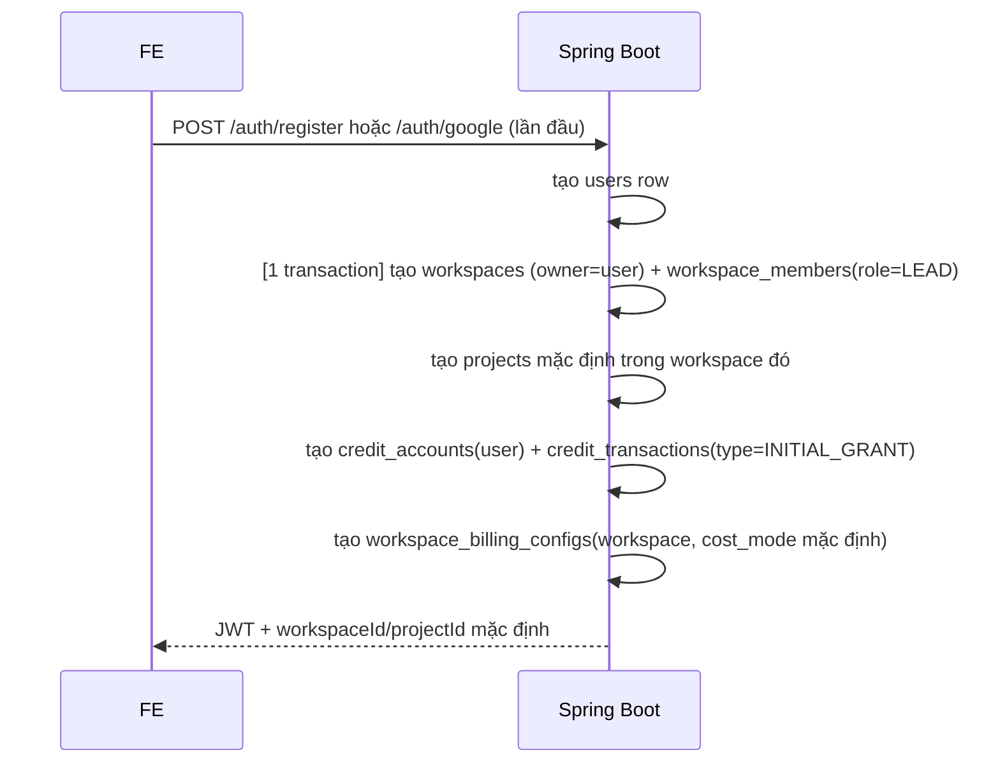
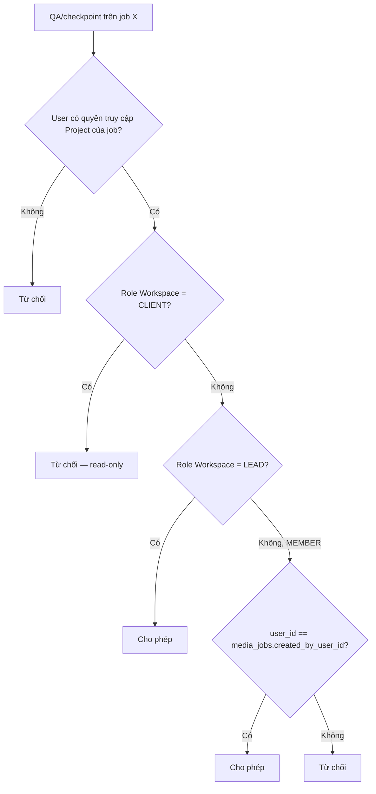
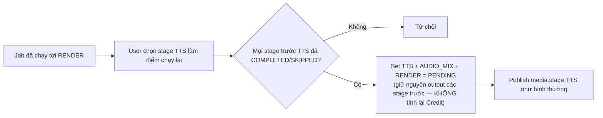
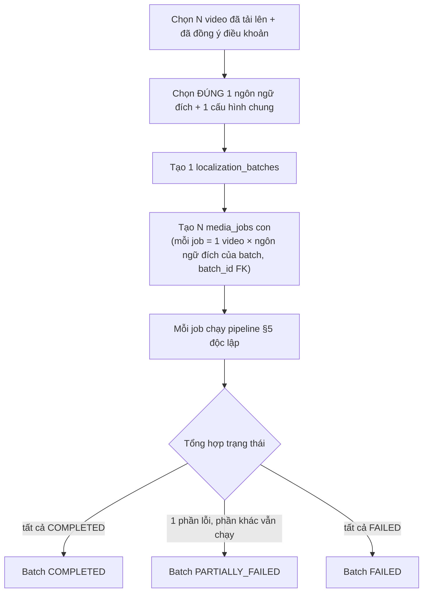
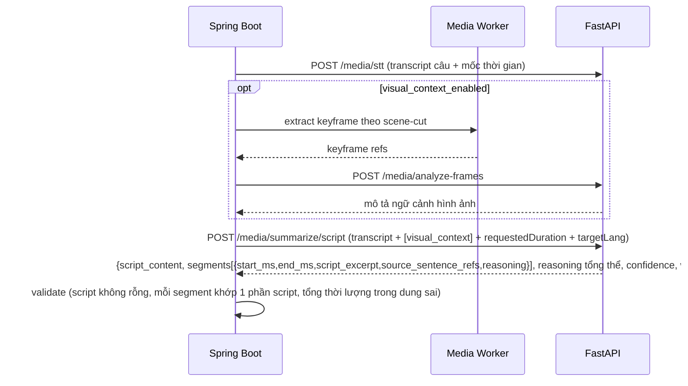

# Kiến trúc hệ thống — TransFlow Media

> Phiên bản: **3.3** · Ngày cập nhật: 2026-09-12 · Bám sát SRS v1.4 + bản chỉnh lý 1.4b.
> **Media Studio là bề mặt sản phẩm trọng tâm**. RBAC 3 role + Project assignment của 3.2 được giữ nguyên.
> Bản 3.3 thu gọn translation platform:
> 1. bỏ Dịch file/Text Translation và Batch dịch file;
> 2. bỏ Translation Memory/TM lookup/TM write-back;
> 3. giữ Video Batch Localization;
> 4. giữ Glossary và QA, nhưng xem chúng là capability tích hợp/hỗ trợ Media Studio.

---

## 1. Nguyên tắc kiến trúc (không đổi so với nền tảng đã build)

1. **Spring Boot = Source of Truth duy nhất** — chỉ Spring chạm PostgreSQL.
2. **Spring Boot = Queue consumer duy nhất** (RabbitMQ) — FastAPI/Worker không consume queue.
3. **FastAPI stateless tuyệt đối** — không DB, không queue; chỉ gateway gọi provider AI theo context Spring đóng gói sẵn.
4. **Media Processing Worker stateless** — callback về Spring qua HMAC-SHA256 (`X-Signature`+`X-Timestamp`, lệch ±5 phút bị từ chối), idempotent theo dedupe key.
5. **Async by default** — mọi xử lý AI/media qua queue; FE polling ~5s; không SSE cho pipeline dài.
6. **Design Before Code** — SRS nghiệp vụ luôn đi trước, tài liệu này chỉ hiện thực hoá SRS, không tự ý thêm nghiệp vụ ngoài SRS.
7. **RBAC ở tầng service** — mọi hành động nhạy cảm (dựng video, xuất bản, bỏ qua lỗi QA) kiểm tra quyền thực ở service, không chỉ ẩn nút FE (SRS §6).

---

## 2. Topology (4 service nghiệp vụ + Redis + Object Storage)

```
React + Vite (SPA)
   │  HTTPS/JSON + polling (~5s)
   ▼
Spring Boot ("Core") ────────────────────────────────────────────
   │  • PostgreSQL (SoT duy nhất) · RabbitMQ (consumer duy nhất)   │
   │  • Auth / Workspace-Project / RBAC 3 vai trò / Credit Ledger  │
   │  • Glossary / QA / Preset / Notification                     │
   │            │ internal REST (context đóng gói: glossary,      │
   │            │ provider đã resolve, subtitle style, script)    │
   │            ▼                                                 │
   │       FastAPI ("AI Gateway", stateless)                      │
   │            │ provider adapters (BYOK cá nhân HOẶC nguồn      │
   │            │ nền tảng — Spring resolve trước khi gọi)        │
   │            ▼                                                 │
   │       External AI APIs (STT / LLM dịch+soạn kịch bản / TTS / │
   │       Vision cho ngữ cảnh hình ảnh)                          │
   │                                                                │
   │  publish/consume ──► RabbitMQ (`media.stage.*`)               │
   │            │                                                  │
   │            ▼                                                  │
   │  Media Processing Worker (FFmpeg) ── callback HMAC ──────────┘
   │
   ▼
Redis — cache phiên Refine Summarization (TTL) + session/rate-limit
   (không phải Source of Truth — hết hạn không mất dữ liệu nghiệp vụ)
```

**Không có trong dự án này** (SRS §4.2/4.3, không build): Dịch file/Text Translation độc lập,
Batch dịch file, Translation Memory, Creative Production (Composition Worker), Bảng điều khiển quản trị
toàn nền tảng (Platform Admin), voice cloning/lip-sync, video editor đầy đủ, public API/plugin,
podcast/meeting/livestream.

**Phase 2 tuỳ chọn** (SRS §4.4, không cam kết MVP): tích hợp `yt-dlp` (nhập video qua link) và tích hợp nền
tảng đăng bài mạng xã hội — xem §13.

---

## 3. Auth & tự động khởi tạo Workspace/Project (SRS §3.1, §5.1)



- Toàn bộ chuỗi tạo Workspace/Project/Credit/BillingConfig chạy **trong 1 transaction**.
- Đăng nhập Google: nếu `google_sub` chưa gắn user nào → coi là lần đầu → chạy đúng luồng trên.
- **Cấp Credit ban đầu** (SRS §5.6): 1 lần duy nhất, không refill. Số lượng là **hằng số cấu hình ứng dụng**
  (`app.credit.initial-grant-amount`), không hard-code trong migration.
- **Chế độ tính chi phí Workspace mặc định**: SRS không chỉ định — **quyết định thiết kế cần BA xác nhận**
  (§14). Đề xuất mặc định `PAY_PER_USER`.

---

## 4. RBAC — 3 vai trò cấp Workspace + Project assignment

### 4.1 Ba vai trò

| Vai trò | Cấp gán | Quyền |
|---|---|---|
| **Lead** | Workspace | Quản lý Workspace/thành viên/Project, cấu hình chi phí & preset; mặc định truy cập và thao tác **mọi Project**; QA override mọi job theo luật QA. |
| **Member** | Workspace | Chỉ truy cập Project được Lead gán; có đầy đủ quyền nghiệp vụ Media Studio trong Project đó. QA/checkpoint vẫn bị giới hạn theo job ownership như §4.2. |
| **Client** | Workspace | Chỉ truy cập Project được Lead gán; read-only, không tạo/sửa/rerun/QA/checkpoint. |

`project_members` **không mang role**. Bảng này chỉ trả lời câu hỏi user có được truy cập Project hay không.

- Lead không cần row `project_members`.
- Member/Client phải có row `project_members` cho từng Project được truy cập.
- Role lấy duy nhất từ `workspace_members`.
- Chỉ Lead quản lý Workspace membership và Project assignment trong bản hiện tại.

### 4.2 Quy tắc QA & checkpoint — giữ job ownership



- `created_by_user_id` chỉ là security condition cho **QA/checkpoint** theo SRS §3.3; không dùng để lọc danh
  sách Job hoặc giới hạn quyền xem.
- Member đã được gán Project vẫn xem được mọi Job trong Project.
- Client không có mutation dù được gán Project.

### 4.3 Ma trận quyền

| Nghiệp vụ | Lead | Member | Client |
|---|---|---|---|
| Quản lý thành viên & Workspace/Project | ✔ | — | — |
| Gán user vào Project | ✔ | — | — |
| Cấu hình cách tính chi phí Workspace | ✔ | — | — |
| Cấu hình mẫu mặc định | ✔ | — | — |
| Mua gói Credit (cho bản thân) | ✔ | ✔ | ✔ |
| Cấu hình API key cá nhân | ✔ | ✔ | ✔ |
| Tạo yêu cầu xử lý (đơn/hàng loạt) | ✔ | ✔ | — |
| Dịch, sửa phụ đề, chọn giọng | ✔ | ✔ | — |
| Tạo/tinh chỉnh phương án tóm tắt | ✔ | ✔ | — |
| Kiểm tra chất lượng & phê duyệt | ✔ (mọi job) | ✔ (chỉ job của mình) | — |
| Bỏ qua lỗi chất lượng — override | ✔ (mọi job) | ✔ (chỉ job của mình) | — |
| Xác nhận tại checkpoint | ✔ (mọi job) | ✔ (chỉ job của mình) | — |
| Rerun-from-stage | ✔ | ✔ (Project được gán) | — |
| Xem tiến trình & kết quả | ✔ | ✔ (Project được gán) | ✔ (Project được gán) |

> Các hành động cá nhân như mua Credit/cấu hình API key không phụ thuộc Project assignment. Client vẫn có
> tài khoản cá nhân nhưng không thể dùng quyền đó để tạo Media Job.

## 5. Localization — Dịch & Lồng tiếng video (SRS §5.3, không đổi so với v1.2)

### 5.1 Pipeline (8 stage kỹ thuật, 6 bước "logic" hiển thị FE)
```
EXTRACT_AUDIO → [SOURCE_SEPARATION → SKIPPED nếu không tách nguồn]
   → STT → [SUMMARIZE → SKIPPED nếu TRANSLATE_ONLY]   ← ở Localization, SUMMARIZE chỉ sinh cut-plan HYBRID
   → TRANSLATE → TTS (nếu không ORIGINAL_ONLY) → [AUDIO_MIX → SKIPPED nếu không DUB_MIX]
   → RENDER
```
- 8 trạng thái stage: `PENDING/PROCESSING/COMPLETED/FAILED/STALE/SKIPPED/CANCEL_REQUESTED/CANCELLED`.
- FE mặc định chỉ hiện **6 bước logic**; bước không áp dụng tự động ẩn (SRS §5.3).

### 5.2 Hai chế độ xử lý (`processing_mode`)
- `TRANSLATE_ONLY` — dịch nguyên văn, giữ khung thời gian gốc.
- `HYBRID` — AI đề xuất giữ đoạn quan trọng trước (1 proposal, không refine, không giới hạn 5 vòng).

### 5.3 Giọng lồng tiếng & đầu ra âm thanh (`output_audio_mode`)
| Giá trị | Ý nghĩa | Bắt buộc chọn giọng? |
|---|---|---|
| `ORIGINAL_ONLY` | Giữ nguyên âm thanh gốc | Không |
| `DUB_REPLACE` | Thay thế hoàn toàn bằng giọng mới | Có |
| `DUB_MIX` | Trộn giọng mới với nhạc nền/hiệu ứng gốc đã tách | Có, bắt buộc `source_separation_enabled=true` |

Giọng chọn phải cùng ngôn ngữ với `target_lang` — từ chối rõ ràng nếu không khớp, không fallback ngầm.

### 5.4 Xuất bản
- `subtitle_mode`: `HARD_SUB` / `SOFT_SUB` (mặc định). **Luôn xuất kèm tệp phụ đề độc lập**.
- Tuỳ chỉnh trình bày (vị trí, màu chữ/nền, kiểu khung nền, số ký tự tối đa/dòng) lưu trong preset (§9).
- **Chặn dựng video/xuất bản** nếu còn lỗi QA nghiêm trọng chưa xử lý (service-layer gate, xem §8).

### 5.5 Sửa phụ đề sau xử lý → "cần chạy lại" (không tự động)
Sửa sau khi đã lồng tiếng/dựng video → các stage phía sau chuyển `STALE`, không tự động chạy lại — chờ user
chủ động yêu cầu, tránh phát sinh Credit ngoài ý muốn.

### 5.6 Hai chế độ vận hành
- **Manual**: dừng tại từng checkpoint chờ xác nhận. **Auto**: tự chạy hết, chỉ dừng khi lỗi hoặc tới bước
  xuất bản cuối. Checkpoint marker (`cut_confirmed`/`review_confirmed`/`publish_confirmed`) lưu durable
  trong `media_job_stages.input_ref` JSONB của stage sở hữu checkpoint.
- **Xác nhận checkpoint tuân theo quy tắc quyền sở hữu job giống QA** (§4.2) — Member chỉ xác nhận được
  checkpoint của job do chính mình tạo; Lead xác nhận được mọi job; Client bị chặn.

### 5.7 Chạy lại từ 1 công đoạn bất kỳ (Rerun-from-stage)

Áp dụng như nhau cho `Manual`/`Auto`. Không tính lại Credit cho stage output được tái sử dụng.

---

## 6. Dịch & Lồng tiếng hàng loạt — Video Batch Localization (SRS §5.4, v1.4/1.4b)

> Đây là **Batch duy nhất còn lại**. Batch `.txt/.docx`/Document Translation bị loại khỏi kiến trúc.
> Mỗi phần tử của lô là một Media Asset/Media Job, không tạo Document/Text Translation Job.

> **v1.4:** Batch giờ chỉ hỗ trợ **N video × ĐÚNG 1 ngôn ngữ đích** (trước là N video × M ngôn ngữ). Muốn
> cùng bộ video ra thêm ngôn ngữ khác → phải tạo **1 lô mới riêng** cho ngôn ngữ đó (SRS đánh dấu đây là
> đánh đổi đơn giản hoá, cần xác nhận — §14).


- Giới hạn **20 video/lô** (bỏ giới hạn "10 ngôn ngữ/lô" của thiết kế trước — không còn ý nghĩa vì chỉ có 1
  ngôn ngữ/lô).
- **Màn hình theo dõi đổi từ ma trận (video×ngôn ngữ) sang danh sách** (video + trạng thái) — không còn
  chiều ngôn ngữ thứ 2 để vẽ ma trận (khác thiết kế trước).
- **`PARTIALLY_FAILED` chỉ tồn tại ở cấp Batch** — `media_jobs.status` chỉ có
  `PENDING/PROCESSING/COMPLETED/FAILED/CANCELLED` (không đổi so với trước).
- Trạng thái Batch tính lại ở service layer, cùng transaction với cập nhật job con.
- Retry riêng từng job con lỗi; huỷ toàn batch hoặc từng job riêng; tải kết quả dạng gói nén hoặc từng job.

---

## 7. Tóm tắt video đa ngôn ngữ — Summarization (SRS §5.5, không đổi so với v1.2)

> AI **VIẾT LẠI (soạn)** một bản nội dung tóm tắt hoàn chỉnh bằng ngôn ngữ đích, rồi **chọn đoạn video gốc
> khớp** với từng phần nội dung vừa soạn. Cơ chế này **hoàn toàn tách biệt** với cut-plan đơn giản của
> Localization HYBRID (§5.2) — không dùng chung state.

### 7.1 Yêu cầu tóm tắt
- Nhập độ dài mong muốn + **chọn ngôn ngữ tóm tắt chính NGAY KHI tạo yêu cầu**.
- Tuỳ chọn bật **Phân tích ngữ cảnh hình ảnh** (mặc định TẮT) — mô tả hình ảnh phục vụ cả soạn kịch bản lẫn
  chọn đoạn khớp.

### 7.2 AI soạn nội dung & chọn đoạn khớp (1 phương án duy nhất/lượt)

Kết quả **1 phương án duy nhất** gồm: kịch bản hoàn chỉnh + các đoạn video tương ứng + lý do tổng thể/theo
từng đoạn + độ tin cậy + cảnh báo.

### 7.3 Tự tạo phương án thủ công (Custom Proposal)
User tự chọn tay đoạn từ lời thoại gốc — **không qua bước AI soạn kịch bản**. Phụ đề = dịch sát nghĩa từ
lời thoại gốc, dùng chung cơ chế TRANSLATE như Localization. Không bị archive khi có đề xuất AI mới.

### 7.4 Tinh chỉnh theo phản hồi (Refine)
Feedback tác động **trực tiếp lên kịch bản đã soạn** — AI viết lại phần liên quan, chọn lại đoạn khớp nếu
cần. Tối đa **5 lần refine/phiên**. Phiên có TTL (Redis) — hết hạn không mất dữ liệu, DB vẫn giữ các phương
án đã lưu. Không refine được nếu phương án đang chọn đã dùng để tạo bản dịch.

### 7.5 Phân tích ngữ cảnh hình ảnh (tuỳ chọn, mặc định TẮT)
Trích keyframe tại điểm chuyển cảnh → AI mô tả → đưa vào cả soạn kịch bản lẫn refine.

### 7.6 Chọn phương án & tạo phụ đề
| Phương án chọn | Nguồn phụ đề | Qua TRANSLATE (Glossary/QA)? |
|---|---|---|
| AI (script-authored) | Chính nội dung đã soạn | **Không** |
| Custom Proposal (thủ công) | Dịch sát nghĩa từ lời thoại gốc | **Có** |

### 7.7 Tóm tắt thêm ngôn ngữ khác
Chỉ áp dụng khi phương án chọn là AI. Hệ thống **dịch kịch bản đã hoàn thiện** sang ngôn ngữ bổ sung — tái
dùng Glossary/QA. **Giữ nguyên đoạn video đã chọn** cho mọi ngôn ngữ bổ sung (thiết kế đề xuất, SRS đánh
dấu cần xác nhận — §14). Mỗi ngôn ngữ bổ sung = **1 `media_jobs` mới** với `source_summary_job_id` trỏ về
job gốc, `SUMMARIZE` bị `SKIPPED`, chỉ chạy `TRANSLATE`(kịch bản)→`TTS`(tuỳ chọn)→`RENDER`.

### 7.8 Xử lý ngoại lệ
Lỗi hạ tầng → tự động thử lại. Lỗi nghiệp vụ → dừng ngay, thông báo rõ nguyên nhân, không tự thử lại.

---

## 8. Glossary & QA tích hợp trong Media Studio (SRS §5.7)

- **Translation Memory (TM): đã loại bỏ.** Pipeline dịch không lookup/reuse câu dịch cũ, không embedding
  similarity và không TM write-back.
- **Bảng thuật ngữ (Glossary): giữ.** Mỗi Project có 1 bảng thuật ngữ; Spring đóng gói glossary phù hợp vào
  context trước khi gọi AI dịch. Đây là capability hỗ trợ/advanced, không phải một application module độc lập.
- **QA: giữ dưới dạng quality gate của Media Job/Review**, không phải một sản phẩm/route nghiệp vụ độc lập.
  Bốn mức độ vẫn là Thấp/Trung bình/Cao/Nghiêm trọng; blocking action còn:
  `BLOCK_APPROVAL | BLOCK_PUBLISH | BLOCK_RENDER`.
- **Không còn `BLOCK_TM_WRITEBACK`** vì Translation Memory không còn tồn tại.
- Override vẫn theo quy tắc job-ownership (§4.2): Lead mọi job, Member chỉ job của mình, Client không được
  override. Bắt buộc lý do, luôn lưu vết. Một số lỗi kỹ thuật đặc biệt nghiêm trọng (vd phụ đề chồng lấn
  thời gian) không bao giờ override được — kể cả Lead.
- Enforce ở **service layer**, chặn cả gọi thẳng API.

## 9. Mẫu cấu hình (Preset) — 1 mô hình duy nhất, 3 cấp + template dùng chung

- 1 preset gồm: kiểu trình bày phụ đề + giọng đọc mặc định theo ngôn ngữ + cấu hình hiển thị khi dựng video.
- 3 cấp: hệ thống / workspace / project, mỗi cấp đúng 1 mẫu mặc định.
- Thứ tự áp dụng: `lựa chọn tường minh > mặc định Project > mặc định Workspace > mặc định hệ thống`. Freeze
  vào job tại thời điểm tạo.
- Preset `SYSTEM` có thể được đưa vào danh mục template dùng chung/public trong app. `Use template` chỉ
  resolve + snapshot cấu hình vào Job trong Project mà user có quyền ghi; không tạo Workspace/Project
  membership mới và không dùng Public Workspace để chia sẻ dữ liệu.

---

## 10. Credit & Thanh toán (không đổi so với v1.2)

### 10.1 Nguyên tắc tách biệt 2 vấn đề
1. **Công thức tính SỐ Credit** — phụ thuộc người **trực tiếp thực hiện** có API key cá nhân hay không.
2. **Ai bị trừ Credit** — phụ thuộc **chế độ thanh toán Workspace** (Lead cấu hình).

### 10.2 Công thức
| Trường hợp | Điều kiện | Công thức |
|---|---|---|
| 1 | Có API key cá nhân | `Credit = x × token` |
| 2 | Không có API key cá nhân (dùng nguồn nền tảng) | `Credit = (x × token) + (y × token)` |

`x`/`y` là dữ liệu cấu hình runtime (`credit_pricing_config`), không hard-code.

### 10.3 Chế độ thanh toán Workspace
| Chế độ | Ý nghĩa |
|---|---|
| `LEAD_PAYS_ALL` | Mọi Credit trong Workspace trừ vào số dư Lead |
| `PAY_PER_USER` | Mỗi người tự trả cho thao tác của mình (kể cả Lead) |

Ghi `credit_transactions` tách 2 trường: `performed_by_user_id` (quyết định công thức) và `charged_user_id =
user_id` (quyết định bởi chế độ thanh toán) — không suy ra lẫn nhau.

### 10.4 Vòng đời Credit
Cấp 1 lần khi đăng nhập lần đầu, không refill. Hết → mua Gói Credit (chi tiết gói chưa mô tả trong SRS, để
mở §14). Số dư không đủ → mặc định thiết kế `BLOCK_UPFRONT` (chặn tạo job), đặt cấu hình được.

### 10.5 Bảng theo dõi mức sử dụng AI
`ai_usage_logs` ghi mỗi thao tác AI + Credit tương ứng, theo Workspace/Project/User/thời gian.

---

## 11. Nguồn AI (chỉ BYOK cá nhân + nguồn nền tảng — không đổi)

- Cấu hình API key **chỉ ở cấp cá nhân** — không có cấu hình nguồn AI ở cấp Workspace.
- Không có API key cá nhân hợp lệ cho capability cần dùng → hệ thống tự dùng **nguồn AI nền tảng**
  (`platform_ai_providers`) — kích hoạt công thức Trường hợp 2 (§10.2).

---

## 12. Bảo mật & multi-tenancy
- JWT access+refresh; đăng nhập Google (OAuth2).
- Không có Document/Text Translation domain hoặc Translation Memory trong access model hiện hành.
- Mọi bảng nghiệp vụ có `workspace_id`; scope theo workspace của user hiện tại.
- RBAC 3 vai trò cấp Workspace (§4) + Project assignment + quy tắc job-ownership cho QA/checkpoint được
  kiểm tra ở service layer.
- HMAC callback Worker→Spring; AES-GCM cho API key cá nhân.
- **Invariant khoá ghi:** mọi mutation trạng thái job (callback worker, rerun-from-stage, aggregate batch,
  workflow continue, trừ Credit) phải serialize bằng pessimistic lock (`SELECT ... FOR UPDATE`) trên
  `media_jobs`/`credit_accounts` liên quan trong cùng transaction.

---

## 13. Tích hợp tuỳ chọn Phase 2 (SRS §4.4 — không cam kết MVP)
- **Nhập video qua đường dẫn** (`yt-dlp`): bước FETCH tuỳ chọn trước `EXTRACT_AUDIO`.
- **Tự động đăng video lên mạng xã hội**: bước PUBLISH tuỳ chọn sau khi job `COMPLETED`.

---

## 14. Các điểm cần BA xác nhận trước khi code (carry-forward từ SRS §7.2 + hệ quả kỹ thuật)

| # | Điểm mở trong SRS | Hệ quả kỹ thuật đã thiết kế sẵn |
|---|---|---|
| 1 | Lead có kế thừa đúng 100% quyền "Admin" v1.0? | Đã map Lead = toàn quyền workspace + full-access mọi project trong workspace |
| 2 | Hệ số `y` cố định hay khác theo thao tác/nhà cung cấp? | `credit_pricing_config` theo `capability`+`provider_scope`, không cần đổi schema |
| 3 | Chi tiết gói Credit (giá, số lượng, cổng thanh toán) | `credit_packages`/`credit_package_purchases` đã có schema tối thiểu, chưa tích hợp cổng thanh toán thật |
| 4 | Số dư không đủ → chặn ngay hay xử lý rồi báo nợ? | Mặc định `BLOCK_UPFRONT`, đặt cấu hình được |
| 5 | Workspace có thể nhiều hơn 1 Lead trong tương lai? | Hiện enforce đúng 1 Lead/workspace bằng partial unique index |
| 6 | Cần vai trò xem-only cho khách hàng? | **✅ ĐÃ CHỐT** — `CLIENT` là role cấp Workspace; Project access qua assignment |
| 7 | Member có được tự thêm user/assign Project không? | **✅ ĐÃ CHỐT cho bản hiện tại: KHÔNG** — chỉ Lead quản lý membership và Project assignment |
| 8 | Tóm tắt thêm ngôn ngữ: giữ nguyên đoạn đã chọn hay soạn/chọn lại độc lập mỗi ngôn ngữ? | Kiến trúc §7.7 đã hiện thực hoá phương án "giữ nguyên đoạn" |
| 9 | Batch nhiều ngôn ngữ: chấp nhận phải tạo nhiều lô riêng theo từng ngôn ngữ? | Đã hiện thực hoá theo đúng v1.4 — `localization_batches` chỉ còn 1 `target_lang` |
| 10 | Chế độ thanh toán mặc định khi Workspace mới tạo | Đề xuất `PAY_PER_USER` (không có trong SRS, do kiến trúc tự chọn) |
